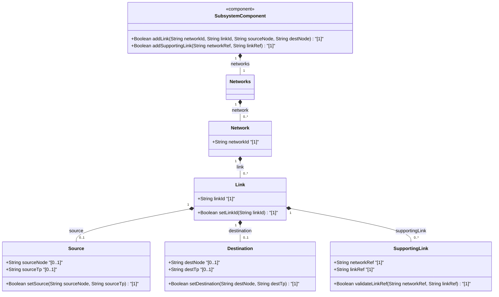

# Feature: [ietf-network-topology: Link Data Model and Supporting Links]

## Parent Epic
- [ ] #90 - [[ietf-network-and-topology]: Network and Topology Base Models](https://github.com/gintatkinson/3dgs-037/blob/main/docs/epics/epic-07-ietf-network-and-topology.md)

## Description
This feature specifies the Link Data Model defined by the `ietf-network-topology` YANG module (RFC-8345 Section 4.3). It models point-to-point and point-to-multipoint topological links within a network. A link connects a source node and source termination point to a destination node and destination termination point. Each link is uniquely identified by `link-id` within its containing network and can be supported by lower-layer links via `supporting-link` references.

## UML Class Diagram


## Interface Requirements

### 1. Test Data Shape
```json
{
  "link": [
    {
      "link-id": "link-101",
      "source": {
        "source-node": "node-A",
        "source-tp": "eth-0/1"
      },
      "destination": {
        "dest-node": "node-B",
        "dest-tp": "eth-0/2"
      },
      "supporting-link": [
        {
          "network-ref": "underlay-nw-01",
          "link-ref": "physical-link-55"
        }
      ]
    }
  ]
}
```

### 2. Validation & Constraints
- **link-id**: Mandatory key string identifying the link within the containing network.
- **source / source-node**: String reference (`node-ref`) identifying the source node in the same network context.
- **source / source-tp**: String reference (`tp-ref`) identifying the source termination point on the source node.
- **destination / dest-node**: String reference (`node-ref`) identifying the destination node in the same network context.
- **destination / dest-tp**: String reference (`tp-ref`) identifying the destination termination point on the destination node.
- **supporting-link / network-ref**: Mandatory key leafref pointing to `/nw:networks/nw:network/nw:network-id` of a supporting underlay network (`require-instance false`).
- **supporting-link / link-ref**: Mandatory key leafref pointing to `/nw:networks/nw:network[nw:network-id=current()/../network-ref]/nt:link/nt:link-id` of a supporting underlay link (`require-instance false`).

### 3. Visual Layout & Arrangement
- **Component Mapping**: Rendered in a tabular format (`TableView`) within layout container `elements_view`.
- **Layout Reset & Scoping**: Implements CSS box-sizing resets (`box-sizing: border-box`) and scoped class names (`.link-table-view`, `.link-table-row`) to prevent style leaks.
- **Layout Containment**: Restricts layout containment to outer splitter panes; scrollable table view container avoids CSS layout containment flags that disrupt scroll geometry.
- **Dom Hierarchy**: Semantic HTML `<table>` or structured grid (`<div role="grid">`) with clear row definitions representing each `link` element, nested expandable detail sub-rows for `source`, `destination`, and `supporting-link` lists.

### 4. Interactive Flow & States
- **Read-Only Mode**: Displays the network link list, showing source node/TP and destination node/TP endpoints along with count of supporting links.
- **Active / Selection State**: Selecting a link row highlights the row and displays supporting link details.
- **Empty State**: Displays an informational message when no links exist in the selected network topology.
- **Error Highlighting**: Invalid or broken leafref links (e.g. unresolvable supporting-link references) are highlighted with error badges and tooltips. Computed-style assertions verify border color and background highlight during error states.

## Given-When-Then Acceptance Criteria

### Scenario 1: Successful Validation of Point-to-Point Topological Link
- **Given** a network instance with ID `overlay-nw-1`
- **When** a new link entry is added with `link-id` = `"link-alpha"`, `source-node` = `"router-1"`, `source-tp` = `"ge-0/0/0"`, `dest-node` = `"router-2"`, and `dest-tp` = `"ge-0/0/0"`
- **Then** the link configuration is successfully validated and stored under `/nw:networks/nw:network[network-id='overlay-nw-1']/nt:link[link-id='link-alpha']`.

### Scenario 2: Validation of Supporting Link Underlay References
- **Given** an existing link `"link-alpha"` in overlay network `"overlay-nw-1"`
- **When** a supporting-link entry is added with `network-ref` = `"underlay-nw-01"` and `link-ref` = `"phys-link-99"`
- **Then** the supporting link reference is accepted and associated with `"link-alpha"`.

### Scenario 3: Rendering Link Information in TableView Component
- **Given** a TableView component bound to `/nw:networks/nw:network/nt:link` in container `elements_view`
- **When** network topology data containing links is loaded
- **Then** each link is displayed with columns for `link-id`, `source-node:source-tp`, `dest-node:dest-tp`, and supporting link counts.

## Specification Context (Verbatim)

### RFC-8345 Section 4.3: Link Data Model
> The link data model is defined by the "ietf-network-topology" YANG module.
> A link is identified by a link-id, which is unique within the containing network.
> A link connects a source node to a destination node. Specifically, a link connects a source termination point on a source node to a destination termination point on a destination node. Thus, a link's source is defined by a source node and a source termination point, and a link's destination is defined by a destination node and a destination termination point.
> Similar to a network or a node, a link can be supported by lower-layer links. A supporting link is defined by a network-ref (which refers to the supporting network) and a link-ref (which refers to the supporting link in that network).

### ietf-network-topology@2018-02-26.yang (link container definition)
> augment "/nw:networks/nw:network" {
>   description "Add links to the network model.";
>   list link {
>     key "link-id";
>     description
>       "A link connects a source node to a destination node.
>        A link is identified by a link-id, which is unique
>        within the containing network.";
>     leaf link-id {
>       type link-id;
>       description
>         "The identifier of a link in the container network.";
>     }
>     container source {
>       description
>         "Link source reference. On a point-to-point link return all
>          termination points headers originating from this node.
>          In case of a point-to-multipoint link return multi-point
>          headers.";
>       leaf source-node {
>         type node-ref;
>         description "Source node identifier, must be in same network.";
>       }
>       leaf source-tp {
>         type tp-ref;
>         description "Termination point within source node that terminates the link.";
>       }
>     }
>     container destination {
>       description
>         "Link destination reference. On a point-to-point link return all
>          termination points headers terminating at this node.
>          In case of a point-to-multipoint link return multi-point
>          headers.";
>       leaf dest-node {
>         type node-ref;
>         description "Destination node identifier, must be in same network.";
>       }
>       leaf dest-tp {
>         type tp-ref;
>         description "Termination point within destination node that terminates the link.";
>       }
>     }
>     list supporting-link {
>       key "network-ref link-ref";
>       description "Identifies the link, or links, that support this link.";
>       leaf network-ref {
>         type leafref {
>           path "/nw:networks/nw:network/nw:network-id";
>           require-instance false;
>         }
>         description "This leaf identifies the network that supports the link.";
>       }
>       leaf link-ref {
>         type leafref {
>           path "/nw:networks/nw:network[nw:network-id=current()/../network-ref]/nt:link/nt:link-id";
>           require-instance false;
>         }
>         description "This leaf identifies the link that supports the link.";
>       }
>     }
>   }
> }

## User Stories
- [ ] #94 - [ietf-network-topology: Directional Link Instantiation, Source/Destination TP Leafref Binding, and Underlay Supporting Link Path Resolution](https://github.com/gintatkinson/3dgs-037/blob/main/docs/user-stories/us-35-directional-link-instantiation-and-traversal.md)

## Source References
Structural Schema: https://github.com/YangModels/yang/blob/main/standard/ietf/RFC/ietf-network-topology%402018-02-26.yang (Clause: Section 4.3)
Normative Specification: https://datatracker.ietf.org/doc/rfc8345/ (Clause: Section 4.3)

## Logical UI & Layout Bindings
- **Target LUI Component:** TableView
- **Target Layout Container ID:** elements_view
- **Data Source Bindings:** /nw:networks/nw:network/nt:link
