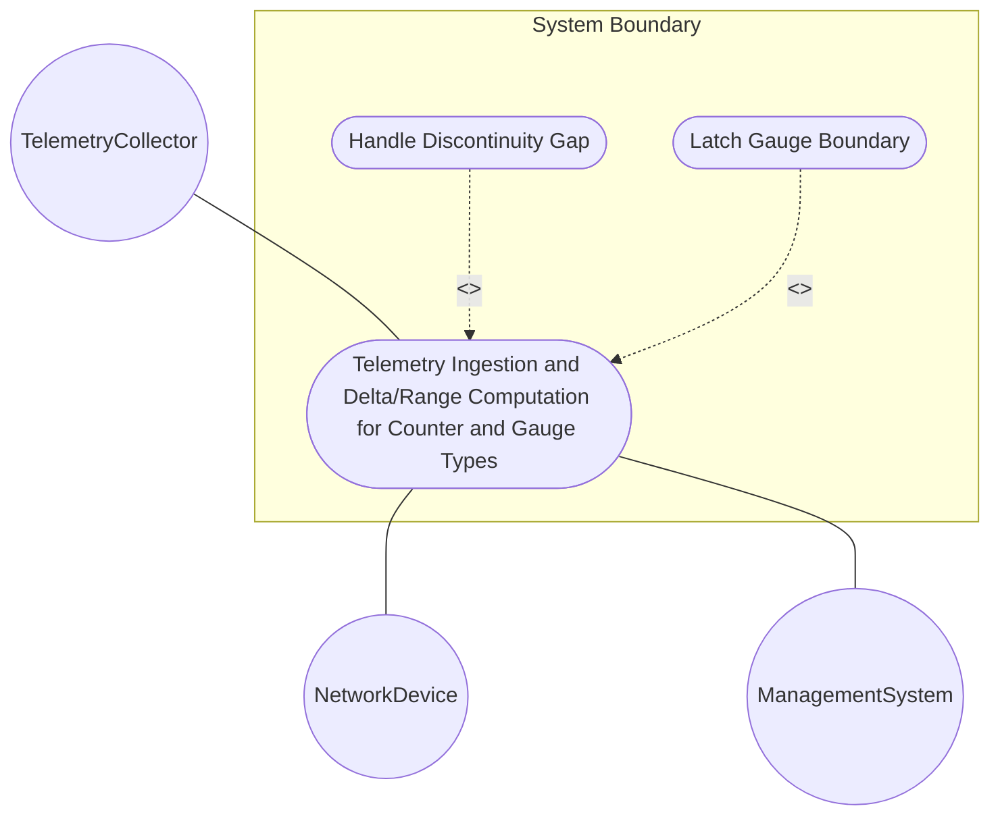
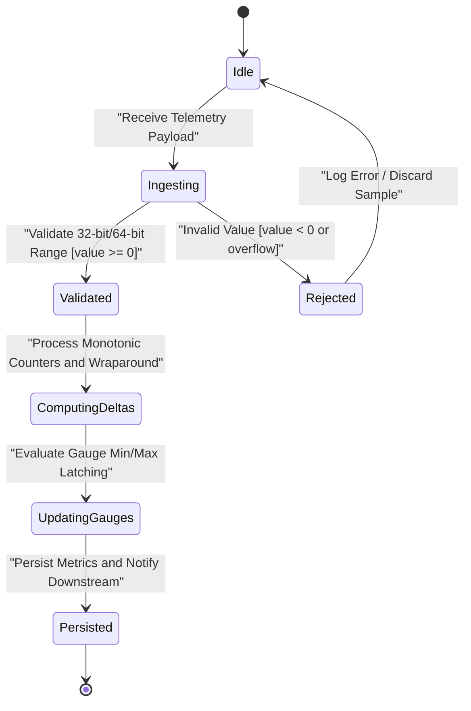

# Use Case: Telemetry Ingestion and Delta/Range Computation for Counter and Gauge Types

## Parent Epic
- [ ] #5 - [[ietf-yang-types]: Common YANG Data Types](https://github.com/gintatkinson/3dgs-037/blob/main/docs/epics/epic-01-ietf-yang-types.md) (Parent Epic for common YANG data types)

## 1. Actors
- **Primary Actor:** TelemetryCollector
- **Secondary Actors:** NetworkDevice, ManagementSystem

## 2. Preconditions
- System has loaded `ietf-yang-types@2025-12-22.yang` module.
- Telemetry session is established between `NetworkDevice` and `TelemetryCollector`.

## 3. Trigger
`NetworkDevice` transmits telemetry stream or responds to a GET polling query containing `counter32`, `zero-based-counter32`, `counter64`, `zero-based-counter64`, `gauge32`, or `gauge64` leaves.

## 4. Main Success Scenario (Basic Flow)
1. `NetworkDevice` sends numeric telemetry payload for `counter-and-gauge-types` container leaves.
2. `TelemetryCollector` validates received non-negative unsigned integer values against 32-bit and 64-bit boundaries.
3. `TelemetryCollector` evaluates monotonic counter increments and computes rate deltas considering $2^{32}-1$ or $2^{64}-1$ wraparound limits.
4. `TelemetryCollector` handles `zero-based-counter` default initialization ("0") for new node instances to calculate initial deltas.
5. `TelemetryCollector` updates dynamic gauge metrics, asserting lower (0) and upper ($2^{32}-1$ / $2^{64}-1$) boundary latching behavior.
6. `TelemetryCollector` persists metric values and notifies downstream analytics services.

## 5. Alternate and Exception Flows
- **5a. Negative Value Validation Failure (Branches from Basic Flow step 2):**
  1. `TelemetryCollector` receives value $< 0$ for counter or gauge leaf.
  2. `TelemetryCollector` rejects payload with error `INVALID_ARGUMENT` and discards sample.
- **5b. 32-Bit / 64-Bit Integer Overflow Exception (Branches from Basic Flow step 2):**
  1. `TelemetryCollector` receives value exceeding $2^{32}-1$ (for 32-bit types) or $2^{64}-1$ (for 64-bit types).
  2. `TelemetryCollector` logs `RANGE_ERROR` out-of-range exception and notifies operator.
- **5c. Counter Discontinuity Gap Handling (Branches from Basic Flow step 3):**
  1. `TelemetryCollector` detects polling gap exceeding minimum wrap time or system re-initialization reset.
  2. `TelemetryCollector` invalidates delta computation, records discontinuity timestamp, and resets baseline.
- **5d. Gauge Upper Limit Latching Notification (Branches from Basic Flow step 5):**
  1. `TelemetryCollector` detects monitored resource load exceeding maximum capacity ($2^{32}-1$ or $2^{64}-1$).
  2. `TelemetryCollector` latches gauge metric at upper limit and generates boundary alert.
- **5e. Gauge Lower Limit Latching Notification (Branches from Basic Flow step 5):**
  1. `TelemetryCollector` detects monitored resource load dropping below 0.
  2. `TelemetryCollector` latches gauge metric at minimum limit (0) and generates lower boundary alert.
- **5f. Zero-Based Counter Initialization Violation (Branches from Basic Flow step 4):**
  1. `TelemetryCollector` detects new `zero-based-counter` node created with non-zero initial state.
  2. `TelemetryCollector` forces initial value reset to 0 and logs initialization anomaly.

## 6. Postconditions (Guarantees)
- **Success Guarantee:** Telemetry values are validated, rate deltas computed, gauge boundaries latched, and metric state persisted cleanly.
- **Failure Guarantee:** Invalid negative or overflow values are rejected with error response, leaving system state unchanged.

## UML Diagrams
### Use Case Diagram

### State Machine Diagram

## 7. Operational Context
> RFC 9911 §3.1: counter32 represents a non-negative integer that monotonically increases until it reaches a maximum value of 2^32-1 (4294967295 decimal), when it wraps around and starts increasing again from zero. Counters have no defined initial value. Discontinuities in the monotonically increasing value normally occur at re-initialization of the management system.
>
> RFC 9911 §3.2: zero-based-counter32 represents a counter32 that has the defined initial value zero. A data tree node using this type will be set to zero (0) on creation and will thereafter increase monotonically until it reaches a maximum value of 2^32-1, when it wraps around to zero. Provided that an application discovers a new data tree node using this type within the minimum time to wrap, it can use the initial value as a delta.
>
> RFC 9911 §3.3: counter64 represents a non-negative integer that monotonically increases until it reaches a maximum value of 2^64-1 (18446744073709551615 decimal), when it wraps around and starts increasing again from zero.
>
> RFC 9911 §3.4: zero-based-counter64 represents a counter64 that has the defined initial value zero. A data tree node using this type will be set to zero (0) on creation and will thereafter increase monotonically until it reaches a maximum value of 2^64-1, when it wraps around to zero.
>
> RFC 9911 §3.5: gauge32 represents a non-negative integer, which may increase or decrease, but shall never exceed a maximum value (2^32-1), nor fall below a minimum value (0). The value has its maximum value whenever the information being modeled is greater than or equal to its maximum value, and has its minimum value whenever the information being modeled is smaller than or equal to its minimum value.
>
> RFC 9911 §3.6: gauge64 represents a non-negative integer, which may increase or decrease, but shall never exceed a maximum value (2^64-1), nor fall below a minimum value (0).

## 8. Realization Matrix
### Required User Stories
- [ ] #6 - [Counter32 and Counter64 Monotonic Increment and Wraparound Behavior](https://github.com/gintatkinson/3dgs-037/blob/main/docs/user-stories/us-01-counter-monotonic-wrap.md) (Validates counter32 and counter64 monotonic wraparound semantics)
- [ ] #7 - [Zero-Based Counter Default Initialization and Initial Delta Computation](https://github.com/gintatkinson/3dgs-037/blob/main/docs/user-stories/us-02-zero-based-counter-initialization.md) (Validates zero-based-counter32 and zero-based-counter64 initialization and initial delta calculation)
- [ ] #8 - [Gauge32 and Gauge64 Dynamic Range and Boundary Latching Behavior](https://github.com/gintatkinson/3dgs-037/blob/main/docs/user-stories/us-03-gauge-min-max-latching.md) (Validates gauge32 and gauge64 dynamic variation and min/max latching boundaries)

### Required Features
- [ ] #1 - [[ietf-yang-types]: Counter and Gauge Data Types](https://github.com/gintatkinson/3dgs-037/blob/main/docs/features/feat-01-counter-and-gauge-types.md) (Provides schema container counter-and-gauge-types)

## Source References
Structural Schema: https://github.com/YangModels/yang/blob/main/standard/ietf/RFC/ietf-yang-types%402025-12-22.yang
Normative Specification: https://datatracker.ietf.org/doc/rfc9911/
