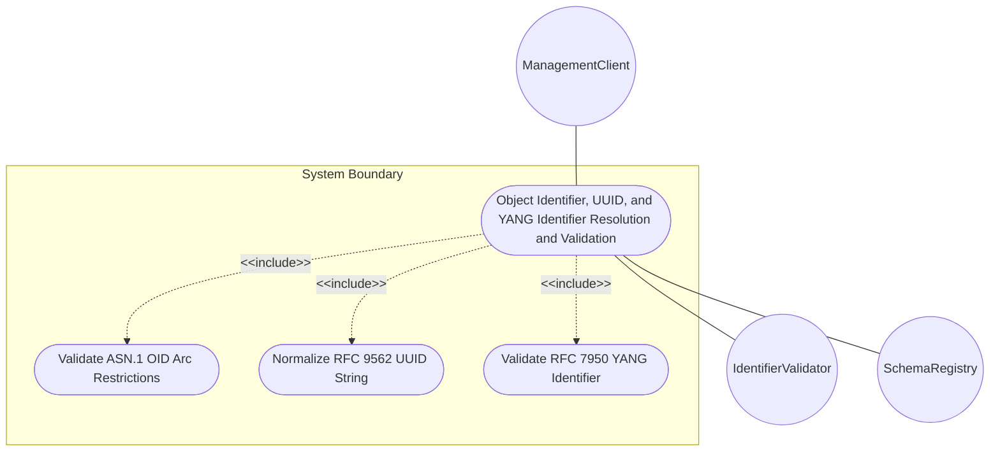
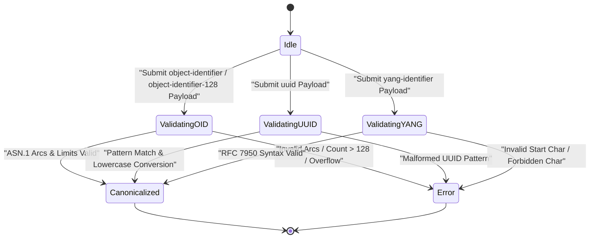

# Use Case: Object Identifier, UUID, and YANG Identifier Resolution and Validation

## Parent Epic
- [ ] #5 - [[ietf-yang-types]: Common YANG Data Types](https://github.com/gintatkinson/3dgs-037/blob/main/docs/epics/epic-01-ietf-yang-types.md) (Parent Epic for common YANG data types)

## 1. Actors
- **Primary Actor:** ManagementClient
- **Secondary Actors:** IdentifierValidator, SchemaRegistry

## 2. Preconditions
- System has loaded `ietf-yang-types@2025-12-22.yang` module.
- `SchemaRegistry` is active and ready to parse identifier attributes.

## 3. Trigger
`ManagementClient` submits an object identifier, UUID, or YANG identifier string for validation, syntax checking, or canonicalization.

## 4. Main Success Scenario (Basic Flow)
1. `ManagementClient` sends identifier payload containing `object-identifier`, `object-identifier-128`, `uuid`, or `yang-identifier` strings.
2. `IdentifierValidator` validates ASN.1 root arc rules (first arc 0, 1, or 2; second arc 0..39 if root 0 or 1; minimum 2 sub-identifiers).
3. `IdentifierValidator` verifies 32-bit unsigned sub-identifier limits ($0 \le v \le 4294967295$) and max 128 sub-identifier restriction for `object-identifier-128`.
4. `IdentifierValidator` verifies RFC 9562 UUID pattern (`8-4-4-4-12` hex characters) and converts uppercase hex to canonical lowercase.
5. `IdentifierValidator` validates RFC 7950 YANG identifier syntax (`[a-zA-Z_][a-zA-Z0-9\-_.]*`, min length 1).
6. `IdentifierValidator` returns validation success confirmation and canonicalized identifier string to `ManagementClient`.

## 5. Alternate and Exception Flows
- **5a. Invalid OID Minimum Sub-identifier Count Exception (Branches from Basic Flow step 2):**
  1. `IdentifierValidator` detects an `object-identifier` payload with fewer than two sub-identifiers (e.g., `"1"`).
  2. `IdentifierValidator` rejects input with `OID_TOO_FEW_SUBIDENTIFIERS` error and aborts processing.
- **5b. Invalid ASN.1 OID Root Sub-identifier Exception (Branches from Basic Flow step 2):**
  1. `IdentifierValidator` detects root sub-identifier value $> 2$ (e.g., `"3.1.2"`).
  2. `IdentifierValidator` rejects input with `INVALID_OID_FIRST_ARC` error and returns error response.
- **5c. Invalid ASN.1 OID Second Arc Restriction Exception (Branches from Basic Flow step 2):**
  1. `IdentifierValidator` detects root sub-identifier `0` or `1` paired with a second arc $> 39$ (e.g., `"0.40.1"` or `"1.50.4"`).
  2. `IdentifierValidator` rejects input with `INVALID_OID_SECOND_ARC` error.
- **5d. OID Sub-identifier Value Range Overflow Exception (Branches from Basic Flow step 3):**
  1. `IdentifierValidator` detects a sub-identifier exceeding $2^{32}-1$ (e.g., `"1.3.4294967296"`).
  2. `IdentifierValidator` rejects input with `OID_SUBIDENTIFIER_OVERFLOW` error.
- **5e. OID Sub-identifier Leading Zero Exception (Branches from Basic Flow step 2):**
  1. `IdentifierValidator` detects non-zero sub-identifier with leading zeroes (e.g., `"1.3.01"`).
  2. `IdentifierValidator` rejects input with `INVALID_OID_FORMAT` error.
- **5f. OID Whitespace Violation Exception (Branches from Basic Flow step 2):**
  1. `IdentifierValidator` detects intermediate whitespace in OID string (e.g., `"1.3. 6.1"`).
  2. `IdentifierValidator` rejects input with `INVALID_OID_FORMAT` error.
- **5g. OID-128 Sub-identifier Inherited Constraint Violation Exception (Branches from Basic Flow step 3):**
  1. `IdentifierValidator` evaluates `object-identifier-128` string failing base OID ASN.1 arc rules.
  2. `IdentifierValidator` rejects input with `INVALID_OID_FIRST_ARC` or `INVALID_OID_SECOND_ARC` error.
- **5h. OID-128 Maximum Sub-identifier Count Overflow Exception (Branches from Basic Flow step 3):**
  1. `IdentifierValidator` detects `object-identifier-128` payload containing 129 or more sub-identifiers.
  2. `IdentifierValidator` rejects input with `OID_128_LIMIT_EXCEEDED` error.
- **5i. UUID Exact String Length Violation Exception (Branches from Basic Flow step 4):**
  1. `IdentifierValidator` detects UUID string length not equal to 36 characters (e.g., 35 or 37 chars).
  2. `IdentifierValidator` rejects input with `INVALID_UUID_FORMAT` error.
- **5j. Malformed UUID Pattern Exception (Branches from Basic Flow step 4):**
  1. `IdentifierValidator` detects UUID string failing 8-4-4-4-12 hex pattern formatting.
  2. `IdentifierValidator` rejects input with `INVALID_UUID_FORMAT` error.
- **5k. Non-Canonical Uppercase UUID Conversion Flow (Branches from Basic Flow step 4):**
  1. `IdentifierValidator` detects valid RFC 9562 UUID containing uppercase hexadecimal characters.
  2. `IdentifierValidator` converts string to canonical lowercase representation and returns success.
- **5l. YANG Identifier Minimum Length Violation Exception (Branches from Basic Flow step 5):**
  1. `IdentifierValidator` detects empty `yang-identifier` string (length 0).
  2. `IdentifierValidator` rejects input with `INVALID_YANG_IDENTIFIER_LENGTH` error.
- **5m. Invalid YANG Identifier Starting Character Exception (Branches from Basic Flow step 5):**
  1. `IdentifierValidator` detects `yang-identifier` starting with a digit, hyphen, or dot (e.g., `"123-node"` or `"-test"`).
  2. `IdentifierValidator` rejects input with `INVALID_YANG_IDENTIFIER_START` error.
- **5n. Invalid YANG Identifier Character Exception (Branches from Basic Flow step 5):**
  1. `IdentifierValidator` detects `yang-identifier` containing forbidden characters such as spaces or colons (e.g., `"interface:eth0"`).
  2. `IdentifierValidator` rejects input with `INVALID_YANG_IDENTIFIER_CHARACTER` error.
- **5o. Schema Container Unregistered Identifier Payload Exception (Branches from Basic Flow step 1):**
  1. `SchemaRegistry` fails to locate `ietf-yang-types:identifier-types` target container schema.
  2. `IdentifierValidator` returns `SCHEMA_NOT_FOUND` error to `ManagementClient`.
- **5p. OID Parsing Array Allocation Overflow Exception (Branches from Basic Flow step 3):**
  1. `IdentifierValidator` encounters integer parsing overflow while processing 64-bit numerical string in sub-identifier.
  2. `IdentifierValidator` rejects input with `OID_SUBIDENTIFIER_OVERFLOW` error.
- **5q. Malformed Payload Structure Exception (Branches from Basic Flow step 1):**
  1. `ManagementClient` sends non-string or null data types in identifier fields.
  2. `IdentifierValidator` rejects input with `INVALID_PAYLOAD_STRUCTURE` error.
- **5r. YANG 1.0 Legacy Reserved Word Context Handling Flow (Branches from Basic Flow step 5):**
  1. `IdentifierValidator` detects `yang-identifier` starting with `xml` (e.g., `"xml-element"`) in a YANG 1.0 restricted context.
  2. `IdentifierValidator` flags or rejects input with `YANG1_LEGACY_XML_PREFIX_RESERVED` error based on context configuration.

## 6. Postconditions (Guarantees)
- **Success Guarantee:** Identifiers are verified against normative syntax rules, OIDs satisfy ASN.1 arc restrictions, UUIDs canonicalized to lowercase.
- **Failure Guarantee:** Malformed identifiers are rejected with descriptive error codes, protecting system registries from injection or corruption.

## UML Diagrams
### Use Case Diagram

### State Machine Diagram

## 7. Operational Context
> **RFC 9911 §3.7 object-identifier:**
> The `object-identifier` type represents administratively assigned names in a registration-hierarchical-name tree. Values of this type are denoted as a sequence of numerical non-negative sub-identifier values. Each sub-identifier value MUST NOT exceed 2^32-1 (4294967295). Sub-identifiers are separated by single dots and without any intermediate whitespace.
> 
> The ASN.1 standard restricts the value space of the first sub-identifier to 0, 1, or 2. Furthermore, the value space of the second sub-identifier is restricted to the range 0 to 39 if the first sub-identifier is 0 or 1. Finally, the ASN.1 standard requires that an object identifier has always at least two sub-identifiers. The pattern captures these restrictions.
> 
> Although the number of sub-identifiers is not limited, module designers should realize that there may be implementations that stick with the SMIv2 limit of 128 sub-identifiers. This type is a superset of the SMIv2 OBJECT IDENTIFIER type since it is not restricted to 128 sub-identifiers. Hence, this type SHOULD NOT be used to represent the SMIv2 OBJECT IDENTIFIER type; the object-identifier-128 type SHOULD be used instead.
> 
> **RFC 9911 §3.8 object-identifier-128:**
> This type represents object-identifiers restricted to 128 sub-identifiers. In the value set and its semantics, this type is equivalent to the OBJECT IDENTIFIER type of the SMIv2.
> 
> **RFC 9911 §3.9 uuid:**
> A Universally Unique IDentifier in the string representation defined in RFC 9562. The canonical representation uses lowercase characters. The following is an example of a UUID in string representation: `f81d4fae-7dec-11d0-a765-00a0c91e6bf6`.
> 
> **RFC 9911 §3.10 yang-identifier:**
> A YANG identifier string as defined by the 'identifier' rule in Section 14 of RFC 7950. An identifier must start with an alphabetic character or an underscore followed by an arbitrary sequence of alphabetic or numeric characters, underscores, hyphens, or dots.
> 
> This definition conforms to YANG 1.1 defined in RFC 7950. In RFC 6991, this definition excluded all identifiers starting with any possible combination of the lowercase or uppercase character sequence 'xml', as required by YANG 1 defined in RFC 6020. If this type is used in a YANG 1 context, then this restriction still applies.

## 8. Realization Matrix
### Required User Stories
- [ ] #9 - [Object Identifier ASN.1 Arc Hierarchy and 128-Subidentifier Boundary Validation](https://github.com/gintatkinson/3dgs-037/blob/main/docs/user-stories/us-04-object-identifier-asn1-validation.md) (Validates object-identifier ASN.1 arc restrictions and object-identifier-128 sub-identifier limits)
- [ ] #10 - [RFC 9562 UUID Pattern Validation and Canonical Lowercase Normalization](https://github.com/gintatkinson/3dgs-037/blob/main/docs/user-stories/us-05-uuid-formatting-canonicalization.md) (Validates RFC 9562 UUID format and canonical lowercase representation)
- [ ] #11 - [RFC 7950 YANG Identifier Syntax Rules and Length Restriction Validation](https://github.com/gintatkinson/3dgs-037/blob/main/docs/user-stories/us-06-yang-identifier-syntax-validation.md) (Validates RFC 7950 YANG 1.1 identifier syntax and character rules)

### Required Features
- [ ] #2 - [[ietf-yang-types]: Identifier Data Types](https://github.com/gintatkinson/3dgs-037/blob/main/docs/features/feat-02-identifier-types.md) (Provides schema container identifier-types)

## Source References
Structural Schema: https://github.com/YangModels/yang/blob/main/standard/ietf/RFC/ietf-yang-types%402025-12-22.yang
Normative Specification: https://datatracker.ietf.org/doc/rfc9911/
