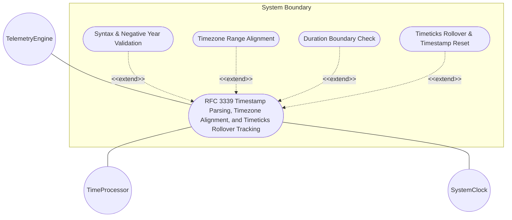
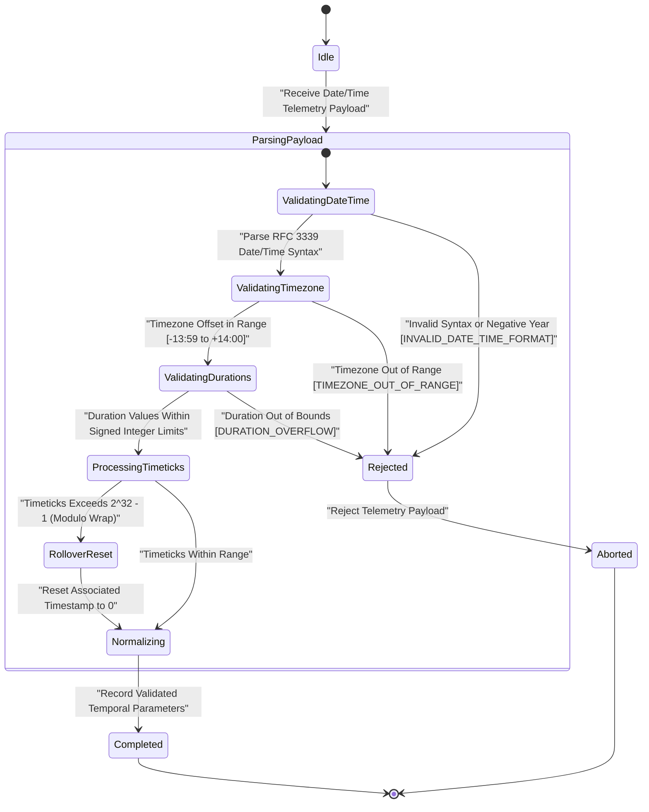

# Use Case: RFC 3339 Timestamp Parsing, Timezone Alignment, and Timeticks Rollover Tracking

## Parent Epic
- [ ] #5 - [[ietf-yang-types]: Common YANG Data Types](https://github.com/gintatkinson/3dgs-037/blob/main/docs/epics/epic-01-ietf-yang-types.md) (Parent Epic for common YANG data types)

## 1. Actors
- **Primary Actor:** `TelemetryEngine`
- **Secondary Actors:** `TimeProcessor`, `SystemClock`

## 2. Preconditions
- System has loaded `ietf-yang-types@2025-12-22.yang` module.
- `SystemClock` is synchronized to UTC reference time source (e.g. NTP).

## 3. Trigger
`TelemetryEngine` processes ISO 8601 / RFC 3339 date/time strings, time durations, or timeticks/timestamp telemetry metrics.

## 4. Main Success Scenario (Basic Flow)
1. `TelemetryEngine` receives date/time payload containing `date-and-time`, `date`, `date-no-zone`, `time`, `time-no-zone`, duration types (`hours32` through `nanoseconds64`), `timeticks`, or `timestamp` fields.
2. `TimeProcessor` parses RFC 3339 dateTime format, fractional seconds, and evaluates RFC 9557 time zone offset semantics (`Z` vs `+00:00`).
3. `TimeProcessor` validates leap second representation (`seconds = 60`) during valid leap second intervals.
4. `TimeProcessor` validates signed 32-bit and 64-bit integer duration boundaries for time period types.
5. `TimeProcessor` executes timeticks modulo $2^{32}$ (4294967296 hundredths of a second) wrap-around arithmetic.
6. `TimeProcessor` evaluates associated timestamp instances, resetting to zero whenever associated timeticks wrap around after ~497 days.
7. `TelemetryEngine` records validated temporal parameters and delivers normalized timestamps to consuming applications.

## 5. Alternate and Exception Flows
- **5a. Malformed Date/Time Syntax or Negative Year Exception (Branches from Basic Flow step 2):**
  1. `TimeProcessor` detects date/time string with negative year or invalid calendar date (e.g., Feb 30).
  2. `TimeProcessor` rejects input with `INVALID_DATE_TIME_FORMAT` or `NEGATIVE_YEAR_NOT_ALLOWED` error.
- **5b. Timezone Offset Range Exception (Branches from Basic Flow step 2):**
  1. `TimeProcessor` detects time zone offset exceeding range `-13:59` to `+14:00`.
  2. `TimeProcessor` rejects input with `TIMEZONE_OUT_OF_RANGE` error.
- **5c. Date-and-Time Regex Pattern Mismatch Exception (Branches from Basic Flow step 2):**
  1. `TimeProcessor` evaluates `date-and-time` payload string failing canonical ISO 8601 / RFC 3339 regex pattern.
  2. `TimeProcessor` rejects payload with `INVALID_DATE_TIME_FORMAT` error.
- **5d. Date Pattern Mismatch Exception (Branches from Basic Flow step 2):**
  1. `TimeProcessor` evaluates `date` field failing standard YYYY-MM-DD[Z|offset] regex pattern.
  2. `TimeProcessor` rejects payload with `INVALID_DATE_TIME_FORMAT` error.
- **5e. Date-No-Zone Timezone Offset Rejection (Branches from Basic Flow step 2):**
  1. `TimeProcessor` detects timezone offset string appended to a `date-no-zone` field.
  2. `TimeProcessor` rejects payload with `INVALID_DATE_TIME_FORMAT` error.
- **5f. Time Pattern Mismatch Exception (Branches from Basic Flow step 2):**
  1. `TimeProcessor` evaluates `time` field failing hh:mm:ss[.fff][Z|offset] regex pattern.
  2. `TimeProcessor` rejects payload with `INVALID_DATE_TIME_FORMAT` error.
- **5g. Time-No-Zone Timezone Offset Rejection (Branches from Basic Flow step 2):**
  1. `TimeProcessor` detects timezone offset string appended to a `time-no-zone` field.
  2. `TimeProcessor` rejects payload with `INVALID_DATE_TIME_FORMAT` error.
- **5h. Invalid Leap Second Placement Exception (Branches from Basic Flow step 3):**
  1. `TimeProcessor` detects seconds value `60` outside of valid designated leap second intervals.
  2. `TimeProcessor` rejects payload with `INVALID_LEAP_SECOND` error.
- **5i. Signed 32-bit Duration Overflow Exception (Branches from Basic Flow step 4):**
  1. `TimeProcessor` receives 32-bit duration value exceeding range `[-2147483648..2147483647]` (e.g. `2,400,000,000` microseconds in `microseconds32`).
  2. `TimeProcessor` rejects value with `DURATION_OVERFLOW` error.
- **5j. Signed 64-bit Duration Overflow Exception (Branches from Basic Flow step 4):**
  1. `TimeProcessor` receives 64-bit duration value exceeding range `[-9223372036854775808..9223372036854775807]`.
  2. `TimeProcessor` rejects value with `DURATION_OVERFLOW` error.
- **5k. Unsigned 32-bit Timeticks Out of Bounds Exception (Branches from Basic Flow step 5):**
  1. `TimeProcessor` receives negative or invalid timeticks count prior to modulo evaluation.
  2. `TimeProcessor` rejects value with `TIMETICKS_OUT_OF_BOUNDS` error.
- **5l. Timeticks Rollover and Associated Timestamp Reset (Branches from Basic Flow step 6):**
  1. `TimeProcessor` detects timeticks count reaching $2^{32}-1$ and wrapping around to 0 after ~497 days.
  2. `TimeProcessor` resets associated timestamp node instances to 0 for occurrences prior to the rollover event.

## 6. Postconditions (Guarantees)
- **Success Guarantee:** Date and time strings parsed per RFC 3339 / RFC 9557, time zone offsets aligned, duration boundaries checked, timeticks rollover tracked cleanly.
- **Failure Guarantee:** Malformed timestamps or out-of-range durations are rejected, preventing timeline corruption.

## UML Diagrams
### Use Case Diagram

### State Machine Diagram

## 7. Operational Context
> The `date-and-time` type is a profile of the ISO 8601 standard for representation of dates and times using the Gregorian calendar. The profile is defined by the date-time production in Section 5.6 of RFC 3339 and the update defined in Section 2 of RFC 9557. The value of 60 for seconds is allowed only in the case of leap seconds.
>
> The `date-and-time` type is compatible with the dateTime XML schema dateTime type with the following notable exceptions:
> (a) The `date-and-time` type does not allow negative years.
> (b) The time-offset `Z` indicates that the `date-and-time` value is reported in UTC and that the local time zone reference point is unknown. The time-offset `+00:00` indicates that the `date-and-time` value is reported in UTC and that the local time zone reference point is UTC (see Section 2 of RFC 9557).
>
> The canonical format for `date-and-time` values with a known time zone uses a numeric time zone offset that is calculated using the device's configured known offset to UTC time. A change of the device's offset to UTC time will cause `date-and-time` values to change accordingly. Such changes might happen periodically if a server automatically follows daylight saving time (DST) time zone offset changes. The canonical format for `date-and-time` values reported in UTC with an unknown local time zone offset SHOULD use the time-offset `Z` and MAY use `-00:00` for backwards compatibility.
>
> The `timeticks` type represents a non-negative integer that represents the time, modulo $2^{32}$ (4294967296 decimal), in hundredths of a second between two epochs. When a schema node is defined that uses this type, the description of the schema node identifies both of the reference epochs.
>
> The `timestamp` type represents the value of an associated `timeticks` schema node instance at which a specific occurrence happened. When the specific occurrence occurred prior to the last time the associated `timeticks` schema node instance was zero, then the timestamp value is zero. Note that this requires all timestamp values to be reset to zero when the value of the associated timeticks schema node instance reaches 497+ days and wraps around to zero.

## 8. Realization Matrix
### Required User Stories
- [ ] #12 - [RFC 3339 Date and Time Timestamp Parsing, Fractional Seconds, and RFC 9557 Timezone Offset Semantics](https://github.com/gintatkinson/3dgs-037/blob/main/docs/user-stories/us-07-date-time-timestamp-parsing.md) (Validates RFC 3339 and RFC 9557 date-and-time, date, and time parsing semantics)
- [ ] #13 - [Timeticks Modulo 2^32 Arithmetic and Associated Timestamp Reset](https://github.com/gintatkinson/3dgs-037/blob/main/docs/user-stories/us-08-timeticks-wrap-timestamp-reset.md) (Validates timeticks modulo 2^32 wrap-around and associated timestamp reset logic)

### Required Features
- [ ] #3 - [[ietf-yang-types]: Date and Time Data Types](https://github.com/gintatkinson/3dgs-037/blob/main/docs/features/feat-03-date-and-time-types.md) (Provides schema container date-and-time-types)

## Source References
Structural Schema: https://github.com/YangModels/yang/blob/main/standard/ietf/RFC/ietf-yang-types%402025-12-22.yang
Normative Specification: https://datatracker.ietf.org/doc/rfc9911/
