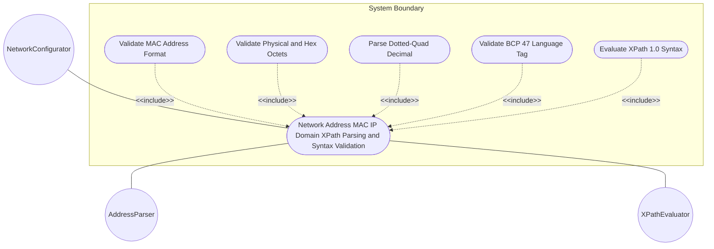
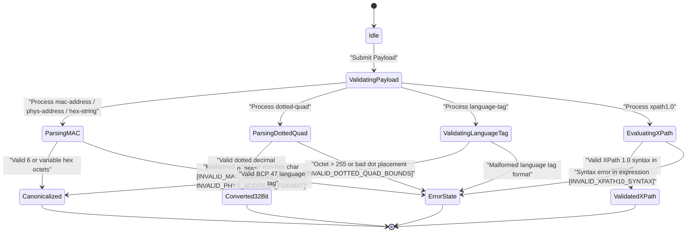

# Use Case: Network Address (MAC/IP/Domain/XPath) Parsing and Syntax Validation

## Parent Epic
- [ ] #5 - [[ietf-yang-types]: Common YANG Data Types](https://github.com/gintatkinson/3dgs-037/blob/main/docs/epics/epic-01-ietf-yang-types.md) (Parent Epic for common YANG data types)

## 1. Actors
- **Primary Actor:** NetworkConfigurator
- **Secondary Actors:** AddressParser, XPathEvaluator

## 2. Preconditions
- System has loaded `ietf-yang-types@2025-12-22.yang` module.
- Target schema node context is established for XPath expression evaluation.

## 3. Trigger
`NetworkConfigurator` submits network address, hex string, dotted-quad decimal, language tag, or XPath 1.0 expression payload for validation or canonicalization.

## 4. Main Success Scenario (Basic Flow)
1. `NetworkConfigurator` sends payload containing `phys-address`, `mac-address`, `hex-string`, `dotted-quad`, `language-tag`, or `xpath1.0` leaves.
2. `AddressParser` validates IEEE 802 48-bit MAC address format (6 colon-separated hex octets) and canonicalizes to lowercase.
3. `AddressParser` validates variable-length `phys-address` and `hex-string` colon-separated octet sequences, lowercasing canonical representation.
4. `AddressParser` parses `dotted-quad` decimal string (4 octets 0..255 separated by dots) into 32-bit unsigned integer.
5. `AddressParser` verifies RFC 5646 (BCP 47) language tag structure and canonicalizes to lowercase.
6. `XPathEvaluator` verifies XPath 1.0 expression grammar and syntax within the active schema context.
7. `AddressParser` returns validation success confirmation and canonical output to `NetworkConfigurator`.

## 5. Alternate and Exception Flows
- **5a. Malformed MAC Address Octet Count (Branches from Basic Flow step 2):**
  1. `AddressParser` detects `mac-address` string with fewer or more than 6 colon-separated octets.
  2. `AddressParser` rejects input with `INVALID_MAC_ADDRESS_FORMAT` error.
- **5b. Invalid Hex Pair or Separator in Physical Address (Branches from Basic Flow step 3):**
  1. `AddressParser` detects non-hex characters or malformed separators in `phys-address` or `hex-string`.
  2. `AddressParser` rejects input with `INVALID_PHYS_ADDRESS_FORMAT` or `INVALID_HEX_STRING_PATTERN` error.
- **5c. Out-of-Bounds Dotted-Quad Octet Value (Branches from Basic Flow step 4):**
  1. `AddressParser` detects `dotted-quad` octet $> 255$ or invalid dot placement.
  2. `AddressParser` rejects input with `INVALID_DOTTED_QUAD_BOUNDS` error.
- **5d. Malformed XPath 1.0 Grammar Exception (Branches from Basic Flow step 6):**
  1. `XPathEvaluator` detects syntax error in `xpath1.0` expression string.
  2. `XPathEvaluator` rejects expression with `INVALID_XPATH10_SYNTAX` error.
- **5e. Non-Hexadecimal Characters in MAC Address (Branches from Basic Flow step 2):**
  1. `AddressParser` detects non-hexadecimal character in `mac-address` payload.
  2. `AddressParser` rejects payload with `INVALID_MAC_ADDRESS_FORMAT` error.
- **5f. Upper-Case MAC Address Canonicalization Trigger (Branches from Basic Flow step 2):**
  1. `AddressParser` receives `mac-address` containing upper-case hex characters.
  2. `AddressParser` canonicalizes upper-case characters to lower-case and proceeds to step 7.
- **5g. Single Digit Octet in MAC Address (Branches from Basic Flow step 2):**
  1. `AddressParser` detects single-digit hex octet in `mac-address`.
  2. `AddressParser` rejects input with `INVALID_MAC_ADDRESS_FORMAT` error.
- **5h. Invalid Separator Character in MAC Address (Branches from Basic Flow step 2):**
  1. `AddressParser` detects hyphen or dot separators instead of colons in `mac-address`.
  2. `AddressParser` rejects input with `INVALID_MAC_ADDRESS_FORMAT` error.
- **5i. Empty MAC Address String Exception (Branches from Basic Flow step 2):**
  1. `AddressParser` detects mandatory `mac-address` leaf populated with empty string.
  2. `AddressParser` rejects input with `INVALID_MAC_ADDRESS_FORMAT` error.
- **5j. Empty Physical Address Handling (Branches from Basic Flow step 3):**
  1. `AddressParser` receives empty string for optional `phys-address` leaf.
  2. `AddressParser` validates empty string as allowed by pattern and proceeds to step 7.
- **5k. Odd Hex Character Sequence in Physical Address (Branches from Basic Flow step 3):**
  1. `AddressParser` detects odd number of hex digits in `phys-address`.
  2. `AddressParser` rejects input with `INVALID_PHYS_ADDRESS_FORMAT` error.
- **5l. Trailing Colon in Physical Address (Branches from Basic Flow step 3):**
  1. `AddressParser` detects trailing colon separator in `phys-address`.
  2. `AddressParser` rejects input with `INVALID_PHYS_ADDRESS_FORMAT` error.
- **5m. Leading Colon in Physical Address (Branches from Basic Flow step 3):**
  1. `AddressParser` detects leading colon separator in `phys-address`.
  2. `AddressParser` rejects input with `INVALID_PHYS_ADDRESS_FORMAT` error.
- **5n. Consecutive Colons in Hex String (Branches from Basic Flow step 3):**
  1. `AddressParser` detects consecutive colon separators in `hex-string`.
  2. `AddressParser` rejects input with `INVALID_HEX_STRING_PATTERN` error.
- **5o. Upper-Case Hex String Lowercasing (Branches from Basic Flow step 3):**
  1. `AddressParser` receives `hex-string` containing upper-case characters.
  2. `AddressParser` canonicalizes string to lowercase and proceeds to step 7.
- **5p. Empty Hex String Acceptance (Branches from Basic Flow step 3):**
  1. `AddressParser` receives empty string for `hex-string` leaf.
  2. `AddressParser` validates empty hex-string as compliant with pattern and proceeds to step 7.
- **5q. Less Than Four Octets in Dotted-Quad (Branches from Basic Flow step 4):**
  1. `AddressParser` detects `dotted-quad` string with fewer than 4 octets.
  2. `AddressParser` rejects input with `INVALID_DOTTED_QUAD_BOUNDS` error.
- **5r. More Than Four Octets in Dotted-Quad (Branches from Basic Flow step 4):**
  1. `AddressParser` detects `dotted-quad` string with more than 4 octets.
  2. `AddressParser` rejects input with `INVALID_DOTTED_QUAD_BOUNDS` error.
- **5s. Leading Zeroes in Dotted-Quad Octet (Branches from Basic Flow step 4):**
  1. `AddressParser` detects invalid leading zeroes in non-zero octet in `dotted-quad`.
  2. `AddressParser` rejects input with `INVALID_DOTTED_QUAD_BOUNDS` error.
- **5t. Malformed BCP 47 Language Tag Exception (Branches from Basic Flow step 5):**
  1. `AddressParser` receives malformed `language-tag` string failing RFC 5646 structural grammar.
  2. `AddressParser` rejects input with `INVALID_LANGUAGE_TAG_BCP47` error.
- **5u. Language Tag Upper-Case Lowercasing (Branches from Basic Flow step 5):**
  1. `AddressParser` receives `language-tag` with upper-case characters.
  2. `AddressParser` canonicalizes language tag to lowercase and proceeds to step 7.
- **5v. XPath 1.0 Unknown Function or Syntax Error (Branches from Basic Flow step 6):**
  1. `XPathEvaluator` encounters invalid function call or unmatched parenthesis in `xpath1.0` expression string.
  2. `XPathEvaluator` rejects expression with `INVALID_XPATH10_SYNTAX` error.

## 6. Postconditions (Guarantees)
- **Success Guarantee:** MAC/Physical addresses and hex strings canonicalized to lowercase, dotted-quad converted to 32-bit int, XPath 1.0 validated against schema context.
- **Failure Guarantee:** Malformed network addresses or invalid XPath strings are rejected with specific error states, protecting system configuration layer.

## UML Diagrams
### Use Case Diagram

### State Machine Diagram

## 7. Operational Context
> RFC 9911 §3.27: phys-address represents media- or physical-level addresses represented as a sequence of octets, each octet represented by two hexadecimal numbers. Octets are separated by colons. The canonical representation uses lowercase characters. In the value set and its semantics, this type is equivalent to the PhysAddress textual convention of the SMIv2.
>
> RFC 9911 §3.28: mac-address represents a 48-bit IEEE 802 Media Access Control (MAC) address. The canonical representation uses lowercase characters. Note that there are IEEE 802 MAC addresses with a different length that this type cannot represent. The phys-address type may be used to represent physical addresses of varying length.
>
> RFC 9911 §3.29: xpath1.0 represents an XPATH 1.0 expression. When a schema node is defined that uses this type, the description of the schema node MUST specify the XPath context in which the XPath expression is evaluated.
>
> RFC 9911 §3.30: hex-string represents a hexadecimal string with octets represented as hex digits separated by colons. The canonical representation uses lowercase characters.
>
> RFC 9911 §3.31: dotted-quad represents an unsigned 32-bit number expressed in the dotted-quad notation, i.e., four octets written as decimal numbers and separated with the '.' (full stop) character.
>
> RFC 9911 §3.32: language-tag represents a language tag according to RFC 5646 (BCP 47). The canonical representation uses lowercase characters. Values of this type must be well-formed language tags, in conformance with the definition of well-formed tags in BCP 47.

## 8. Realization Matrix
### Required User Stories
- [ ] #14 - [IEEE 802 MAC Address and Physical Media Address Validation and Lowercase Canonicalization](https://github.com/gintatkinson/3dgs-037/blob/main/docs/user-stories/us-09-mac-and-phys-address-canonicalization.md) (Validates MAC address 48-bit octet format, physical media address variable octets, and canonical lowercasing)
- [ ] #15 - [Dotted-Quad Decimal Parsing to Unsigned Int32 and XPath 1.0 Expression Syntax Validation](https://github.com/gintatkinson/3dgs-037/blob/main/docs/user-stories/us-10-dotted-quad-and-xpath-validation.md) (Validates dotted-quad decimal notation parsing, XPath 1.0 syntax evaluation, and BCP 47 language tag formatting)

### Required Features
- [ ] #4 - [[ietf-yang-types]: Address and String Data Types](https://github.com/gintatkinson/3dgs-037/blob/main/docs/features/feat-04-address-and-string-types.md) (Provides schema container address-and-string-types)

## Source References
Structural Schema: https://github.com/YangModels/yang/blob/main/standard/ietf/RFC/ietf-yang-types%402025-12-22.yang
Normative Specification: https://datatracker.ietf.org/doc/rfc9911/
