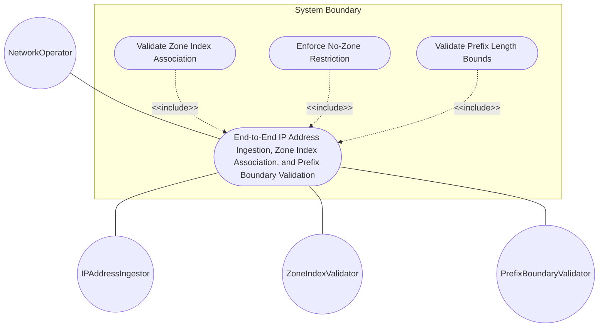
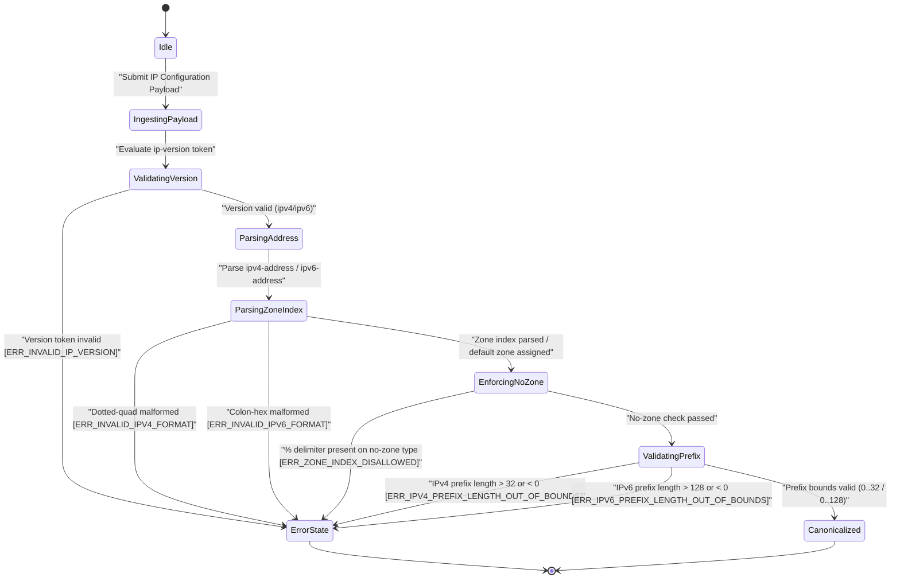

# Use Case: End-to-End IP Address Ingestion, Zone Index Association, and Prefix Boundary Validation

## Parent Epic
- [ ] #24 - [[ietf-inet-types]: Common Internet Data Types](https://github.com/gintatkinson/3dgs-037/blob/main/docs/epics/epic-02-ietf-inet-types.md) (Parent Epic specification for common Internet data types)

## 1. Actors
- **Primary Actor:** NetworkOperator
- **Secondary Actors:** IPAddressIngestor, ZoneIndexValidator, PrefixBoundaryValidator

## 2. Preconditions
- System has loaded `ietf-inet-types@2013-07-15.yang` module definitions.
- `IPAddressIngestor` engine is initialized and ready to receive IP host, scoped address, and CIDR prefix payloads.

## 3. Trigger
`NetworkOperator` submits an IP address configuration payload containing version declarations (`ip-version`), host/scoped addresses (`ip-address`, `ipv4-address`, `ipv6-address`), non-scoped strict addresses (`ip-address-no-zone`, `ipv4-address-no-zone`, `ipv6-address-no-zone`), or prefix block specifications (`ip-prefix`, `ipv4-prefix`, `ipv6-prefix`) for ingestion and boundary validation.

## 4. Main Success Scenario (Basic Flow)
1. `NetworkOperator` submits IP configuration payload containing version identifier, address strings, and network prefix specifications to `IPAddressIngestor`.
2. `IPAddressIngestor` evaluates protocol version token and confirms valid enumeration (`unknown(0)`, `ipv4(1)`, or `ipv6(2)`).
3. `IPAddressIngestor` passes IPv4/IPv6 host address string to `ZoneIndexValidator` for dotted-quad or colon-hex format validation.
4. `ZoneIndexValidator` parses optional `%`-delimited zone index (extracting interface index or name token) and canonicalizes address representation.
5. `IPAddressIngestor` verifies strict no-zone restrictions when target node is typed as `ip-address-no-zone`, `ipv4-address-no-zone`, or `ipv6-address-no-zone`, confirming absence of `%` delimiters.
6. `IPAddressIngestor` passes CIDR prefix notation string (`address/prefix-length`) to `PrefixBoundaryValidator`.
7. `PrefixBoundaryValidator` verifies prefix length bounds ($0 \le n \le 32$ for IPv4, $0 \le m \le 128$ for IPv6), computes MSB subnet mask, and canonicalizes non-prefix host bits to zero.
8. `IPAddressIngestor` returns ingestion success confirmation and canonicalized IP constructs to `NetworkOperator`.

## 5. Alternate and Exception Flows
- **5a. Invalid IP Version Enumeration Exception (Branches from Basic Flow step 2):**
  1. `IPAddressIngestor` detects version token or integer value outside allowed enumeration set `{unknown(0), ipv4(1), ipv6(2)}`.
  2. `IPAddressIngestor` aborts ingestion transaction, rejects payload with `ERR_INVALID_IP_VERSION` error code, and notifies `NetworkOperator`.
- **5b. Malformed IPv4 Address Format Exception (Branches from Basic Flow step 3):**
  1. `ZoneIndexValidator` detects IPv4 address string with octet value $> 255$, illegal leading zeros in multi-digit octets, or incorrect dot counts.
  2. `ZoneIndexValidator` aborts address parsing, returns `ERR_INVALID_IPV4_FORMAT` error to `IPAddressIngestor`, and rejects payload.
- **5c. Malformed IPv6 Address Format Exception (Branches from Basic Flow step 3):**
  1. `ZoneIndexValidator` detects IPv6 address string with multiple `::` compressions, non-hexadecimal characters, or malformed group counts.
  2. `ZoneIndexValidator` aborts address parsing, returns `ERR_INVALID_IPV6_FORMAT` error to `IPAddressIngestor`, and rejects payload.
- **5d. Disallowed Zone Index Exception (Branches from Basic Flow step 5):**
  1. `IPAddressIngestor` detects `%` zone index delimiter in payload targeted to `ip-address-no-zone`, `ipv4-address-no-zone`, or `ipv6-address-no-zone`.
  2. `IPAddressIngestor` aborts ingestion, rejects input with `ERR_ZONE_INDEX_DISALLOWED` error code, and notifies `NetworkOperator`.
- **5e. IPv4 Prefix Length Out of Bounds Exception (Branches from Basic Flow step 7):**
  1. `PrefixBoundaryValidator` detects IPv4 prefix length value $< 0$ or $> 32$ (e.g. `/33`).
  2. `PrefixBoundaryValidator` aborts calculation, returns `ERR_IPV4_PREFIX_LENGTH_OUT_OF_BOUNDS` error code to `IPAddressIngestor`, and rejects payload.
- **5f. IPv6 Prefix Length Out of Bounds Exception (Branches from Basic Flow step 7):**
  1. `PrefixBoundaryValidator` detects IPv6 prefix length value $< 0$ or $> 128$ (e.g. `/129`).
  2. `PrefixBoundaryValidator` aborts calculation, returns `ERR_IPV6_PREFIX_LENGTH_OUT_OF_BOUNDS` error code to `IPAddressIngestor`, and rejects payload.
- **5g. Disallowed Zone Index on Strict IPv6 Address Exception (Branches from Basic Flow step 5):**
  1. `IPAddressIngestor` detects `%` zone index delimiter in payload targeted to `ipv6-address-no-zone`.
  2. `IPAddressIngestor` aborts ingestion, rejects input with `ERR_ZONE_INDEX_DISALLOWED` error code, and notifies `NetworkOperator`.
- **5h. Disallowed Zone Index on Strict Neutral IP Address Exception (Branches from Basic Flow step 5):**
  1. `IPAddressIngestor` detects `%` zone index delimiter in payload targeted to `ip-address-no-zone`.
  2. `IPAddressIngestor` aborts ingestion, rejects input with `ERR_ZONE_INDEX_DISALLOWED` error code, and notifies `NetworkOperator`.
- **5i. Negative IPv4 Prefix Length Exception (Branches from Basic Flow step 7):**
  1. `PrefixBoundaryValidator` detects negative IPv4 prefix length value (e.g. `/-1`).
  2. `PrefixBoundaryValidator` aborts calculation, returns `ERR_IPV4_PREFIX_LENGTH_OUT_OF_BOUNDS` error code to `IPAddressIngestor`, and rejects payload.
- **5j. Negative IPv6 Prefix Length Exception (Branches from Basic Flow step 7):**
  1. `PrefixBoundaryValidator` detects negative IPv6 prefix length value (e.g. `/-5`).
  2. `PrefixBoundaryValidator` aborts calculation, returns `ERR_IPV6_PREFIX_LENGTH_OUT_OF_BOUNDS` error code to `IPAddressIngestor`, and rejects payload.
- **5k. Invalid Characters in IPv4 Dotted-Quad Exception (Branches from Basic Flow step 3):**
  1. `ZoneIndexValidator` detects alpha or special characters within IPv4 dotted-quad octets.
  2. `ZoneIndexValidator` aborts parsing, returns `ERR_INVALID_IPV4_FORMAT` error to `IPAddressIngestor`, and rejects payload.
- **5l. Non-Hexadecimal Characters in IPv6 Address Exception (Branches from Basic Flow step 3):**
  1. `ZoneIndexValidator` detects non-hexadecimal character (e.g. `g..z`) inside IPv6 colon-hex blocks.
  2. `ZoneIndexValidator` aborts parsing, returns `ERR_INVALID_IPV6_FORMAT` error to `IPAddressIngestor`, and rejects payload.
- **5m. Incorrect Octet Count in IPv4 Dotted-Quad Exception (Branches from Basic Flow step 3):**
  1. `ZoneIndexValidator` detects IPv4 address with fewer or more than 4 dot-separated octets.
  2. `ZoneIndexValidator` aborts parsing, returns `ERR_INVALID_IPV4_FORMAT` error to `IPAddressIngestor`, and rejects payload.
- **5n. Insufficient Group Count in IPv6 Address Exception (Branches from Basic Flow step 3):**
  1. `ZoneIndexValidator` detects uncompressed IPv6 address string with fewer than 8 colon-hex blocks.
  2. `ZoneIndexValidator` aborts parsing, returns `ERR_INVALID_IPV6_FORMAT` error to `IPAddressIngestor`, and rejects payload.
- **5o. Invalid Zone Index Character Format Exception (Branches from Basic Flow step 4):**
  1. `ZoneIndexValidator` detects illegal non-alphanumeric characters following `%` zone delimiter.
  2. `ZoneIndexValidator` aborts zone parsing, returns `ERR_INVALID_IPV4_FORMAT` or `ERR_INVALID_IPV6_FORMAT` error code to `IPAddressIngestor`, and rejects payload.
- **5p. Host Bit Zero-Canonicalization Flow (Branches from Basic Flow step 7):**
  1. `PrefixBoundaryValidator` detects non-zero host bits in CIDR prefix specification (e.g. `192.168.1.1/24`).
  2. `PrefixBoundaryValidator` zeroes out non-prefix host bits to canonicalize prefix (`192.168.1.0/24`) and proceeds to step 8 of Main Success Scenario.

## 6. Postconditions (Guarantees)
- **Success Guarantee:** Validated IP addresses are ingested with zone index scoping separated, no-zone constraints enforced, CIDR prefixes verified within bit boundaries, and host bits canonicalized to zero.
- **Failure Guarantee:** Any invalid IP version, malformed dotted-quad/colon-hex string, prohibited zone index, or out-of-bounds prefix length triggers transaction abort and returns explicit exception code without altering system IP tables.

## UML Diagrams
### Use Case Diagram

### State Machine Diagram

## 7. Operational Context
> RFC 6021 §3.1: ip-version represents the version of the IP protocol (unknown, ipv4, ipv6). In the value set and its semantics, this type is equivalent to the InetVersion textual convention of the SMIv2.
>
> RFC 6021 §3.2: ip-address represents an IP address and is IP version neutral. The format of the textual representation implies the IP version. This type supports scoped addresses by allowing zone identifiers in the address format.
>
> RFC 6021 §3.3: ipv4-address represents an IPv4 address in dotted-quad notation. The IPv4 address may include a zone index, separated by a % sign. The zone index is used to disambiguate identical address values.
>
> RFC 6021 §3.4: ipv6-address represents an IPv6 address in full, mixed, shortened, and shortened-mixed notation. The IPv6 address may include a zone index, separated by a % sign. The canonical format of IPv6 addresses uses RFC 5952 recommendations.
>
> RFC 6021 §3.5: ip-address-no-zone represents an IP address and is IP version neutral, but does not support scoped addresses since it does not allow zone identifiers in the address format.
>
> RFC 6021 §3.8: ip-prefix represents an IP prefix and is IP version neutral. ipv4-prefix length must be less than or equal to 32. ipv6-prefix length must be less than or equal to 128. Canonical format has all bits of the address set to zero that are not part of the prefix.

## 8. Realization Matrix
### Required User Stories
- [ ] #25 - [[ietf-inet-types]: IPv4 and IPv6 Address Format Validation, Zone Index Parsing, and Hex Normalization](https://github.com/gintatkinson/3dgs-037/blob/main/docs/user-stories/us-11-ip-address-zone-index-validation.md) (Validates IPv4/v6 address format rules, zone index percent-delimiter extraction, and no-zone restriction enforcement)
- [ ] #26 - [[ietf-inet-types]: IPv4 and IPv6 Prefix Notation Parsing, Subnet Mask Calculation, and Prefix-Length Bound Enforcement](https://github.com/gintatkinson/3dgs-037/blob/main/docs/user-stories/us-12-ip-prefix-and-subnet-range-calculation.md) (Validates IPv4/v6 prefix length bounds 0..32 and 0..128, subnet mask MSB calculation, and zero-host-bits canonicalization)

### Required Features
- [ ] #20 - [[ietf-inet-types]: IP Address Data Types](https://github.com/gintatkinson/3dgs-037/blob/main/docs/features/feat-05-ip-address-types.md) (Defines IPv4/v6 address typedefs, zone index scoping, no-zone variants, and prefix CIDR block validation)

## Source References
Structural Schema: https://github.com/YangModels/yang/blob/main/standard/ietf/RFC/ietf-inet-types%402013-07-15.yang
Normative Specification: https://datatracker.ietf.org/doc/rfc6021/
