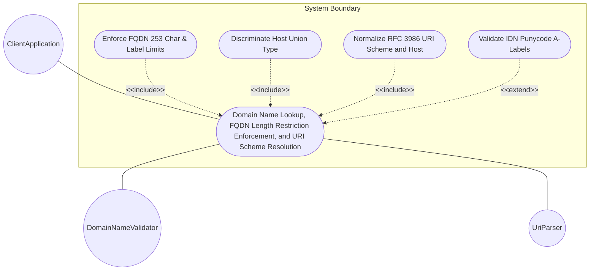
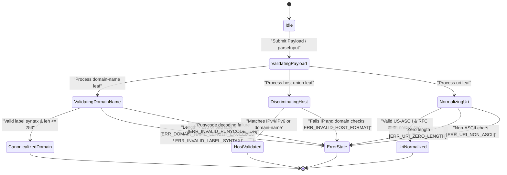

# Use Case: Domain Name Lookup, FQDN Length Restriction Enforcement, and URI Scheme Resolution

## Parent Epic
- [ ] #24 - [[ietf-inet-types]: Common Internet Data Types](https://github.com/gintatkinson/3dgs-037/blob/main/docs/epics/epic-02-ietf-inet-types.md) (Parent Epic specification for common Internet data types)

## 1. Actors
- **Primary Actor:** ClientApplication
- **Secondary Actors:** DomainNameValidator, UriParser

## 2. Preconditions
- The system has initialized the `ietf-inet-types@2013-07-15.yang` module definitions for `domain-name`, `host`, and `uri` data types.
- The validation engine is active and ready to process domain names, host union structures, and RFC 3986 URI strings.

## 3. Trigger
`ClientApplication` submits a `domain-name`, `host` (union of IP address or domain name), or `uri` string payload to the system for syntax validation, FQDN length constraint verification, canonicalization, host resolution, or scheme normalization.

## 4. Main Success Scenario (Basic Flow)
1. `ClientApplication` transmits a payload containing `domain-name`, `host`, or `uri` attribute values to `DomainNameValidator` and `UriParser`.
2. `DomainNameValidator` validates the `domain-name` string against US-ASCII syntax, verifies that total length is between 1 and 253 characters (representing 255-octet DNS wire format limit), ensures dot-separated labels do not exceed 63 characters each, and canonicalizes upper-case characters to lower-case.
3. `DomainNameValidator` processes `host` union input by discriminating between IP address formats (IPv4 dotted-quad or IPv6 hex-colon with optional zone indices) and `domain-name` syntax, validating that the input conforms to one of the valid host types.
4. `UriParser` validates `uri` input string syntax against STD 66 / RFC 3986 generic URI grammar, enforcing minimum 1-character length (non-zero), US-ASCII encoding, scheme/host lowercasing, hex percent-encoding uppercasing, and unreserved percent-encoding removal.
5. `DomainNameValidator` decodes Internationalized Domain Names (IDN) present as A-labels (`xn--...`) per RFC 5890 to verify Punycode structure compliance.
6. `DomainNameValidator` and `UriParser` return the normalized, canonicalized strings and validation confirmation to `ClientApplication`.

## 5. Alternate and Exception Flows
- **5a. FQDN Total Length Exceeded (Branches from Basic Flow step 2):**
  1. `DomainNameValidator` receives a `domain-name` string exceeding 253 characters in total length.
  2. `DomainNameValidator` aborts validation and returns error code `ERR_DOMAIN_NAME_LENGTH_EXCEEDED` to `ClientApplication`.
- **5b. Empty Domain Name String Exception (Branches from Basic Flow step 2):**
  1. `DomainNameValidator` receives a zero-length empty string (`""`) for mandatory `domain-name`.
  2. `DomainNameValidator` aborts validation and returns error code `ERR_DOMAIN_NAME_LENGTH_EXCEEDED` to `ClientApplication`.
- **5c. Individual Label Length Exceeding 63 Octets (Branches from Basic Flow step 2):**
  1. `DomainNameValidator` encounters a dot-separated label within `domain-name` containing more than 63 characters.
  2. `DomainNameValidator` aborts validation and returns error code `ERR_INVALID_LABEL_SYNTAX` to `ClientApplication`.
- **5d. Label Starting with Invalid Hyphen (Branches from Basic Flow step 2):**
  1. `DomainNameValidator` detects a domain name label beginning with a hyphen (`-label.com`).
  2. `DomainNameValidator` aborts validation and returns error code `ERR_INVALID_LABEL_SYNTAX` to `ClientApplication`.
- **5e. Label Ending with Invalid Hyphen (Branches from Basic Flow step 2):**
  1. `DomainNameValidator` detects a domain name label ending with a hyphen (`label-.com`).
  2. `DomainNameValidator` aborts validation and returns error code `ERR_INVALID_LABEL_SYNTAX` to `ClientApplication`.
- **5f. Invalid Special Characters in Domain Label (Branches from Basic Flow step 2):**
  1. `DomainNameValidator` detects disallowed characters (such as spaces, exclamations, or colons) inside a domain label.
  2. `DomainNameValidator` aborts validation and returns error code `ERR_INVALID_LABEL_SYNTAX` to `ClientApplication`.
- **5g. Upper-Case Domain Name Lowercasing (Branches from Basic Flow step 2):**
  1. `DomainNameValidator` receives domain name string containing upper-case US-ASCII characters (`EXAMPLE.COM`).
  2. `DomainNameValidator` canonicalizes string to lowercase (`example.com`) and proceeds to step 6.
- **5h. Root Domain Dot Handling (Branches from Basic Flow step 2):**
  1. `DomainNameValidator` receives single root domain string `.` (length 1).
  2. `DomainNameValidator` validates root domain syntax and proceeds to step 6.
- **5i. Trailing Dot FQDN Validation (Branches from Basic Flow step 2):**
  1. `DomainNameValidator` receives fully qualified domain name with trailing dot (`sub.example.com.`).
  2. `DomainNameValidator` validates root-anchored FQDN syntax and proceeds to step 6.
- **5j. Invalid Host Format Rejection (Branches from Basic Flow step 3):**
  1. `DomainNameValidator` receives `host` payload string failing both IP address (IPv4/IPv6) and domain name syntax validation.
  2. `DomainNameValidator` aborts validation and returns error code `ERR_INVALID_HOST_FORMAT` to `ClientApplication`.
- **5k. Host IPv4 Dotted-Quad Discrimination (Branches from Basic Flow step 3):**
  1. `DomainNameValidator` identifies `host` input string as matching IPv4 dotted-quad syntax (`192.0.2.1`).
  2. `DomainNameValidator` resolves host union type as `inet:ip-address` and proceeds to step 6.
- **5l. Host IPv6 Hex-Colon Discrimination (Branches from Basic Flow step 3):**
  1. `DomainNameValidator` identifies `host` input string as matching IPv6 hex-colon syntax (`2001:db8::1`).
  2. `DomainNameValidator` resolves host union type as `inet:ip-address` and proceeds to step 6.
- **5m. Host IPv6 Zone Index Discrimination (Branches from Basic Flow step 3):**
  1. `DomainNameValidator` identifies `host` input string as scoped IPv6 with zone index (`fe80::1%eth0`).
  2. `DomainNameValidator` resolves host union type as `inet:ip-address` and proceeds to step 6.
- **5n. Host Domain Name Discrimination (Branches from Basic Flow step 3):**
  1. `DomainNameValidator` evaluates `host` input string and determines it does not match IP address format but matches valid domain name syntax (`host.example.com`).
  2. `DomainNameValidator` resolves host union type as `inet:domain-name` and proceeds to step 6.
- **5o. Zero-Length URI Rejection (Branches from Basic Flow step 4):**
  1. `UriParser` detects empty string (`""`) for `uri` parameter payload.
  2. `UriParser` aborts processing and returns error code `ERR_URI_ZERO_LENGTH` to `ClientApplication`.
- **5p. Non-ASCII URI Character Rejection (Branches from Basic Flow step 4):**
  1. `UriParser` detects raw non-US-ASCII Unicode characters in `uri` string.
  2. `UriParser` aborts processing and returns error code `ERR_URI_NON_ASCII` to `ClientApplication`.
- **5q. URI Scheme and Host Lowercase Normalization (Branches from Basic Flow step 4):**
  1. `UriParser` receives `uri` containing upper-case scheme or host components (`HTTP://EXAMPLE.COM/path`).
  2. `UriParser` normalizes scheme and host to lowercase (`http://example.com/path`) and proceeds to step 6.
- **5r. URI Hex Percent-Encoding Uppercasing (Branches from Basic Flow step 4):**
  1. `UriParser` receives `uri` containing lower-case percent-encoded hexadecimal digits (`%3a` or `%2f`).
  2. `UriParser` normalizes percent-encoded hex digits to uppercase (`%3A`, `%2F`) and proceeds to step 6.
- **5s. Unreserved Percent-Encoding Removal (Branches from Basic Flow step 4):**
  1. `UriParser` receives `uri` containing percent-encoded unreserved ASCII characters (`%7E` or `%41`).
  2. `UriParser` decodes unreserved characters to native US-ASCII (`~`, `A`) and proceeds to step 6.
- **5t. Invalid Punycode IDN A-Label Decoding (Branches from Basic Flow step 5):**
  1. `DomainNameValidator` receives Internationalized Domain Name label starting with `xn--` that fails RFC 5890 Punycode decoding.
  2. `DomainNameValidator` aborts processing and returns error code `ERR_INVALID_PUNYCODE_IDN` to `ClientApplication`.

## 6. Postconditions (Guarantees)
- **Success Guarantee:** `domain-name` is verified within 1..253 character limit and canonicalized to lower-case US-ASCII; `host` union is correctly discriminated and validated as an IP address or domain name; `uri` is validated against RFC 3986 and normalized (lowercased scheme/host, uppercased hex percent-encodings, unreserved percent-encodings decoded).
- **Failure Guarantee:** Any input violating domain length, label syntax, host format, URI length, ASCII encoding, or Punycode IDN rules is rejected with an explicit error code (`ERR_DOMAIN_NAME_LENGTH_EXCEEDED`, `ERR_INVALID_LABEL_SYNTAX`, `ERR_INVALID_HOST_FORMAT`, `ERR_URI_ZERO_LENGTH`, `ERR_URI_NON_ASCII`, `ERR_INVALID_PUNYCODE_IDN`), leaving system state unchanged.

## UML Diagrams
### Use Case Diagram

### State Machine Diagram

## 7. Operational Context
> RFC 6021 § Domain Name Definition: The domain-name type represents a DNS domain name. The name SHOULD be fully qualified whenever possible. Internet domain names are only loosely specified. Section 3.5 of RFC 1034 recommends a syntax (modified in Section 2.1 of RFC 1123). The pattern above is intended to allow for current practice in domain name use, and some possible future expansion.
>
> RFC 6021 § Domain Name Wire Format Limit: The encoding of DNS names in the DNS protocol is limited to 255 characters. Since the encoding consists of labels prefixed by length bytes and there is a trailing NULL byte, only 253 characters can appear in the textual dotted notation. Domain-name values use the US-ASCII encoding. Their canonical format uses lowercase US-ASCII characters. Internationalized domain names MUST be A-labels as per RFC 5890.
>
> RFC 6021 § Host Union Definition: The host type represents either an IP address or a DNS domain name.
>
> RFC 6021 § URI Definition: The uri type represents a Uniform Resource Identifier (URI) as defined by STD 66. Objects using the uri type MUST be in US-ASCII encoding, and MUST be normalized as described by RFC 3986 Sections 6.2.1, 6.2.2.1, and 6.2.2.2. All unnecessary percent-encoding is removed, and all case-insensitive characters are set to lowercase except for hexadecimal digits, which are normalized to uppercase. A zero-length URI is not a valid URI.

## 8. Realization Matrix
### Required User Stories
- [ ] #27 - [[ietf-inet-types]: RFC 1034 / RFC 1123 Domain Name Syntax Validation, FQDN Length Restrictions, and RFC 3986 URI Parsing](https://github.com/gintatkinson/3dgs-037/blob/main/docs/user-stories/us-13-domain-name-and-uri-syntax-parsing.md) (Validates DNS domain name label/total length limits, host union discrimination, and RFC 3986 URI syntax normalization)

### Required Features
- [ ] #21 - [[ietf-inet-types]: Domain Name and Host Data Types](https://github.com/gintatkinson/3dgs-037/blob/main/docs/features/feat-06-domain-name-and-host-types.md) (Defines DNS domain name syntax, host union types, and RFC 3986 URI normalization rules)

## Source References
Structural Schema: https://github.com/YangModels/yang/blob/main/standard/ietf/RFC/ietf-inet-types%402013-07-15.yang
Normative Specification: https://datatracker.ietf.org/doc/rfc6021/
