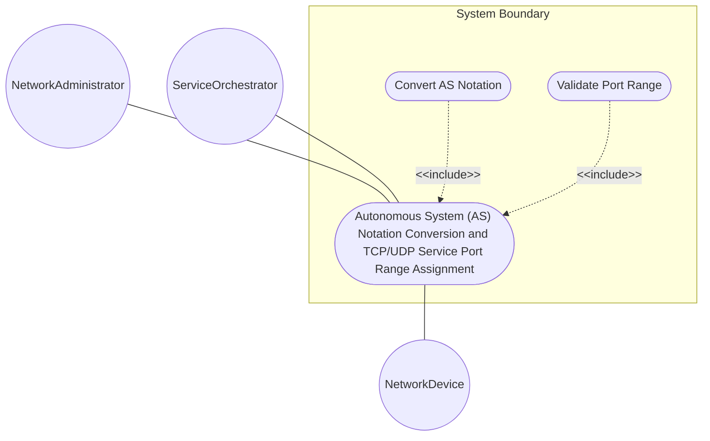
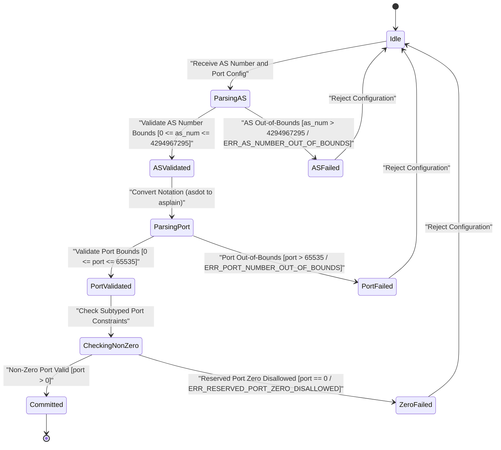

# Use Case: Autonomous System (AS) Notation Conversion and TCP/UDP Service Port Range Assignment

## Parent Epic
- [ ] #24 - [[ietf-inet-types]: Common Internet Data Types](https://github.com/gintatkinson/3dgs-037/blob/main/docs/epics/epic-02-ietf-inet-types.md) (Parent Epic specification for common Internet data types)

## 1. Actors
- **Primary Actor:** NetworkAdministrator
- **Secondary Actors:** ServiceOrchestrator, NetworkDevice

## 2. Preconditions
- System has loaded `ietf-inet-types@2013-07-15.yang` module.
- Network routing and service configuration parameters are provided in string or integer representation for Autonomous System (AS) numbers and transport port specifications.

## 3. Trigger
`NetworkAdministrator` or `ServiceOrchestrator` submits a BGP routing or service configuration request containing Autonomous System numbers (`as-number`) or transport port numbers (`port-number`) for validation, notation conversion, and range assignment.

## 4. Main Success Scenario (Basic Flow)
1. `NetworkAdministrator` or `ServiceOrchestrator` submits configuration containing AS numbers in 2-byte/4-byte `asdot` notation (`"65535.65535"`) or `asplain` decimal format (`"4294967295"`) and transport port range parameters (`port-number`).
2. `System` parses AS number input and validates 32-bit uint32 bounds ($0 \dots 4294967295$).
3. `System` converts `asdot` notation (`"X.Y"`) to 32-bit plain integer representation (`(X * 65536) + Y`) or validates native `asplain` representation.
4. `System` parses transport port parameters and validates 16-bit uint16 range bounds ($0 \dots 65535$).
5. `System` enforces non-zero constraints for subtyped port definitions (`port-number` vs restricted port ranges requiring $> 0$).
6. `System` commits valid AS notation, AS plain values, and port assignments to active routing configuration.

## 5. Alternate and Exception Flows
- **5a. AS Number Out-of-Bounds Validation Failure (`ERR_AS_NUMBER_OUT_OF_BOUNDS`) (Branches from Basic Flow step 2):**
  1. `System` receives AS number value exceeding $4294967295$ or invalid dot notation (`"65536.1"`).
  2. `System` rejects configuration with error `ERR_AS_NUMBER_OUT_OF_BOUNDS` and aborts transaction without mutating state.
- **5b. Transport Port Out-of-Bounds Exception (`ERR_PORT_NUMBER_OUT_OF_BOUNDS`) (Branches from Basic Flow step 4):**
  1. `System` receives transport port number exceeding $65535$ (e.g., `70000`).
  2. `System` rejects port assignment with error `ERR_PORT_NUMBER_OUT_OF_BOUNDS`, logs range violation, and returns failure response.
- **5c. Reserved Port Zero Disallowed Failure (`ERR_RESERVED_PORT_ZERO_DISALLOWED`) (Branches from Basic Flow step 5):**
  1. `System` receives port number `0` for subtyped port leaf configured with non-zero constraint (`1..65535`).
  2. `System` rejects input with error `ERR_RESERVED_PORT_ZERO_DISALLOWED`, rolls back port binding, and notifies caller.

## 6. Postconditions (Guarantees)
- **Success Guarantee:** AS numbers are validated and converted to canonical representations, TCP/UDP port range bounds ($0 \dots 65535$) and non-zero port constraints are verified, and routing/service configuration is successfully committed.
- **Failure Guarantee:** Out-of-bounds AS numbers or port numbers trigger precise error codes (`ERR_AS_NUMBER_OUT_OF_BOUNDS`, `ERR_PORT_NUMBER_OUT_OF_BOUNDS`, `ERR_RESERVED_PORT_ZERO_DISALLOWED`), aborting configuration without state side-effects.

## UML Diagrams
### Use Case Diagram

### State Machine Diagram

## 7. Operational Context
> RFC 6021 §3: typedef as-number { type uint32; description "The as-number type represents autonomous system numbers which identify an Autonomous System (AS). The AS number is a 32-bit unsigned integer."; }
>
> RFC 6021 §3: typedef port-number { type uint16 { range "0..65535"; } description "The port-number type represents a 16-bit port number of an Internet transport-layer protocol such as UDP, TCP, DCCP, or SCTP. Port numbers are assigned by IANA. A current list of all assignments is available from http://www.iana.org/."; }

## 8. Realization Matrix
### Required User Stories
- [ ] #28 - [[ietf-inet-types]: Autonomous System (AS) Number 2-Byte / 4-Byte Notation Parsing, AS Plain Conversions, and TCP/UDP Port Range Bounds (0..65535)](https://github.com/gintatkinson/3dgs-037/blob/main/docs/user-stories/us-14-as-number-and-port-range-validation.md) (Validates 32-bit AS number range bounds 0..4294967295, 16-bit transport port bounds 0..65535, and subtyped non-zero port constraints)

### Required Features
- [ ] #22 - [[ietf-inet-types]: Autonomous System and Port Number Data Types](https://github.com/gintatkinson/3dgs-037/blob/main/docs/features/feat-07-autonomous-system-and-port-types.md) (Defines 32-bit AS number typedefs and 16-bit transport port range constraints)

## Source References
Structural Schema: https://github.com/YangModels/yang/blob/main/standard/ietf/RFC/ietf-inet-types%402013-07-15.yang
Normative Specification: https://datatracker.ietf.org/doc/rfc6021/
