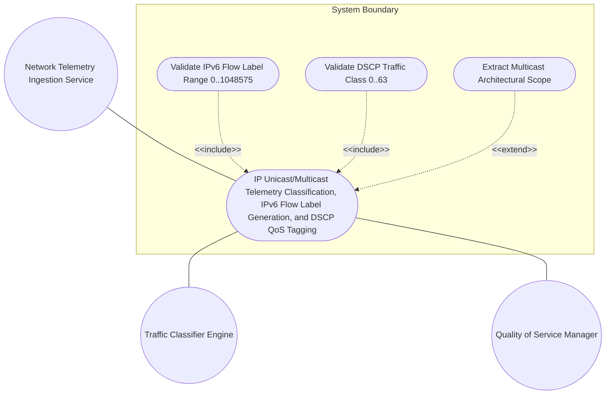
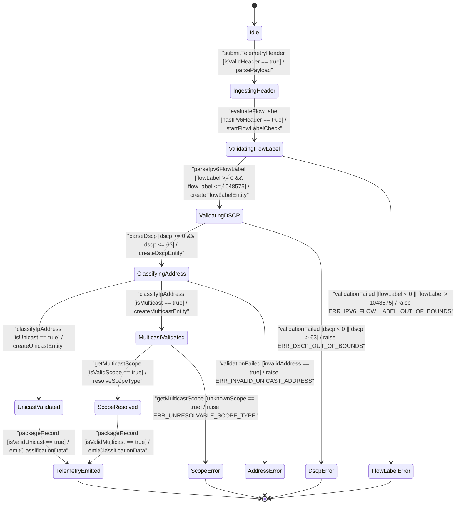

# Use Case: IP Unicast/Multicast Telemetry Classification, IPv6 Flow Label Generation, and DSCP QoS Tagging

## Parent Epic
- [ ] #24 - [[ietf-inet-types]: Common Internet Data Types](https://github.com/gintatkinson/3dgs-037/blob/main/docs/epics/epic-02-ietf-inet-types.md) (Parent Epic specification for common Internet data types)

## 1. Actors
- **Primary Actor:** Network Telemetry Ingestion Service
- **Secondary Actors:** Traffic Classifier Engine, Quality of Service Manager, IPv6 Flow Controller

## 2. Preconditions
- Network Telemetry Ingestion Service receives raw packet headers containing IP addresses, DSCP traffic class bits, and optional 20-bit IPv6 flow label values.
- Validation schema engine is initialized with `ietf-inet-types` structural boundaries (`ipv6-flow-label` 0..1048575, `dscp` 0..63, `224.0.0.0/4` and `ff00::/8` multicast space, scope type enumerations).

## 3. Trigger
Network Telemetry Ingestion Service receives a telemetry packet header tuple requiring address mode classification, IPv6 flow label validation, DSCP traffic class verification, and scope resolution.

## 4. Main Success Scenario (Basic Flow)
1. Network Telemetry Ingestion Service submits raw IPv6 flow label, DSCP traffic class, IP address, and scope parameters to the Traffic Classifier Engine.
2. Traffic Classifier Engine invokes `parseIpv6FlowLabel(flowLabel)` and verifies that the 20-bit integer falls strictly within the inclusive range 0 to 1048575 ($2^{20}-1$).
3. Quality of Service Manager invokes `parseDscp(dscpVal)` and verifies that the 6-bit DSCP code point falls strictly within the inclusive range 0 to 63 ($2^6-1$).
4. Traffic Classifier Engine evaluates the IP address string using `classifyIpAddress(address)` and `validateUnicastAddress(address)` to classify point-to-point unicast traffic excluding multicast blocks (`224.0.0.0/4` for IPv4, `ff00::/8` for IPv6).
5. Traffic Classifier Engine evaluates group destination addresses using `validateMulticastAddress(address)` to confirm placement within designated IPv4/IPv6 multicast space.
6. Traffic Classifier Engine extracts architectural scope using `getMulticastScope(address)` to resolve valid scope level (`interface-local`, `link-local`, `admin-local`, `site-local`, `organization-local`, `global`).
7. System constructs and emits fully validated telemetry classification data records containing flow label, DSCP tag, address mode (unicast/multicast), and scope level to the downstream routing pipeline.

## 5. Alternate and Exception Flows
- **5a. Out-of-Bounds IPv6 Flow Label (Branches from Basic Flow step 2):**
  1. Traffic Classifier Engine detects IPv6 flow label value less than `0` or greater than `1048575` ($2^{20}-1$).
  2. System aborts processing, raises `ERR_IPV6_FLOW_LABEL_OUT_OF_BOUNDS`, logs telemetry failure metadata, and discards the invalid flow label packet tuple.
- **5b. Out-of-Bounds DSCP Code Point (Branches from Basic Flow step 3):**
  1. Quality of Service Manager detects DSCP code point value less than `0` or greater than `63` ($2^6-1$).
  2. System aborts processing, raises `ERR_DSCP_OUT_OF_BOUNDS`, logs traffic class validation failure, and rejects QoS tagging request.
- **5c. Generic Multicast Address in Unicast Context (Branches from Basic Flow step 4):**
  1. Traffic Classifier Engine detects multicast address falling within `224.0.0.0/4` or `ff00::/8` supplied in a general IP unicast context.
  2. System aborts unicast classification, raises `ERR_INVALID_UNICAST_ADDRESS`, logs address type mismatch, and routes tuple to exception handler.
- **5d. IPv4 Multicast Block Address in IPv4 Unicast Context (Branches from Basic Flow step 4):**
  1. Traffic Classifier Engine detects IPv4 address falling inside multicast block `224.0.0.0` through `239.255.255.255` supplied for an IPv4 unicast parameter.
  2. System aborts IPv4 unicast processing, raises `ERR_INVALID_UNICAST_ADDRESS`, logs block violation, and drops packet tuple.
- **5e. IPv6 Multicast Prefix Address in IPv6 Unicast Context (Branches from Basic Flow step 4):**
  1. Traffic Classifier Engine detects IPv6 address starting with prefix `ff00::/8` supplied for an IPv6 unicast parameter.
  2. System aborts IPv6 unicast processing, raises `ERR_INVALID_UNICAST_ADDRESS`, logs prefix violation, and flags invalid IPv6 header.
- **5f. Non-Multicast IP Address in Multicast Context (Branches from Basic Flow step 5):**
  1. Traffic Classifier Engine receives point-to-point unicast address string or invalid IP formatting where a generic multicast group destination address is required.
  2. System aborts group routing, raises `ERR_INVALID_MULTICAST_ADDRESS`, logs group address failure, and terminates multicast session setup.
- **5g. Out-of-Range IPv4 Multicast Group Address (Branches from Basic Flow step 5):**
  1. Traffic Classifier Engine receives IPv4 address outside designated range `224.0.0.0` to `239.255.255.255` for IPv4 multicast group parameter.
  2. System aborts IPv4 group join, raises `ERR_INVALID_MULTICAST_ADDRESS`, logs IPv4 multicast range error, and drops join request.
- **5h. Non-FF00 Multicast Prefix in IPv6 Multicast Group (Branches from Basic Flow step 5):**
  1. Traffic Classifier Engine receives IPv6 address lacking mandatory 8-bit `ff00::/8` multicast prefix for IPv6 multicast parameter.
  2. System aborts IPv6 group registration, raises `ERR_INVALID_MULTICAST_ADDRESS`, logs IPv6 prefix failure, and rejects subscription.
- **5i. Unresolvable Architectural Scope Identifier (Branches from Basic Flow step 6):**
  1. Traffic Classifier Engine encounters unknown scope string or invalid 4-bit scope code not matching defined enumerations (`interface-local`, `link-local`, `admin-local`, `site-local`, `organization-local`, `global`).
  2. System aborts scope mapping, raises `ERR_UNRESOLVABLE_SCOPE_TYPE`, logs scope resolution failure, and falls back to default un-scoped state.

## 6. Postconditions (Guarantees)
- **Success Guarantee:** Telemetry records are accurately classified into unicast vs multicast address modes, IPv6 flow label range [0..1048575] is verified, DSCP QoS tag [0..63] is validated, multicast architectural scope is extracted, and packet tuples are dispatched to downstream routing engines.
- **Failure Guarantee:** Any invalid flow label, out-of-bounds DSCP, mismatched address mode, or unresolvable scope raises a specific exception (`ERR_IPV6_FLOW_LABEL_OUT_OF_BOUNDS`, `ERR_DSCP_OUT_OF_BOUNDS`, `ERR_INVALID_UNICAST_ADDRESS`, `ERR_INVALID_MULTICAST_ADDRESS`, `ERR_UNRESOLVABLE_SCOPE_TYPE`), aborts transaction processing, logs diagnostic error details, and leaves system classification state uncorrupted.

## UML Diagrams

### Use Case Diagram


### State Machine Diagram


## 7. Operational Context

> "The flow-label type represents flow identifier or Flow Label in an IPv6 packet header that may be used to discriminate traffic flows. In the value set and its semantics, this type is equivalent to the IPv6FlowLabel textual convention of the SMIv2."
> -- RFC 6021 Section 3 / `ietf-inet-types@2013-07-15.yang`

> "The dscp type represents a Differentiated Services Code-Point that may be used for marking packets in a traffic stream. In the value set and its semantics, this type is equivalent to the Dscp textual convention of the SMIv2."
> -- RFC 6021 Section 3 / `ietf-inet-types@2013-07-15.yang`

> "The ip-unicast-address type represents an IP unicast address. The ip-multicast-address type represents an IP multicast address."
> -- RFC 6021 Section 3 / `ietf-inet-types@2013-07-15.yang`

## 8. Realization Matrix

### Required User Stories
- [ ] #29 - [[ietf-inet-types]: IP Unicast vs Multicast Address Classification, IPv6 Flow Label Generation, and DSCP Code Point Validation](https://github.com/gintatkinson/3dgs-037/blob/main/docs/user-stories/us-15-ip-unicast-multicast-flow-label-classification.md) (Validates 20-bit IPv6 flow label range 0..1048575, 6-bit DSCP range 0..63, IP unicast vs multicast address classification, and multicast scope extraction)

### Required Features
- [ ] #23 - [[ietf-inet-types]: IP Unicast, Multicast, and Scope Data Types](https://github.com/gintatkinson/3dgs-037/blob/main/docs/features/feat-08-ip-unicast-multicast-and-scope-types.md) (Defines IPv6 flow label, DSCP traffic class, unicast/multicast classification, and architectural scope types)

## Source References
Structural Schema: https://github.com/YangModels/yang/blob/main/standard/ietf/RFC/ietf-inet-types%402013-07-15.yang
Normative Specification: https://datatracker.ietf.org/doc/rfc6021/

> [!WARNING]
> **Mermaid Block Closing Constraints & Code Fence Integrity:**
> - Every Mermaid diagram MUST be strictly closed with ```` ``` ```` on a new line. Leaking Mermaid blocks (e.g. having headings like `##` inside an unclosed diagram) or stray/unclosed code fences will fail downstream validation checks.
> - Ensure there are no stray backticks or unmatched code fences in the document.
> - **All Mermaid syntax constraints are defined in `rules/platform-independence.md` and MUST be observed in full** — including the prohibition on semicolons in `Note` and message text, colons in class members and note strings, stereotypes on relationship lines, and curly braces in class member lines.
> - **Universal Angle Bracket Escaping**: Unquoted `<` and `>` characters are strictly forbidden across ALL diagram types (graph TD, flowchart TD, sequenceDiagram, stateDiagram-v2). Transitions, labels, or guards containing comparison operators, brackets, or guards MUST enclose the label in double quotes.
> - **Use Case Node Label Quoting**: Mandate double quotes around graph TD/flowchart TD node labels containing slashes, colons, parentheses, or brackets.
> - **Subgraph Title Quoting**: Mandate double quotes around subgraph titles with spaces or hyphens (e.g. `subgraph "System Boundary"`).
