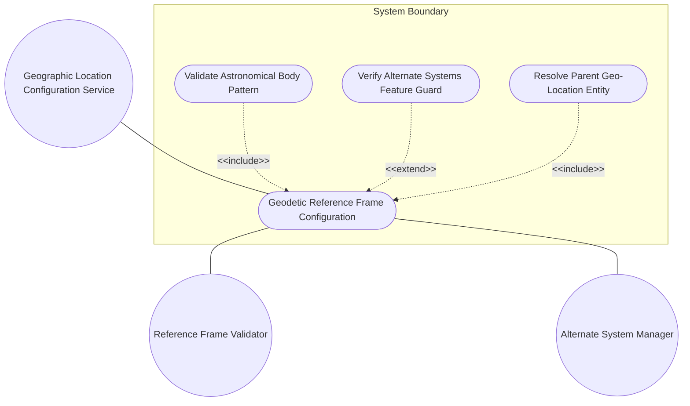
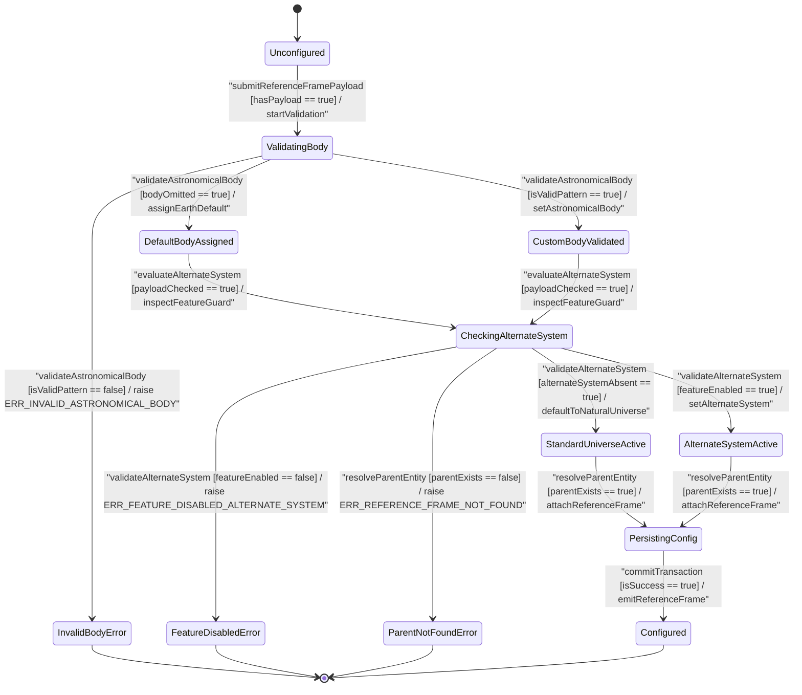

# Use Case: [ietf-geo-location]: Geodetic Reference Frame Configuration

## Parent Epic
- [ ] #38 - [[ietf-geo-location]: Geographic Location Management](https://github.com/gintatkinson/3dgs-037/blob/main/docs/epics/epic-03-ietf-geo-location.md) (Parent Epic specification for geographic location reference frames)

## 1. Actors
- **Primary Actor:** Geographic Location Configuration Service
- **Secondary Actors:** Reference Frame Validator, IAU Celestial Body Registry, Alternate System Manager

## 2. Preconditions
- Geographic Location Configuration Service has instantiated or received a `geo-location` container reference.
- System validation schema engine is initialized with `ietf-geo-location` structural constraints (`astronomical-body` default `"earth"`, printable ASCII regex `'[ -@\[-\^_-~]*'`, optional `alternate-system` string, and `alternate-systems` feature capability flag).

## 3. Trigger
Geographic Location Configuration Service receives a client request to configure, update, or resolve the geodetic reference frame parameters (`astronomical-body`, `alternate-system`) for a `geo-location` entity.

## 4. Main Success Scenario (Basic Flow)
1. Geographic Location Configuration Service submits reference frame payload containing `astronomical-body` and optional `alternate-system` parameters to the Reference Frame Validator.
2. Reference Frame Validator inspects `astronomical-body`; if omitted, the system automatically assigns the default value `"earth"` as standardized by the International Astronomical Union (IAU).
3. Reference Frame Validator evaluates explicit `astronomical-body` string inputs (e.g. `"mars"`, `"Enceladus"`, `"1P/Halley"`) against the printable ASCII regular expression pattern `'[ -@\[-\^_-~]*'`.
4. Alternate System Manager checks whether the request contains an `alternate-system` leaf node.
5. Alternate System Manager verifies that the system has enabled the `alternate-systems` YANG feature capability before binding the alternate coordinate reference system string (e.g. `"wgs84-3d"`).
6. Reference Frame Validator resolves parent `geo-location` entity under `/nwi:network-inventory/nil:locations/nil:location/nil:geo-location/nil:reference-frame` and persists valid reference frame configuration.
7. System emits verified `reference-frame` configuration object to downstream spatial location and coordinate processing modules.

## 5. Alternate and Exception Flows
- **5a. Explicit Astronomical Body Omitted (Branches from Basic Flow step 2):**
  1. Reference Frame Validator detects that `astronomical-body` is omitted or empty in the incoming payload.
  2. System automatically assigns default value `"earth"` as defined by IAU standards and proceeds with reference frame processing.
- **5b. Invalid Control Characters in Astronomical Body (Branches from Basic Flow step 3):**
  1. Reference Frame Validator evaluates `astronomical-body` input string against printable ASCII pattern `'[ -@\[-\^_-~]*'`.
  2. System detects invalid unprintable control characters, raises exception `ERR_INVALID_ASTRONOMICAL_BODY`, logs pattern violation, and rejects the payload.
- **5c. Non-Printable ASCII Character in Astronomical Body (Branches from Basic Flow step 3):**
  1. Reference Frame Validator detects extended non-ASCII or high-bit byte sequences outside `'[ -@\[-\^_-~]*'` range in `astronomical-body`.
  2. System aborts payload parsing, raises exception `ERR_INVALID_ASTRONOMICAL_BODY`, logs encoding violation, and returns an invalid parameter response.
- **5d. Unrecognized Astronomical Body Identifier (Branches from Basic Flow step 3):**
  1. IAU Celestial Body Registry receives an `astronomical-body` string that passes ASCII pattern validation but is absent from the IAU registry.
  2. System flags an unrecognized celestial body warning, logs body resolution metadata, and applies default fallback rules or escalates for admin approval.
- **5e. Alternate System Specified When Feature Disabled (Branches from Basic Flow step 5):**
  1. Alternate System Manager inspects `alternate-system` leaf in payload when `alternate-systems` YANG feature capability is disabled.
  2. System aborts processing, raises exception `ERR_FEATURE_DISABLED_ALTERNATE_SYSTEM`, logs feature capability mismatch, and rejects update request.
- **5f. Alternate System Omitted in Payload (Branches from Basic Flow step 4):**
  1. Alternate System Manager notes that `alternate-system` leaf is omitted or null in payload.
  2. System defaults coordinate system interpretation to the natural universe and proceeds to step 6 of the Main Success Scenario.
- **5g. Invalid UTF-8 Encoding in Reference Frame Payload (Branches from Basic Flow step 1):**
  1. Reference Frame Validator encounters malformed UTF-8 byte sequences in incoming payload strings.
  2. System rejects payload at schema boundary, raises exception `ERR_INVALID_UTF8_ENCODING`, logs byte framing failure, and drops payload.
- **5h. Invalid Sub-tree Location Hierarchy (Branches from Basic Flow step 6):**
  1. Reference Frame Validator receives a reference frame update targeting an invalid path outside `/nwi:network-inventory/nil:locations/nil:location/nil:geo-location/nil:reference-frame`.
  2. System halts execution, raises exception `ERR_INVALID_SUBTREE_LOCATION`, logs schema path violation, and returns path error.
- **5i. Non-Existent Parent Geo-Location Entity (Branches from Basic Flow step 6):**
  1. Reference Frame Validator attempts to bind reference frame under target `/nwi:network-inventory/nil:locations/nil:location/nil:geo-location`, but parent entity is missing.
  2. System halts binding, raises exception `ERR_REFERENCE_FRAME_NOT_FOUND`, rolls back transaction, and returns entity not found response.
- **5j. Read-Only Retrieval Query Mode (Branches from Basic Flow step 1):**
  1. Geographic Location Configuration Service receives a read query for reference frame parameters rather than a write payload.
  2. System retrieves active `astronomical-body` and `alternate-system` state and returns current reference frame configuration parameters without executing state modification steps.
- **5k. Unsupported Alternate System Value (Branches from Basic Flow step 5):**
  1. Alternate System Manager confirms `alternate-systems` feature is enabled but receives an unparseable or unsupported `alternate-system` identifier string.
  2. System aborts alternate system binding, raises exception `ERR_UNSUPPORTED_ALTERNATE_SYSTEM`, logs system mapping failure, and rejects update.
- **5l. Empty Reference Frame Container Payload (Branches from Basic Flow step 1):**
  1. Geographic Location Configuration Service receives an empty `reference-frame` object (`{}`).
  2. System applies default `"earth"` astronomical body, confirms absence of alternate system, and completes configuration initialization successfully.
- **5m. Feature Capability Status Query (Branches from Basic Flow step 5):**
  1. Client sends a capability query to evaluate whether `alternate-systems` feature is supported on the node.
  2. System queries active YANG feature table, returns capability status boolean, and ends operation.
- **5n. Reference Frame Modification Lock Conflict (Branches from Basic Flow step 6):**
  1. Reference Frame Validator encounters an active write lock on target parent `geo-location` node held by another transaction.
  2. System aborts write attempt, raises exception `ERR_REFERENCE_FRAME_LOCK_CONFLICT`, logs concurrency conflict, and prompts client to retry.

## 6. Postconditions (Guarantees)
- **Success Guarantee:** Reference frame is validly assigned with verified `astronomical-body` (default `"earth"` or IAU-compliant string matching `'[ -@\[-\^_-~]*'`) and optional `alternate-system` (when feature enabled), anchored to target `geo-location` entity.
- **Failure Guarantee:** Any regex validation failure, feature guard violation, missing parent entity, or schema framing error raises a specific exception (`ERR_INVALID_ASTRONOMICAL_BODY`, `ERR_FEATURE_DISABLED_ALTERNATE_SYSTEM`, `ERR_REFERENCE_FRAME_NOT_FOUND`, `ERR_INVALID_UTF8_ENCODING`), aborts transaction processing, leaves system reference frame state uncorrupted, and notifies caller.

## UML Diagrams

### Use Case Diagram


### State Machine Diagram


## 7. Operational Context

> "The frame of reference ('reference-frame') defines what the location values refer to and their meaning. The referred-to object can be any astronomical body. It could be a planet such as Earth or Mars, a moon such as Enceladus, an asteroid such as Ceres, or even a comet such as 1P/Halley. This value is specified in 'astronomical-body' and is defined by the International Astronomical Union <http://www.iau.org>. The default 'astronomical-body' value is 'earth'.
> In addition to identifying the astronomical body, we also need to define the meaning of the coordinates (e.g., latitude and longitude) and the definition of 0-height. This is done with a 'geodetic-datum' value. The default value for 'geodetic-datum' is 'wgs-84' (i.e., the World Geodetic System [WGS84]), which is used by the Global Positioning System (GPS) among many others. We define an IANA registry for specifying standard values for the 'geodetic-datum'.
> In addition to the 'geodetic-datum' value, we allow overriding the coordinate and height accuracy using 'coord-accuracy' and 'height-accuracy', respectively. When specified, these values override the defaults implied by the 'geodetic-datum' value.
> Finally, we define an optional feature that allows for changing the system for which the above values are defined. This optional feature adds an 'alternate-system' value to the reference frame. This value is normally not present, which implies the natural universe is the system. The use of this value is intended to allow for creating virtual realities or perhaps alternate coordinate systems. The definition of alternate systems is outside the scope of this document."
> -- RFC 9179 Section 2.1

## 8. Realization Matrix

### Required User Stories
- [ ] #39 - [[ietf-geo-location]: Geodetic Reference Frame Validation](https://github.com/gintatkinson/3dgs-037/blob/main/docs/user-stories/us-16-geodetic-reference-frame-validation.md) (Validates geodetic reference frame astronomical body assignment, geodetic datum selection, and alternate system feature guard checks)

### Required Features
- [ ] #34 - [[ietf-geo-location]: Geodetic Reference Frame](https://github.com/gintatkinson/3dgs-037/blob/main/docs/features/feat-09-geodetic-reference-frame.md) (Provides schema definition and validation rules for astronomical-body, alternate-system, and alternate-systems feature guard)

## Source References
Structural Schema: https://github.com/YangModels/yang/blob/main/standard/ietf/RFC/ietf-geo-location%402022-02-11.yang
Normative Specification: https://datatracker.ietf.org/doc/rfc9179/

> [!WARNING]
> **Mermaid Block Closing Constraints & Code Fence Integrity:**
> - Every Mermaid diagram MUST be strictly closed with ```` ``` ```` on a new line. Leaking Mermaid blocks (e.g. having headings like `##` inside an unclosed diagram) or stray/unclosed code fences will fail downstream validation checks.
> - Ensure there are no stray backticks or unmatched code fences in the document.
> - **All Mermaid syntax constraints are defined in `rules/platform-independence.md` and MUST be observed in full** — including the prohibition on semicolons in `Note` and message text, colons in class members and note strings, stereotypes on relationship lines, and curly braces in class member lines.
> - **Universal Angle Bracket Escaping**: Unquoted `<` and `>` characters are strictly forbidden across ALL diagram types (graph TD, flowchart TD, sequenceDiagram, stateDiagram-v2). Transitions, labels, or guards containing comparison operators, brackets, or guards MUST enclose the label in double quotes.
> - **Use Case Node Label Quoting**: Mandate double quotes around graph TD/flowchart TD node labels containing slashes, colons, parentheses, or brackets.
> - **Subgraph Title Quoting**: Mandate double quotes around subgraph titles with spaces or hyphens (e.g. `subgraph "System Boundary"`).
