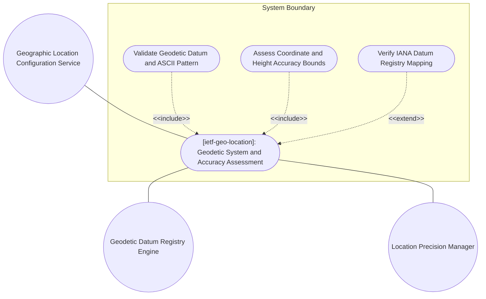
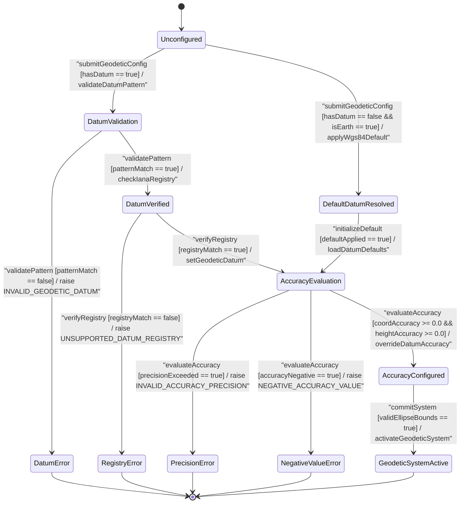

# Use Case: [ietf-geo-location]: Geodetic System and Accuracy Assessment

## Parent Epic
- [ ] #38 - [[ietf-geo-location]: Geographic Location Management](https://github.com/gintatkinson/3dgs-037/blob/main/docs/epics/epic-03-ietf-geo-location.md) (Parent Epic defining geographic location management, reference frame structures, and accuracy bounds)

## 1. Actors
- **Primary Actor:** Geographic Location Configuration Service
- **Secondary Actors:** Geodetic Datum Registry Engine, Location Precision Manager, Network Inventory Service

## 2. Preconditions
- The `ietf-geo-location` module schema is active and initialized with container `/nwi:network-inventory/nil:locations/nil:location/nil:geo-location/nil:reference-frame/nil:geodetic-system`.
- The parent reference frame configuration exists and has established the target astronomical body (defaulting to `"earth"`).
- Geodetic Datum Registry Engine maintains standard datum registrations (e.g. `"wgs-84"`, `"nad83"`, `"egm96"`) and character pattern matching constraints `'[ -@\[-\^_-~]*'`.

## 3. Trigger
Geographic Location Configuration Service receives a request to configure or evaluate geodetic datum selection, horizontal coordinate accuracy overrides (`coord-accuracy`), and vertical height accuracy overrides (`height-accuracy`) for an active reference frame.

## 4. Main Success Scenario (Basic Flow)
1. Geographic Location Configuration Service submits a geodetic system configuration request containing optional `geodeticDatum`, `coordAccuracy`, and `heightAccuracy` parameters to the Location Precision Manager.
2. Location Precision Manager validates `geodeticDatum` string against pattern `'[ -@\[-\^_-~]*'` and verifies string encoding against printable ASCII specifications.
3. Location Precision Manager queries Geodetic Datum Registry Engine to confirm that `geodeticDatum` is recognized in the IANA geodetic datum registry (resolving to `"wgs-84"` default when omitted for Earth coordinates).
4. Location Precision Manager evaluates explicit `coordAccuracy` parameter, verifying non-negative constraint ($\ge 0.0$) and maximum 6 fraction digits decimal precision.
5. Location Precision Manager evaluates explicit `heightAccuracy` parameter, verifying non-negative constraint ($\ge 0.0$) in vertical meters and maximum 6 fraction digits decimal precision.
6. Location Precision Manager applies explicit accuracy values to override default uncertainty bounds implied by the selected geodetic datum, constructing a closed uncertainty ellipse for 3D coordinate evaluation.
7. System commits validated geodetic system properties to the reference frame container and returns success status to Network Inventory Service.

## 5. Alternate and Exception Flows
- **5a. Invalid Geodetic Datum Character Pattern (Branches from Basic Flow step 2):**
  1. Location Precision Manager evaluates `geodeticDatum` string and detects prohibited ASCII control characters failing pattern `'[ -@\[-\^_-~]*'`.
  2. System aborts processing, raises exception `INVALID_GEODETIC_DATUM`, logs pattern violation metadata, and rejects the configuration request.
- **5b. Invalid Control Character in Datum String (Branches from Basic Flow step 2):**
  1. Location Precision Manager receives a `geodeticDatum` payload containing non-printable character sequences.
  2. System aborts parsing, raises exception `INVALID_GEODETIC_DATUM`, logs character encoding error, and discards input tuple.
- **5c. Non-ASCII Character Sequence in Datum Input (Branches from Basic Flow step 2):**
  1. Location Precision Manager detects UTF-8 multi-byte characters outside printable ASCII range in `geodeticDatum` input.
  2. System aborts datum evaluation, raises exception `INVALID_GEODETIC_DATUM`, logs encoding mismatch, and returns validation failure.
- **5d. String Length Overflow in Geodetic Datum (Branches from Basic Flow step 2):**
  1. Location Precision Manager receives an excessively long `geodeticDatum` string exceeding system buffer bounds.
  2. System aborts memory allocation, raises exception `INVALID_GEODETIC_DATUM`, logs buffer overflow attempt, and terminates session.
- **5e. Unregistered Geodetic Datum Lookup Failure (Branches from Basic Flow step 3):**
  1. Geodetic Datum Registry Engine checks requested datum against active IANA geodetic datum registry.
  2. Engine fails to resolve registry entry, raises exception `UNSUPPORTED_DATUM_REGISTRY`, logs missing registry mapping, and aborts frame update.
- **5f. Incompatible Astronomical Body Datum Association (Branches from Basic Flow step 3):**
  1. Geodetic Datum Registry Engine evaluates terrestrial datum `"wgs-84"` requested for non-terrestrial body `"mars"`.
  2. Engine detects body-datum incompatibility, raises exception `UNSUPPORTED_DATUM_REGISTRY`, logs celestial body mismatch, and rejects assignment.
- **5g. Deprecated Geodetic Datum Entry Requested (Branches from Basic Flow step 3):**
  1. Geodetic Datum Registry Engine detects an obsolete or deprecated datum identifier in the IANA registry lookup.
  2. Engine rejects deprecated datum, raises exception `UNSUPPORTED_DATUM_REGISTRY`, logs deprecation warning, and retains current reference frame.
- **5h. Exceeded Fraction Digits for Coordinate Accuracy (Branches from Basic Flow step 4):**
  1. Location Precision Manager detects `coordAccuracy` input with 7 or more fraction digits exceeding decimal64 fraction-digits 6 precision.
  2. System aborts precision validation, raises exception `INVALID_ACCURACY_PRECISION`, logs decimal scale violation, and rejects coordinate accuracy payload.
- **5i. Floating Point Overflow in Coordinate Accuracy (Branches from Basic Flow step 4):**
  1. Location Precision Manager encounters an out-of-range numerical representation for `coordAccuracy`.
  2. System aborts numerical evaluation, raises exception `INVALID_ACCURACY_PRECISION`, logs numeric range exception, and notifies caller.
- **5j. Exceeded Fraction Digits for Height Accuracy (Branches from Basic Flow step 5):**
  1. Location Precision Manager detects `heightAccuracy` input with 7 or more fraction digits exceeding decimal64 fraction-digits 6 precision.
  2. System aborts height accuracy processing, raises exception `INVALID_ACCURACY_PRECISION`, logs vertical scale error, and discards payload.
- **5k. Floating Point Overflow in Height Accuracy (Branches from Basic Flow step 5):**
  1. Location Precision Manager encounters an out-of-range decimal representation for `heightAccuracy`.
  2. System aborts height scale calculation, raises exception `INVALID_ACCURACY_PRECISION`, logs vertical overflow exception, and aborts transaction.
- **5l. Negative Coordinate Accuracy Value Specified (Branches from Basic Flow step 4):**
  1. Location Precision Manager detects negative horizontal coordinate accuracy ($< 0.0$).
  2. System aborts override operation, raises exception `NEGATIVE_ACCURACY_VALUE`, logs non-negative constraint failure, and restores datum defaults.
- **5m. Negative Height Accuracy Value Specified (Branches from Basic Flow step 5):**
  1. Location Precision Manager detects negative vertical height accuracy ($< 0.0$).
  2. System aborts vertical override operation, raises exception `NEGATIVE_ACCURACY_VALUE`, logs vertical non-negative violation, and restores datum height defaults.
- **5n. Unassigned Astronomical Body Default Resolution Failure (Branches from Basic Flow step 3):**
  1. Geodetic Datum Registry Engine attempts to resolve default datum when `astronomical-body` is unassigned or null.
  2. Engine defaults `astronomical-body` to `"earth"` and automatically applies default geodetic datum `"wgs-84"`.
- **5o. Disabled Alternate System Feature Access Attempt (Branches from Basic Flow step 1):**
  1. Geographic Location Configuration Service attempts to pass `alternate-system` parameters when `alternate-systems` feature guard is disabled.
  2. System rejects alternate system configuration, raises exception `ERR_FEATURE_DISABLED_ALTERNATE_SYSTEM`, logs feature state, and ignores alternate parameter.
- **5p. Parent Reference Frame Entity Not Found (Branches from Basic Flow step 1):**
  1. Geographic Location Configuration Service attempts to configure geodetic system for a non-existent parent `geo-location` container.
  2. System aborts operation, raises exception `ERR_REFERENCE_FRAME_NOT_FOUND`, logs missing parent reference, and returns entity not found error.
- **5q. Degenerate Uncertainty Ellipse Boundary Failure (Branches from Basic Flow step 6):**
  1. Location Precision Manager evaluates horizontal and vertical accuracy bounds and detects conflicting precision parameters leading to a degenerate zero-volume ellipse.
  2. System aborts ellipse construction, raises exception `INVALID_ACCURACY_PRECISION`, logs geometry failure, and rolls back geodetic system state.

## 6. Postconditions (Guarantees)
- **Success Guarantee:** Geodetic datum is validated against pattern `'[ -@\[-\^_-~]*'` and IANA registry (defaulting to `"wgs-84"` for Earth when unasserted), horizontal `coord-accuracy` and vertical `height-accuracy` non-negative constraints ($\ge 0.0$) with decimal64 6-fraction-digit precision are enforced, explicit accuracy overrides replace datum defaults, and valid geodetic system state is committed to the reference frame.
- **Failure Guarantee:** Any invalid datum pattern (`INVALID_GEODETIC_DATUM`), unregistered datum (`UNSUPPORTED_DATUM_REGISTRY`), exceeded fraction digits (`INVALID_ACCURACY_PRECISION`), or negative accuracy value (`NEGATIVE_ACCURACY_VALUE`) aborts transaction processing, logs diagnostic error details, leaves existing geodetic system configuration unmodified, and returns an error response.

## UML Diagrams

### Use Case Diagram


### State Machine Diagram


## 7. Operational Context
> "The frame of reference ('reference-frame') defines what the location values refer to and their meaning. The referred-to object can be any astronomical body. It could be a planet such as Earth or Mars, a moon such as Enceladus, an asteroid such as Ceres, or even a comet such as 1P/Halley. This value is specified in 'astronomical-body' and is defined by the International Astronomical Union <http://www.iau.org>. The default 'astronomical-body' value is 'earth'.
> In addition to identifying the astronomical body, we also need to define the meaning of the coordinates (e.g., latitude and longitude) and the definition of 0-height. This is done with a 'geodetic-datum' value. The default value for 'geodetic-datum' is 'wgs-84' (i.e., the World Geodetic System [WGS84]), which is used by the Global Positioning System (GPS) among many others. We define an IANA registry for specifying standard values for the 'geodetic-datum'.
> In addition to the 'geodetic-datum' value, we allow overriding the coordinate and height accuracy using 'coord-accuracy' and 'height-accuracy', respectively. When specified, these values override the defaults implied by the 'geodetic-datum' value.
> Finally, we define an optional feature that allows for changing the system for which the above values are defined. This optional feature adds an 'alternate-system' value to the reference frame. This value is normally not present, which implies the natural universe is the system. The use of this value is intended to allow for creating virtual realities or perhaps alternate coordinate systems. The definition of alternate systems is outside the scope of this document."
> -- RFC 9179 Section 2.1

## 8. Realization Matrix

### Required User Stories
- [ ] #39 - [[ietf-geo-location]: Geodetic Reference Frame Validation](https://github.com/gintatkinson/3dgs-037/blob/main/docs/user-stories/us-16-geodetic-reference-frame-validation.md) (Validates reference frame datum selection, default WGS-84 resolution, and character pattern checks)
- [ ] #40 - [[ietf-geo-location]: 3D Coordinates and Altitude Parsing](https://github.com/gintatkinson/3dgs-037/blob/main/docs/user-stories/us-17-3d-coordinates-and-altitude-parsing.md) (Validates coordinate and altitude boundary checks in relation to active geodetic system definitions)
- [ ] #42 - [[ietf-geo-location]: Location Uncertainty Ellipse Bounds](https://github.com/gintatkinson/3dgs-037/blob/main/docs/user-stories/us-19-location-uncertainty-ellipse-bounds.md) (Validates horizontal coordinate accuracy and vertical height accuracy override bounds and non-negative constraints)

### Required Features
- [ ] #34 - [[ietf-geo-location]: Geodetic Reference Frame](https://github.com/gintatkinson/3dgs-037/blob/main/docs/features/feat-09-geodetic-reference-frame.md) (Provides schema container structure and parent reference frame context for geodetic system configurations)
- [ ] #35 - [[ietf-geo-location]: Geodetic System and Accuracy Bounds](https://github.com/gintatkinson/3dgs-037/blob/main/docs/features/feat-10-geodetic-system-and-accuracy.md) (Defines geodetic-datum, coord-accuracy, height-accuracy leaves, IANA registry validation, and decimal64 precision constraints)

## Source References
Structural Schema: https://github.com/YangModels/yang/blob/main/standard/ietf/RFC/ietf-geo-location%402022-02-11.yang
Normative Specification: https://datatracker.ietf.org/doc/rfc9179/

> [!WARNING]
> **Mermaid Block Closing Constraints & Code Fence Integrity:**
> - Every Mermaid diagram MUST be strictly closed with ```` ``` ```` on a new line. Leaking Mermaid blocks (e.g. having headings like `##` inside an unclosed diagram) or stray/unclosed code fences will fail downstream validation checks.
> - Ensure there are no stray backticks or unmatched code fences in the document.
> - **All Mermaid syntax constraints are defined in `rules/platform-independence.md` and MUST be observed in full** — including the prohibition on semicolons in `Note` and message text, colons in class members and note strings, stereotypes on relationship lines, and curly braces in class member lines.
> - **Universal Angle Bracket Escaping**: Unquoted `<` and `>` characters are strictly forbidden across ALL diagram types (graph TD, flowchart TD, sequenceDiagram, stateDiagram-v2). Transitions, labels, or guards containing comparison operators, brackets, or guards MUST enclose the label in double quotes.
> - **Use Case Node Label Quoting**: Mandate double quotes around graph TD/flowchart TD node labels containing slashes, colons, parentheses, or brackets.
> - **Subgraph Title Quoting**: Mandate double quotes around subgraph titles with spaces or hyphens (e.g. `subgraph "System Boundary"`).
