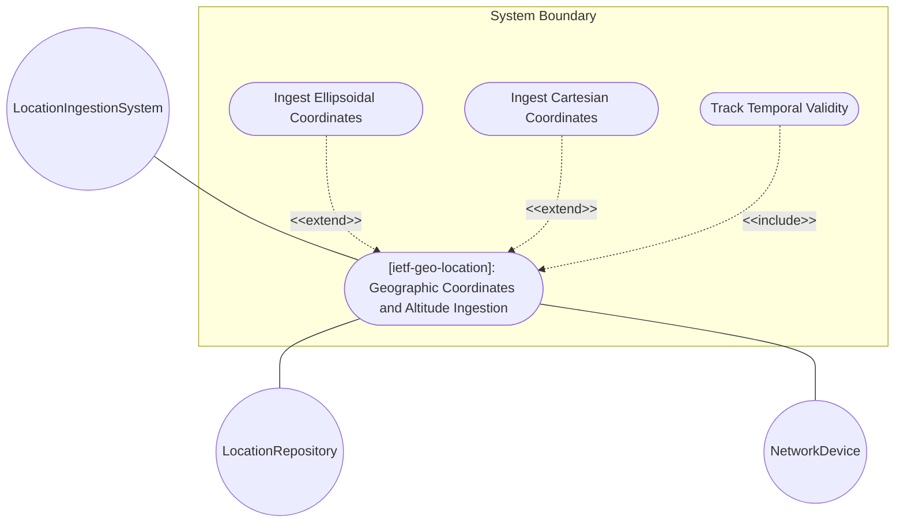
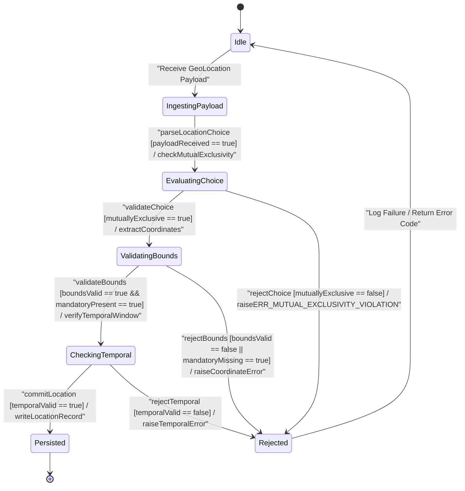

# Use Case: [ietf-geo-location]: Geographic Coordinates and Altitude Ingestion

## Parent Epic
- [ ] #38 - [[ietf-geo-location]: Geographic Location Management](https://github.com/gintatkinson/3dgs-037/blob/main/docs/epics/epic-03-ietf-geo-location.md) (Parent Epic providing overall governance for geographic location management and spatial data models)

## 1. Actors
- **Primary Actor:** LocationIngestionSystem
- **Secondary Actors:** LocationRepository, NetworkDevice

## 2. Preconditions
- The `ietf-geo-location@2022-02-11.yang` module is loaded and registered within the system schema registry.
- The coordinate validation engine is initialized with reference ellipsoid and astronomical body datum parameters.
- Session context between `NetworkDevice` (or client application) and `LocationIngestionSystem` is active.

## 3. Trigger
`LocationIngestionSystem` receives a telemetry stream or configuration request containing data for the `geo-location` container (ellipsoidal coordinates, cartesian coordinates, or temporal validity metadata).

## 4. Main Success Scenario (Basic Flow)
1. `NetworkDevice` transmits a configuration or telemetry payload containing `geo-location` container attributes to `LocationIngestionSystem`.
2. `LocationIngestionSystem` validates the structural layout of `geo-location` and asserts mutual exclusivity between the `ellipsoid` and `cartesian` location choice branches.
3. `LocationIngestionSystem` evaluates coordinate value bounds for the active choice branch, checking decimal degrees for `latitude` ([-90.0, 90.0]) and `longitude` ([-180.0, 180.0]) or meter ranges for geocentric `x`, `y`, `z` axes.
4. `LocationIngestionSystem` parses optional ellipsoidal `height` (meters relative to reference ellipsoid) or Cartesian 3D spatial values with up to 6 fraction digits.
5. `LocationIngestionSystem` verifies RFC 6991 `yang:date-and-time` string syntax for `timestamp` and `valid-until`, asserting that `valid-until` is chronologically equal to or later than `timestamp`.
6. `LocationIngestionSystem` persists validated 3D geographic coordinates and temporal validity metadata into `LocationRepository` and returns a success response.

## 5. Alternate and Exception Flows
- **5a. Latitude Out of Bounds (Branches from Basic Flow step 3):**
  1. `LocationIngestionSystem` detects `latitude` value less than -90.0 or greater than +90.0 decimal degrees.
  2. `LocationIngestionSystem` rejects the transaction with error code `ERR_INVALID_LATITUDE_OUT_OF_BOUNDS` and discards the coordinate payload.
- **5b. Longitude Out of Bounds (Branches from Basic Flow step 3):**
  1. `LocationIngestionSystem` detects `longitude` value less than -180.0 or greater than +180.0 decimal degrees.
  2. `LocationIngestionSystem` rejects the transaction with error code `ERR_INVALID_LONGITUDE_OUT_OF_BOUNDS` and discards the coordinate payload.
- **5c. Height or Cartesian Coordinate Precision Violation (Branches from Basic Flow step 4):**
  1. `LocationIngestionSystem` detects `height` or Cartesian coordinates exceeding maximum permitted fraction-digits precision limit of 6.
  2. `LocationIngestionSystem` rejects the update with error code `ERR_INVALID_FRACTIONAL_PRECISION` and notifies the client.
- **5d. Location Choice Mutual Exclusivity Violation (Branches from Basic Flow step 2):**
  1. `LocationIngestionSystem` detects that payload contains both `ellipsoid` and `cartesian` choice objects under `geo-location`.
  2. `LocationIngestionSystem` aborts ingestion with error code `ERR_MUTUAL_EXCLUSIVITY_VIOLATION` and notifies the client.
- **5e. Missing Mandatory Coordinates (Branches from Basic Flow step 3):**
  1. `LocationIngestionSystem` detects that `ellipsoid` choice is selected without both `latitude` and `longitude`, or `cartesian` choice is selected without all three of `x`, `y`, and `z`.
  2. `LocationIngestionSystem` rejects the request with error code `ERR_MISSING_MANDATORY_COORDINATES` and logs a schema validation failure.
- **5f. Invalid Date-Time String Format (Branches from Basic Flow step 5):**
  1. `LocationIngestionSystem` detects that `timestamp` or `valid-until` string fails RFC 6991 `yang:date-and-time` regex format checks.
  2. `LocationIngestionSystem` rejects the update with error code `ERR_INVALID_DATE_TIME_FORMAT` and returns format guidelines to the sender.
- **5g. Invalid Temporal Window Order (Branches from Basic Flow step 5):**
  1. `LocationIngestionSystem` detects that `valid-until` timestamp chronologically precedes `timestamp`.
  2. `LocationIngestionSystem` rejects the transaction with error code `ERR_INVALID_TEMPORAL_WINDOW` and logs a temporal sequence error.

## 6. Postconditions (Guarantees)
- **Success Guarantee:** 3D geographic coordinates (ellipsoidal or Cartesian), altitude, and temporal validity metadata are validated and persisted cleanly in `LocationRepository`.
- **Failure Guarantee:** Invalid coordinate ranges, choice conflicts, missing mandatory fields, or malformed temporal windows trigger specific error codes and abort execution without modifying existing location records.

## UML Diagrams
### Use Case Diagram

### State Machine Diagram

## 7. Operational Context
> RFC 9179 Section 2.2: "This is the location on, or relative to, the astronomical object. It is specified using two or three coordinate values. These values are given either as 'latitude', 'longitude', and an optional 'height', or as Cartesian coordinates of 'x', 'y', and 'z'. For the standard location choice, 'latitude' and 'longitude' are specified as decimal degrees, and the 'height' value is in fractions of meters. For the Cartesian choice, 'x', 'y', and 'z' are in fractions of meters. In both choices, the exact meanings of all the values are defined by the 'geodetic-datum' value in Section 2.1."
>
> RFC 9179 Section 2.4: "Locations may be specified with a timestamp and a valid-until time. The timestamp is the date and time when the location was determined. The valid-until time is the date and time until which the location remains valid."

## 8. Realization Matrix
### Required User Stories
- [ ] #40 - [[ietf-geo-location]: 3D Coordinates and Altitude Parsing](https://github.com/gintatkinson/3dgs-037/blob/main/docs/user-stories/us-17-3d-coordinates-and-altitude-parsing.md) (Validates 3D ellipsoidal and cartesian coordinate bounds and temporal validity tracking)

### Required Features
- [ ] #36 - [[ietf-geo-location]: Geographic Coordinates and Altitude](https://github.com/gintatkinson/3dgs-037/blob/main/docs/features/feat-11-coordinates-and-altitude.md) (Provides schema container geo-location and validation rules for coordinates and altitude)

## Source References
Structural Schema: https://github.com/YangModels/yang/blob/main/standard/ietf/RFC/ietf-geo-location%402022-02-11.yang
Normative Specification: https://datatracker.ietf.org/doc/rfc9179/
