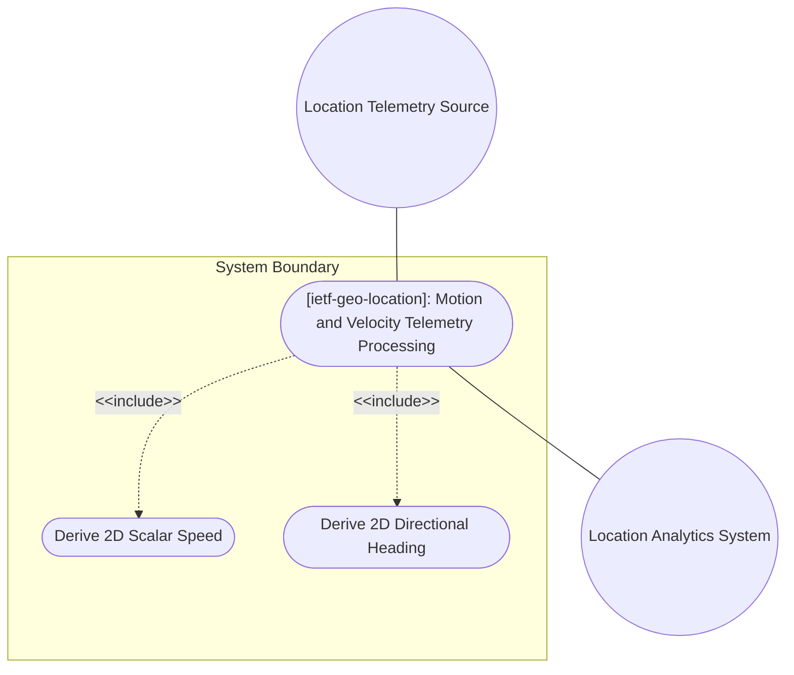
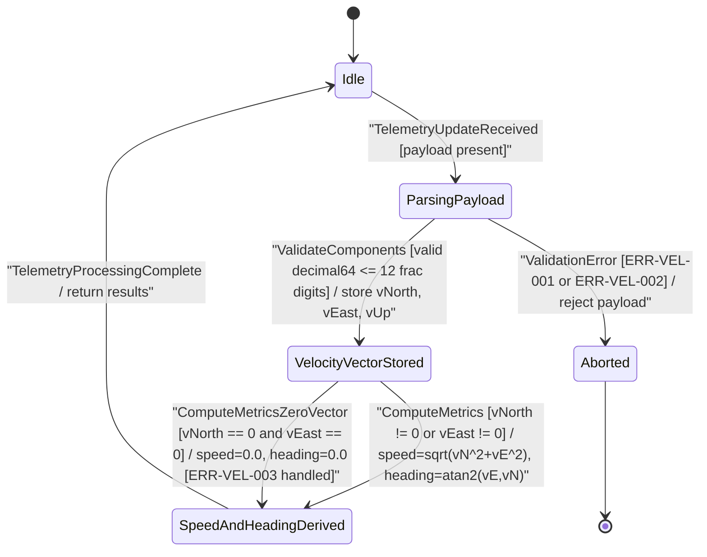

# Use Case: [ietf-geo-location]: Motion and Velocity Telemetry Processing

## Parent Epic
- [ ] #38 - [[ietf-geo-location]: Geographic Location Management](https://github.com/gintatkinson/3dgs-037/blob/main/docs/epics/epic-03-ietf-geo-location.md) (Parent Epic specification for geographic location management subsystem)

## 1. Actors
- **Primary Actor:** Location Telemetry Source
- **Secondary Actors:** Location Analytics System

## 2. Preconditions
- Target location object exists within the system inventory.
- Velocity container `/nwi:network-inventory/nil:locations/nil:location/nil:geo-location/nil:velocity` is instantiated or available for update.
- System is initialized with valid coordinate reference frame parameters.

## 3. Trigger
The Location Telemetry Source transmits a 3D motion vector update request containing velocity components (`v-north`, `v-east`, `v-up`) or requests 2D speed/heading derivation.

## 4. Main Success Scenario (Basic Flow)
1. Location Telemetry Source submits a 3D velocity payload containing `v-north`, `v-east`, and `v-up` components to the System.
2. System parses the payload and validates all velocity components against `decimal64` data type rules (up to 12 fraction digits) and fractional meters per second (m/s) unit constraints.
3. System stores the 3D velocity vector components in the target location object state.
4. Location Analytics System requests scalar 2D speed and directional heading derived metrics.
5. System computes scalar 2D speed using $speed = \sqrt{v_{north}^2 + v_{east}^2}$.
6. System derives 2D directional heading angle relative to true north using $heading = \arctan2(v_{east}, v_{north})$.
7. System returns computed 2D speed and heading metrics alongside the active 3D velocity vector to the Location Analytics System.

## 5. Alternate and Exception Flows
- **5a. Velocity Precision Exceeded (Branches from Basic Flow step 2):**
  1. System detects a velocity component (`v-north`, `v-east`, or `v-up`) exceeding the maximum allowed 12 fraction digits of precision.
  2. System rejects the payload with error code `ERR-VEL-001` (Invalid Precision), aborts state modification, and returns a precision violation response to the Location Telemetry Source.
- **5b. Non-Numeric Velocity Component Encountered (Branches from Basic Flow step 2):**
  1. System encounters a non-numeric or malformed string value within any velocity payload element (`v-north`, `v-east`, or `v-up`).
  2. System rejects the payload with error code `ERR-VEL-002` (Non-Numeric Value), logs the invalid element schema failure, and returns an unprocessable entity error to the Location Telemetry Source.
- **5c. Zero Vector Undefined Heading Handling (Branches from Basic Flow step 6):**
  1. System detects that both `v-north` and `v-east` components equal `0.0` m/s, resulting in an indeterminate arctangent angle ($0/0$).
  2. System sets derived 2D speed to `0.0` m/s and assigns heading to zero or undefined without throwing a mathematical division exception (`ERR-VEL-003`).
  3. System completes telemetry processing and returns the zero-speed state to the Location Analytics System.
- **5d. North Component Unit Constraint Violation (Branches from Basic Flow step 2):**
  1. System detects `v-north` payload value supplied in invalid non-SI units.
  2. System rejects the payload with a unit conversion error, logs the schema constraint violation, and requests re-transmission in fractional meters per second (m/s).
- **5e. East Component Unit Constraint Violation (Branches from Basic Flow step 2):**
  1. System detects `v-east` payload value supplied in invalid non-SI units.
  2. System rejects the payload with a unit conversion error, aborts telemetry ingest, and returns a bad request error to the Location Telemetry Source.
- **5f. Up Component Unit Constraint Violation (Branches from Basic Flow step 2):**
  1. System detects `v-up` payload value supplied in invalid non-SI units.
  2. System rejects the payload with a unit conversion error, prevents database mutation, and notifies the Location Telemetry Source.
- **5g. Reference Frame True North Alignment Failure (Branches from Basic Flow step 3):**
  1. System encounters uncalibrated or invalid true north reference frame metadata during velocity vector storage.
  2. System flags the velocity record with an uncalibrated reference frame warning, stores the vector under restricted quality tier, and alerts the Location Analytics System.
- **5h. Perpendicular Up Vector Alignment Exception (Branches from Basic Flow step 3):**
  1. System detects `v-up` vector component deviating from perpendicular alignment relative to the `v-north`/`v-east` tangent plane.
  2. System rejects the misaligned 3D motion vector, logs a reference frame alignment exception, and returns an error response to the Location Telemetry Source.
- **5i. Derived Speed Floating-Point Overflow Exception (Branches from Basic Flow step 5):**
  1. System encounters extreme scalar values for `v-north` or `v-east` during $\sqrt{v_{north}^2 + v_{east}^2}$ computation causing floating-point overflow.
  2. System caps scalar speed at maximum representable `decimal64` ceiling, logs a numerical threshold warning, and returns the capped scalar speed to the Location Analytics System.

## 6. Postconditions (Guarantees)
- **Success Guarantee:** 3D velocity vector attributes are persistently stored with 12 fraction digit precision, and accurate 2D speed (m/s) and heading (rad/deg) are computed and made available.
- **Failure Guarantee:** In invalid precision, data type, or unit error states (`ERR-VEL-001`, `ERR-VEL-002`, `ERR-VEL-003`), object state remains unmutated, telemetry payload is rejected, and an appropriate error response is returned.

## UML Diagrams
### Use Case Diagram

### State Machine Diagram

## 7. Operational Context
Support is added for objects in relatively stable motion. For objects in relatively stable motion, the grouping provides a three-dimensional vector value. The components of the vector are 'v-north', 'v-east', and 'v-up', which are all given in fractional meters per second. The values 'v-north' and 'v-east' are relative to true north as defined by the reference frame for the astronomical body; 'v-up' is perpendicular to the plane defined by 'v-north' and 'v-east', and is pointed away from the center of mass.
To derive the two-dimensional heading and speed: speed = sqrt(v_north^2 + v_east^2), heading = arctan(v_east / v_north).

## 8. Realization Matrix
### Required User Stories
- [ ] #41 - [[ietf-geo-location]: Motion Vector Velocity Calculation](https://github.com/gintatkinson/3dgs-037/blob/main/docs/user-stories/us-18-motion-vector-velocity-calculation.md) (Validates 3D motion vector decomposition and 2D speed/heading derivation)
### Required Features
- [ ] #37 - [[ietf-geo-location]: Motion and Velocity Vectors](https://github.com/gintatkinson/3dgs-037/blob/main/docs/features/feat-12-motion-and-velocity-vectors.md) (Defines schema containers, validation rules ERR-VEL-001/002/003, and operational interface contracts)

## Source References
Structural Schema: https://github.com/YangModels/yang/blob/main/standard/ietf/RFC/ietf-geo-location%402022-02-11.yang
Normative Specification: https://datatracker.ietf.org/doc/rfc9179/
