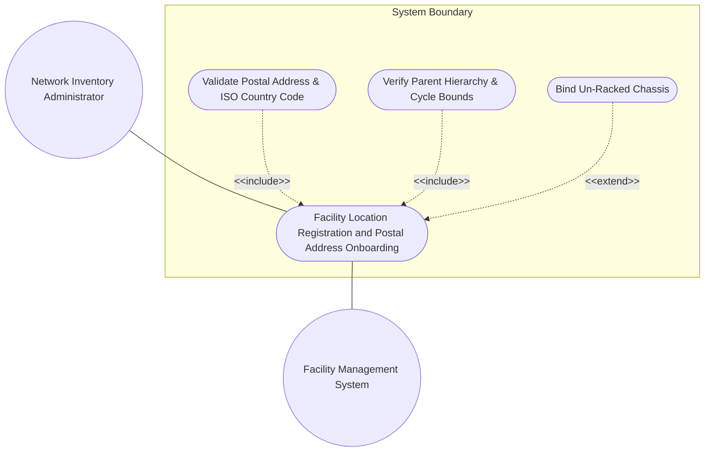
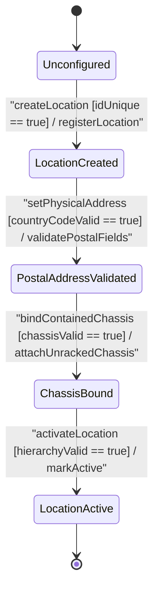

# Use Case: Physical Facility Location Registration, Postal Address Formatting, and Inventory Hierarchy Initialization

## Parent Epic
- [ ] #51 - [[ietf-ni-location]: Network Inventory Location Management](https://github.com/gintatkinson/3dgs-037/blob/main/docs/epics/epic-04-ietf-ni-location.md) (Provides parent epic framework for physical site location registration and inventory hierarchy management)

## 1. Actors
- **Primary Actor:** Network Inventory Administrator (`UserActor`)
- **Secondary Actors:** Facility Management System, Network Inventory DB (`Locations`)

## 2. Preconditions
- The `Locations` inventory registry is initialized and accessible.
- Network Inventory Administrator has administrative privileges to provision physical site location records.

## 3. Trigger
Network Inventory Administrator submits a physical location registration request with location identifier, metadata, physical address attributes, and optional parent reference or un-racked chassis bindings.

## 4. Main Success Scenario (Basic Flow)
1. Administrator submits location creation parameters (`id`, `uuid`, `name`, `type`, `timestamp`) to `Locations`.
2. System validates key uniqueness of `id` and canonical format of `uuid`.
3. System initializes the `Location` record and registers it in the `Locations` registry.
4. Administrator provisions physical mailing address attributes (`address`, `postal-code`, `city`, `state`, `country-code`).
5. System validates the `country-code` against ISO 3166-1 Alpha-2 regex pattern `'[A-Z]{2}'`.
6. Administrator configures parent location reference (`parent`) for hierarchical site nesting.
7. System validates `parent` leafref existence and verifies no cyclic parent dependency path exists.
8. Administrator attaches un-racked chassis entries (`chassis-id`, `ne-ref`, `component-ref`) to `contained-chassis`.
9. System validates `chassis-id` uniqueness and leafref target integrity (`ne-ref`, `component-ref`).
10. System transitions `Location` state to `LocationActive` and returns success status to Administrator.

## 5. Alternate and Exception Flows
- **5a. Non-Unique Location ID Exception (Branches from Basic Flow step 2):**
  1. System detects existing `Location` record with duplicate `id`.
  2. System rejects registration, returns duplicate key error, and maintains previous inventory state.
- **5b. Non-Canonical UUID Format Exception (Branches from Basic Flow step 2):**
  1. System detects non-canonical RFC 4122 UUID string format for `uuid`.
  2. System rejects location creation payload and prompts for valid 36-character UUID string.
- **5c. Missing Mandatory Location ID Failure (Branches from Basic Flow step 2):**
  1. System detects null or empty string value for mandatory primary key `id`.
  2. System aborts record creation and returns mandatory key missing validation error.
- **5d. Invalid Location Timestamp Syntax Failure (Branches from Basic Flow step 2):**
  1. System detects `timestamp` string non-matching `yang:date-and-time` standard ISO 8601 offset format.
  2. System rejects timestamp value, logs date parsing error, and prompts for valid ISO 8601 date-time string.
- **5e. Invalid Location Type Identity Exception (Branches from Basic Flow step 2):**
  1. System detects unknown or unmapped string identity for `type` attribute.
  2. System rejects location initialization and returns invalid location type classification error.
- **5f. Invalid ISO Country Code Pattern Failure (Branches from Basic Flow step 5):**
  1. System detects `country-code` string non-matching pattern `'[A-Z]{2}'` (e.g. `'USA'` or `'us'`).
  2. System rejects address update, flags validation error, and prompts for valid 2-letter uppercase ISO code.
- **5g. Exceeded Street Address Length Exception (Branches from Basic Flow step 5):**
  1. System detects `address` string length exceeding maximum 256 UTF-8 character limit.
  2. System rejects physical address assignment and returns string length constraint violation error.
- **5h. Invalid Control Characters in Street Address Failure (Branches from Basic Flow step 5):**
  1. System detects unescaped ASCII control characters inside `address` string payload.
  2. System flags illegal character validation failure and aborts address registration.
- **5i. Exceeded Postal Code Length Exception (Branches from Basic Flow step 5):**
  1. System detects `postal-code` string exceeding maximum 20 character length bound.
  2. System rejects postal code update and returns field length overflow error.
- **5j. Malformed Postal Code Character Format Exception (Branches from Basic Flow step 5):**
  1. System detects invalid special symbols inside `postal-code` field non-matching alphanumeric dash format.
  2. System aborts postal code update and prompts operator for valid postal identifier.
- **5k. Exceeded City Locality Length Failure (Branches from Basic Flow step 5):**
  1. System detects `city` municipality string length exceeding maximum 256 character boundary.
  2. System rejects locality assignment and returns attribute size constraint error.
- **5l. Exceeded State Region Length Exception (Branches from Basic Flow step 5):**
  1. System detects `state` region string length exceeding maximum 256 character boundary.
  2. System rejects state assignment and returns administrative region size constraint error.
- **5m. Exceeded Building Designation Length Failure (Branches from Basic Flow step 5):**
  1. System detects `building` identifier string length exceeding 64 characters.
  2. System rejects indoor building designation and flags string overflow error.
- **5n. Exceeded Floor Level Length Exception (Branches from Basic Flow step 5):**
  1. System detects `floor` level string length exceeding 64 characters.
  2. System rejects floor level assignment and returns indoor floor size constraint error.
- **5o. Exceeded Equipment Room Designation Length Failure (Branches from Basic Flow step 5):**
  1. System detects `room` suite identifier string length exceeding 64 characters.
  2. System rejects equipment room assignment and flags indoor room size constraint error.
- **5p. Exceeded Room Building Position Format Length Exception (Branches from Basic Flow step 5):**
  1. System detects compound `room-building-position` descriptor length exceeding 128 characters.
  2. System rejects position descriptor update and returns position format overflow error.
- **5q. Non-Existent Parent Location Reference Failure (Branches from Basic Flow step 7):**
  1. System fails to resolve `parent` leafref target path `/ietf-ni-location:locations/location/id`.
  2. System aborts parent assignment, logs orphaned location error, and returns failure status.
- **5r. Self-Referential Parent Dependency Exception (Branches from Basic Flow step 7):**
  1. System detects `parent` leafref referencing the location's own `id` value.
  2. System aborts self-nesting hierarchy assignment and returns self-referential parent error.
- **5s. Cyclic Parent Hierarchy Detection Exception (Branches from Basic Flow step 7):**
  1. System detects cyclic dependency path where parent reference forms a closed loop (e.g., A -> B -> A).
  2. System aborts hierarchy update, rolls back parent leafref, and returns cyclic dependency exception.
- **5t. Invalid Valid-Until Expiry Timestamp Syntax Failure (Branches from Basic Flow step 7):**
  1. System detects `valid-until` temporal expiry timestamp non-matching `yang:date-and-time` syntax.
  2. System rejects temporal bounds configuration and returns date-time validation error.
- **5u. Premature Expiry Timestamp Bounds Exception (Branches from Basic Flow step 7):**
  1. System detects `valid-until` timestamp preceding `timestamp` creation time.
  2. System rejects temporal interval configuration and returns invalid validity window error.
- **5v. Duplicate Contained Chassis Key Exception (Branches from Basic Flow step 9):**
  1. System detects duplicate `chassis-id` uint32 value within host location's `contained-chassis` list.
  2. System rejects chassis binding, returns duplicate chassis key error, and preserves location state.
- **5w. Invalid Chassis ID Range Bound Failure (Branches from Basic Flow step 9):**
  1. System detects `chassis-id` integer value outside non-negative 32-bit uint32 range bounds.
  2. System rejects chassis attachment and returns integer range validation error.
- **5x. Invalid Network Element Leafref Target Failure (Branches from Basic Flow step 9):**
  1. System fails to resolve `ne-ref` leafref target in network element inventory.
  2. System aborts chassis attachment, flags invalid network element reference, and notifies operator.
- **5y. Invalid Component Reference Target Exception (Branches from Basic Flow step 9):**
  1. System fails to resolve `component-ref` leafref target under specified network element path.
  2. System aborts chassis attachment, flags invalid component reference target, and returns error status.

## 6. Postconditions (Guarantees)
- **Success Guarantee:** Location entity is registered in `Locations`, physical address is validated against ISO standards, parent hierarchy is established without cycles, contained chassis are linked, and state is set to `LocationActive`.
- **Failure Guarantee:** Transaction is aborted, invalid address or hierarchy state is rejected, and existing inventory records remain unchanged.

## UML Diagrams
### Use Case Diagram

### State Machine Diagram

## 7. Operational Context
> "The network inventory location module defines top-level locations container containing a list of location entries. Each location entry is uniquely identified by a string id, with optional UUID canonicalization for global uniqueness tracking. Locations can form hierarchical structures via parent location leafrefs, where a child location references its parent location entry. A physical address container within a location specifies postal address details including street address, postal code, city, state, and an ISO 3166-1 alpha-2 two-character uppercase country code matched against the regex pattern '[A-Z]{2}'. Un-racked network equipment stored at a facility location is represented via a contained-chassis list linking individual chassis instances by chassis-id, network element reference (ne-ref), and component reference (component-ref)."

## 8. Realization Matrix
### Required User Stories
- [ ] #52 - [[ietf-ni-location]: Facility Location Creation, Unique Identifier Generation, and Postal Address Formatting/Validation](https://github.com/gintatkinson/3dgs-037/blob/main/docs/user-stories/us-20-location-inventory-onboarding.md) (Validates facility location creation, unique identifier generation, postal address formatting, ISO country code regex, parent hierarchy, and contained chassis assignment)

### Required Features
- [ ] #47 - [[ietf-ni-location: Location Inventory Base and Postal Address]](https://github.com/gintatkinson/3dgs-037/blob/main/docs/features/feat-13-location-inventory-base-and-postal-address.md) (Provides base location list, id/uuid metadata, parent hierarchy, postal address container, and contained chassis specifications)
- [ ] #48 - [[ietf-ni-location: Building and Floor Position Specs]](https://github.com/gintatkinson/3dgs-037/blob/main/docs/features/feat-14-building-and-floor-position-specs.md) (Provides physical address fields including country-code ISO pattern validation and indoor building structure)

## Source References
Structural Schema: https://github.com/ietf-ivy-wg/network-inventory-location/blob/main/ietf-ni-location.yang
Normative Specification: https://datatracker.ietf.org/doc/html/draft-ietf-ivy-network-inventory-location
