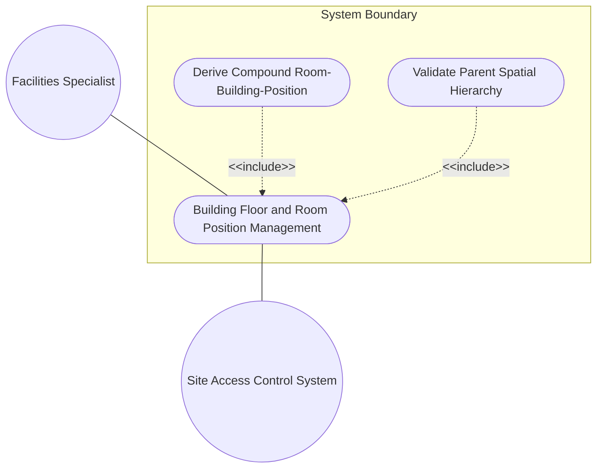
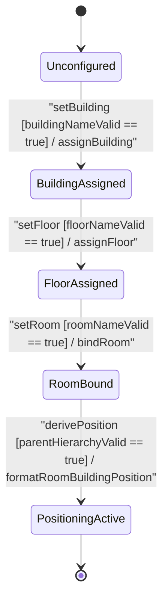

# Use Case: Building, Floor, and Room Position Management, Room Name Assignment, and Physical Access Bounds

## Parent Epic
- [ ] #51 - [[ietf-ni-location]: Network Inventory Location Management](https://github.com/gintatkinson/3dgs-037/blob/main/docs/epics/epic-04-ietf-ni-location.md) (Provides parent epic framework for indoor building position management and spatial location hierarchy)

## 1. Actors
- **Primary Actor:** Facilities Specialist (`UserActor`)
- **Secondary Actors:** Site Access Control System, Network Inventory DB (`Location`)

## 2. Preconditions
- The target `Location` record exists in `Locations` registry.
- Facilities Specialist is authorized to manage building, floor, room designations, and indoor access bounds.

## 3. Trigger
Facilities Specialist submits an indoor positioning configuration request specifying building identifier, floor level, room designation, and spatial hierarchy parent references.

## 4. Main Success Scenario (Basic Flow)
1. Facilities Specialist selects target `Location` entity in inventory database.
2. Specialist specifies `building` string identifier (e.g. `"Building B"`).
3. Specialist specifies `floor` level designation (e.g. `"Floor 3"`).
4. Specialist specifies `room` name designation (e.g. `"Room 302"`).
5. System validates string character constraints and length limits (1..64 chars) for `building`, `floor`, and `room`.
6. System derives compound `room-building-position` string (e.g. `"Building B, Floor 3, Room 302"`).
7. Specialist configures physical street address parameters (`address`, `postal-code`, `city`, `state`, `country-code`).
8. System validates `country-code` against ISO ALPHA-2 pattern `'[A-Z]{2}'`.
9. Specialist binds parent location reference (`parent`) linking room to building or building to site facility.
10. System verifies parent location leafref resolution and updates location state to `PositioningActive`.

## 5. Alternate and Exception Flows
- **5a. Building Identifier Length/Format Violation (Branches from Basic Flow step 5):**
  1. System detects `building` string exceeding max length (64 chars) or containing invalid control characters.
  2. System rejects attribute assignment, returns input format error, and retains existing building state.
- **5b. Floor Designation Overflow (Branches from Basic Flow step 5):**
  1. System detects `floor` string exceeding character bounds.
  2. System flags validation error, prompts operator for valid floor designation, and halts update.
- **5c. Room Name Format Exception (Branches from Basic Flow step 5):**
  1. System detects `room` name string exceeding character limits or missing mandatory designation.
  2. System rejects room assignment and returns validation error.
- **5d. Country Code Regex Validation Failure (Branches from Basic Flow step 8):**
  1. System detects `country-code` non-matching pattern `'[A-Z]{2}'` (e.g. `'USA'`).
  2. System rejects address update, displays pattern mismatch error, and requests ISO Alpha-2 code.
- **5e. Non-Existent Parent Building Location Reference (Branches from Basic Flow step 10):**
  1. System fails to resolve `parent` leafref target in `Locations` registry.
  2. System rejects hierarchy binding, flags orphaned room exception, and notifies operator.
- **5f. Compound Position String Overflow Exception (Branches from Basic Flow step 6):**
  1. System detects concatenated `room-building-position` exceeding 128 character storage threshold.
  2. System truncates or re-formats descriptor, logs warning, and returns updated positioning status.
- **5g. Lowercase Country Code Pattern Failure (Branches from Basic Flow step 8):**
  1. System detects lowercase characters in `country-code` input (e.g. `'us'`).
  2. System rejects input, notifies operator that regex requires uppercase ASCII characters `'[A-Z]{2}'`, and aborts commit.
- **5h. Postal Code Character Length Exceeded (Branches from Basic Flow step 7):**
  1. System detects `postal-code` exceeding maximum allowed 20 character length boundary.
  2. System flags length validation failure and prevents physical address update.
- **5i. Address Control Character Injection Failure (Branches from Basic Flow step 7):**
  1. System identifies unescaped ASCII control characters in `address` text string.
  2. System sanitizes input, raises character encoding exception, and halts postal address assignment.
- **5j. City Field String Overflow (Branches from Basic Flow step 7):**
  1. System detects `city` text exceeding 256 character storage limit.
  2. System rejects city update and displays field length error to operator.
- **5k. State Field Character Encoding Violation (Branches from Basic Flow step 7):**
  1. System detects non-UTF-8 invalid byte sequences within `state` attribute payload.
  2. System rejects payload and requests valid UTF-8 string encoding from client.
- **5l. Self-Referential Parent Location Binding (Branches from Basic Flow step 9):**
  1. System detects `parent` leafref reference pointing to location's own `id` string.
  2. System rejects self-referential parent binding and returns hierarchy validation exception.
- **5m. Cyclic Spatial Hierarchy Dependency Detected (Branches from Basic Flow step 10):**
  1. System traverses parent hierarchy chain and detects cyclic dependency (e.g. Location A -> Location B -> Location A).
  2. System aborts spatial hierarchy binding, logs cyclic tree exception, and rolls back transaction.
- **5n. Duplicate Location Key Identifier Conflict (Branches from Basic Flow step 1):**
  1. System detects primary key `id` collision within `/ietf-ni-location:locations/location`.
  2. System rejects entity instantiation and returns duplicate key violation error.
- **5o. Contained Chassis Non-Unique Key Rejection (Branches from Basic Flow step 10):**
  1. System detects duplicate `chassis-id` within `contained-chassis` list for target location.
  2. System rejects chassis binding and notifies operator of key collision.
- **5p. Unresolvable Network Element Reference (`ne-ref`) (Branches from Basic Flow step 10):**
  1. System evaluates `ne-ref` leafref path against `/nwi:network-inventory/nwi:network-elements` registry and finds no target match.
  2. System flags broken leafref reference and aborts chassis containment association.
- **5q. Unresolvable Network Component Reference (`component-ref`) (Branches from Basic Flow step 10):**
  1. System evaluates `component-ref` leafref path against component hierarchy and finds no match under target NE.
  2. System rejects component association and prompts operator for valid component ID.
- **5r. Invalid ISO 8601 Timestamp Format (Branches from Basic Flow step 10):**
  1. System detects invalid date-time format for `timestamp` or `valid-until` leaves non-conforming to `yang:date-and-time`.
  2. System rejects temporal metadata update and returns date syntax error.
- **5s. Expired Location Temporal Validity (`valid-until`) (Branches from Basic Flow step 10):**
  1. System compares `valid-until` timestamp with current system clock and detects expired location entry.
  2. System flags location record as archived/expired and prevents positioning modifications.
- **5t. Room Name Mandatory Designation Missing (Branches from Basic Flow step 4):**
  1. System detects empty or null `room` designation during room-level location configuration.
  2. System flags missing mandatory attribute error and halts positioning synthesis.
- **5u. Building Identifier Blank String Input (Branches from Basic Flow step 2):**
  1. System detects whitespace-only or empty string input for `building` identifier.
  2. System rejects empty building assignment and requests non-blank identifier.
- **5v. Floor Level Empty String Assignment (Branches from Basic Flow step 3):**
  1. System detects empty string input for `floor` level attribute.
  2. System halts update, prompts for valid floor designation string, and retains previous state.
- **5w. Physical Address Sub-tree Hierarchy Resolution Error (Branches from Basic Flow step 7):**
  1. System fails to resolve sub-tree container path `/ietf-ni-location:locations/location/physical-address`.
  2. System returns schema path resolution exception and rolls back address transaction.
- **5x. Invalid Country Code Numeric Character Injection (Branches from Basic Flow step 8):**
  1. System detects numeric digits in `country-code` (e.g. `'U1'`).
  2. System rejects input, displays regex pattern error `'[A-Z]{2}'`, and requests 2-letter ASCII code.
- **5y. Orphaned Spatial Node Hierarchy Rejection (Branches from Basic Flow step 10):**
  1. System detects room location record missing valid parent building or site reference.
  2. System rejects unanchored positioning update and alerts operator to establish valid parent hierarchy link.

## 6. Postconditions (Guarantees)
- **Success Guarantee:** Building, floor, and room attributes are persisted, compound `room-building-position` descriptor is derived, parent hierarchy is linked, and state transitions to `PositioningActive`.
- **Failure Guarantee:** Invalid indoor position attributes or broken parent leafrefs are rejected, and location physical address state remains unmodified.

## UML Diagrams
### Use Case Diagram

### State Machine Diagram

## 7. Operational Context
> "The network inventory location module defines indoor building position attributes within facility location entries. Locations can be nested to form a spatial hierarchy (e.g. Site -> Building -> Floor -> Room) using the parent leafref reference. Each level of the indoor position specifies building identifier, floor level, and room designation. A compound room-building-position descriptor is derived to represent the complete indoor position hierarchy (e.g. 'Building B, Floor 3, Room 302'). Location entries must validate parent leafrefs to prevent orphaned spatial nodes or invalid hierarchy paths."

## 8. Realization Matrix
### Required User Stories
- [ ] #53 - [[ietf-ni-location]: Building, Floor, and Room Spatial Hierarchy Navigation, Room Name Assignment, and Physical Access Bounds](https://github.com/gintatkinson/3dgs-037/blob/main/docs/user-stories/us-21-building-floor-room-positioning.md) (Validates indoor building, floor, room spatial hierarchy navigation, room name assignment, compound position formatting, and parent access bounds)

### Required Features
- [ ] #48 - [[ietf-ni-location: Building and Floor Position Specs]](https://github.com/gintatkinson/3dgs-037/blob/main/docs/features/feat-14-building-and-floor-position-specs.md) (Provides schema containers and validation rules for building, floor, room, and room-building-position formatting)
- [ ] #47 - [[ietf-ni-location: Location Inventory Base and Postal Address]](https://github.com/gintatkinson/3dgs-037/blob/main/docs/features/feat-13-location-inventory-base-and-postal-address.md) (Provides parent leafref hierarchy mapping for nested facility locations)

## Source References
Structural Schema: https://github.com/ietf-ivy-wg/network-inventory-location/blob/main/ietf-ni-location.yang
Normative Specification: https://datatracker.ietf.org/doc/html/draft-ietf-ivy-network-inventory-location
