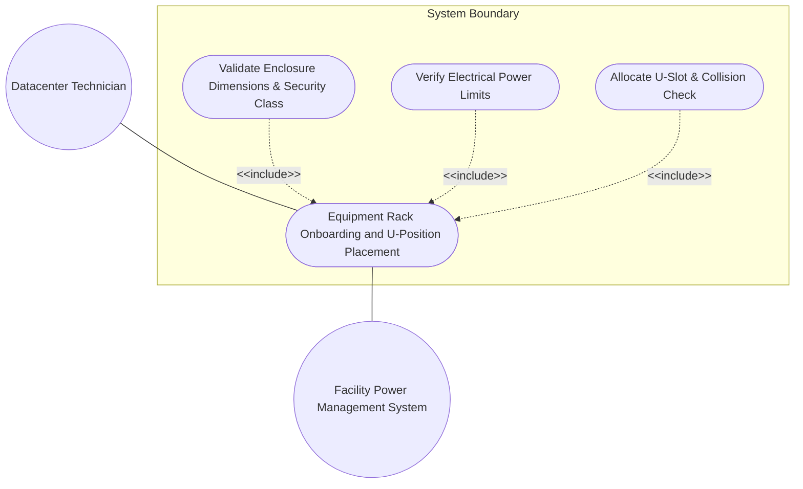
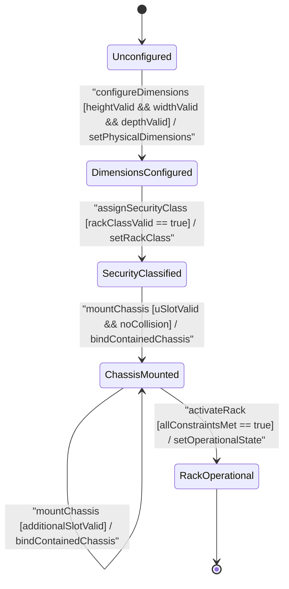

# Use Case: Equipment Rack Onboarding, Bay Position Assignment, U-Position Allocation (1U..48U), and Chassis Placement Validation

## Parent Epic
- [ ] #51 - [[ietf-ni-location]: Network Inventory Location Management](https://github.com/gintatkinson/3dgs-037/blob/main/docs/epics/epic-04-ietf-ni-location.md) (Provides parent epic framework for physical rack placement, bay allocation, and vertical U-slot chassis mounting)

## 1. Actors
- **Primary Actor:** Datacenter Technician (`UserActor`)
- **Secondary Actors:** Facility Power Management System, Network Inventory DB (`Racks`)

## 2. Preconditions
- Target equipment room facility is registered in `Locations` registry.
- Datacenter Technician has access to configure physical rack enclosures and equipment mountings.

## 3. Trigger
Datacenter Technician initiates an equipment rack onboarding request specifying rack identifier, physical dimensions, security classification identityref, electrical limits, and contained chassis U-position assignments.

## 4. Main Success Scenario (Basic Flow)
1. Technician creates a new equipment rack entry in `Racks` container with unique `id`.
2. Technician specifies physical dimensions: `height` (e.g. 2200 mm), `width` (e.g. 600 mm), and `depth` (e.g. 1000 mm).
3. System validates dimensional parameters against `uint16` millimeter bounds `[1..65535]`.
4. Technician assigns physical security classification `rack-class` identityref (e.g. `ietf-ni-location:rack-secure-high`).
5. System validates that `rack-class` derives from base identity `rack-class-type`.
6. Technician configures electrical capacity bounds: `max-voltage` (e.g. 240 V) and `max-allocated-power` (e.g. 8000 W).
7. System validates electrical parameters within `uint16` limits `[0..65535]`.
8. Technician mounts chassis into rack specifying `relative-position` uint8 U-slot (1U..48U), `ne-ref`, and `component-ref`.
9. System validates that target `relative-position` U-slot is vacant (collision check) and leafrefs resolve to valid network elements.
10. System transitions `Rack` state to `RackOperational` and confirms placement.

## 5. Alternate and Exception Flows
- **5a. Physical Enclosure Height Range Violation (Branches from Basic Flow step 3):**
  1. System detects `height` value equal to 0 or exceeding `uint16` limit (>65535 mm).
  2. System rejects height parameter, returns range validation error, and requests valid millimeter height (1..65535 mm).
- **5b. Physical Enclosure Width Range Violation (Branches from Basic Flow step 3):**
  1. System detects `width` value equal to 0 or exceeding `uint16` limit (>65535 mm).
  2. System rejects width parameter, returns range validation error, and requests valid millimeter width (1..65535 mm).
- **5c. Physical Enclosure Depth Range Violation (Branches from Basic Flow step 3):**
  1. System detects `depth` value equal to 0 or exceeding `uint16` limit (>65535 mm).
  2. System rejects depth parameter, returns range validation error, and requests valid millimeter depth (1..65535 mm).
- **5d. Invalid Security Identityref Class (Branches from Basic Flow step 5):**
  1. System detects `rack-class` identityref not derived from base `rack-class-type`.
  2. System rejects security classification, logs identity mismatch error, and prompts for valid rack class identity.
- **5e. Electrical Max Voltage Limit Exceeded (Branches from Basic Flow step 7):**
  1. System detects `max-voltage` exceeding `uint16` threshold (>65535 V).
  2. System rejects electrical parameters, returns power limit error, and prevents rack activation.
- **5f. Electrical Max Power Capacity Out-of-Bounds (Branches from Basic Flow step 7):**
  1. System detects `max-allocated-power` exceeding `uint16` threshold (>65535 W).
  2. System rejects electrical parameters, returns power capacity out-of-bounds error, and flags capacity error.
- **5g. Allocated Power Overload Warning (Branches from Basic Flow step 7):**
  1. System evaluates aggregate chassis power consumption exceeding `max-allocated-power`.
  2. System triggers high-power allocation warning indicator, logs capacity alert, and requests load balancing.
- **5h. Location Ref Leafref Resolution Failure (Branches from Basic Flow step 3):**
  1. System fails to resolve `location-ref` in `rack-location` against registered locations registry.
  2. System rejects location linkage, flags unresolvable location leafref error, and aborts placement.
- **5i. Row Number Out-of-Bounds Exception (Branches from Basic Flow step 3):**
  1. System detects `row-number` exceeding `uint32` limit (>4294967295).
  2. System rejects spatial location row index, flags out-of-bounds error, and requests valid row number.
- **5j. Column Number Out-of-Bounds Exception (Branches from Basic Flow step 3):**
  1. System detects `column-number` exceeding `uint32` limit (>4294967295).
  2. System rejects spatial location column index, flags out-of-bounds error, and requests valid column number.
- **5k. Vertical U-Slot Position Collision Exception (Branches from Basic Flow step 9):**
  1. System detects an existing chassis already mounted at specified `relative-position` U-slot index.
  2. System rejects duplicate mounting, returns U-slot collision error, and highlights occupied slot index.
- **5l. Relative Position Range Violation (Branches from Basic Flow step 9):**
  1. System detects `relative-position` value of 0 or exceeding `uint8` limit (>255).
  2. System rejects position assignment, flags slot out-of-bounds error, and requests valid U-slot index (1..48).
- **5m. Network Element Leafref Resolution Failure (Branches from Basic Flow step 9):**
  1. System fails to resolve `ne-ref` leafref target in active network inventory.
  2. System aborts chassis mounting, flags unresolvable network element leafref error, and notifies technician.
- **5n. Component Reference Leafref Resolution Failure (Branches from Basic Flow step 9):**
  1. System fails to resolve `component-ref` leafref target in active inventory.
  2. System aborts chassis mounting, flags unresolvable component leafref error, and notifies technician.

## 6. Postconditions (Guarantees)
- **Success Guarantee:** Equipment rack is onboarded with valid dimensions, security identity, electrical limits, and non-overlapping chassis U-position bindings, reaching `RackOperational` state.
- **Failure Guarantee:** Invalid dimensions, security identityrefs, power limits, or U-slot collisions cause transaction rejection, leaving existing rack state unmodified.

## UML Diagrams
### Use Case Diagram

### State Machine Diagram

## 7. Operational Context
> "racks represent physical equipment racks in which NEs can be installed, which facilitate device maintenance. Through rack-location, each rack can be assigned to a site or a specific location within a site, such as an equipment room. Each rack is assigned a unique ID and a name in the context of a facility, e.g. a site. A rack may have some specific attributes, such as appearance-related attributes and electricity-related attributes. The height, depth and width describe physical enclosure dimensions in mm. The rack attributes include security classification identityref (rack-class e.g. rack-secure-high), electrical limits (max-voltage, max-allocated-power), and vertical U-slot relative position allocations (relative-position uint8 [1..255])."

## 8. Realization Matrix
### Required User Stories
- [ ] #54 - [[ietf-ni-location]: Rack Identification, Bay Position Assignment, U-Position Alignment (1U..48U), and Vertical Slot Constraint Enforcement](https://github.com/gintatkinson/3dgs-037/blob/main/docs/user-stories/us-22-rack-unit-bay-positioning-bounds.md) (Validates equipment rack identification, physical dimensions, security classification identityrefs, electrical limits, vertical U-slot relative position alignment, and collision detection)

### Required Features
- [ ] #49 - [[ietf-ni-location: Rack and Bay Positioning]](https://github.com/gintatkinson/3dgs-037/blob/main/docs/features/feat-15-rack-and-bay-positioning.md) (Provides schema definitions for racks, rack dimensions, electrical limits, rack classification identityref hierarchy, and chassis U-positioning)
- [ ] #47 - [[ietf-ni-location: Location Inventory Base and Postal Address]](https://github.com/gintatkinson/3dgs-037/blob/main/docs/features/feat-13-location-inventory-base-and-postal-address.md) (Provides parent location and network element reference linkages for mounted chassis)

## Source References
Structural Schema: https://github.com/ietf-ivy-wg/network-inventory-location/blob/main/ietf-ni-location.yang
Normative Specification: https://datatracker.ietf.org/doc/html/draft-ietf-ivy-network-inventory-location
