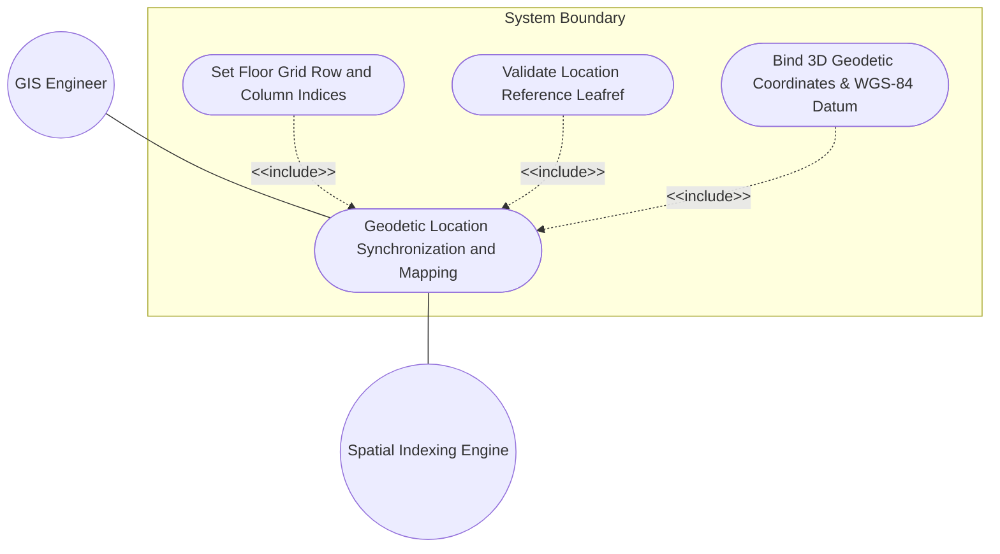
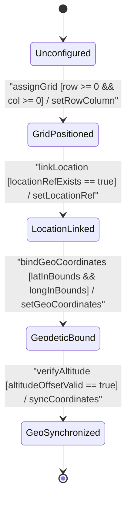

# Use Case: Facility Geodetic Coordinate Binding, Spatial Coordinate Synchronization, and Altitude Offset Mapping

## Parent Epic
- [ ] #51 - [[ietf-ni-location]: Network Inventory Location Management](https://github.com/gintatkinson/3dgs-037/blob/main/docs/epics/epic-04-ietf-ni-location.md) (Provides parent epic framework for rack floor grid positioning and geodetic 3D coordinate binding)

## 1. Actors
- **Primary Actor:** GIS Engineer (`UserActor`)
- **Secondary Actors:** Spatial Indexing Engine, Network Inventory DB (`RackLocation`)

## 2. Preconditions
- Physical `Rack` entity exists in `Racks` container.
- Target facility `Location` is registered in `Locations` registry.
- GIS Engineer has authorization to configure spatial grid coordinates and geodetic reference frames.

## 3. Trigger
GIS Engineer submits a spatial positioning and geodetic coordinate binding request for an onboarded rack entity.

## 4. Main Success Scenario (Basic Flow)
1. GIS Engineer selects target `Rack` entity and opens `rack-location` configuration container.
2. Engineer assigns indoor floor grid row index `row-number` (`uint32`).
3. Engineer assigns indoor floor grid column index `column-number` (`uint32`).
4. System validates `row-number` and `column-number` within `uint32` bounds `[0..4294967295]`.
5. Engineer binds target facility location reference `location-ref` (`ni-location-ref`).
6. System resolves `location-ref` leafref target path `/ietf-ni-location:locations/location/id`.
7. Engineer provides 3D spatial coordinates (`latitude`, `longitude`, `height`) via imported `ietf-geo-location` container.
8. System validates `latitude` within `[-90.0..+90.0]`, `longitude` within `[-180.0..+180.0]`, and `height` altitude offset relative to WGS-84 reference ellipsoid.
9. Engineer initiates spatial coordinate synchronization and 3D map index alignment.
10. System verifies altitude offset, updates `RackLocation` state to `GeoSynchronized`, and returns success.

## 5. Alternate and Exception Flows
- **5a. Row Number uint32 Overflow (Branches from Basic Flow step 4):**
  1. System detects `row-number` negative or exceeding uint32 limit (>4294967295).
  2. System rejects grid row assignment, returns range error, and retains previous grid state.
- **5b. Column Number uint32 Overflow (Branches from Basic Flow step 4):**
  1. System detects `column-number` negative or exceeding uint32 limit (>4294967295).
  2. System rejects column assignment, flags validation error, and aborts state update.
- **5c. Unresolvable Location Ref Leafref Target (Branches from Basic Flow step 6):**
  1. System fails to locate matching `location-id` for `location-ref` in `Locations` registry.
  2. System rejects location binding, flags unresolvable leafref error, and notifies GIS Engineer.
- **5d. Latitude Coordinate Out-of-Bounds [-90, +90] (Branches from Basic Flow step 8):**
  1. System detects `latitude` coordinate value outside valid `[-90.0..+90.0]` degree range.
  2. System rejects geodetic binding, returns spatial boundary error, and halts synchronization.
- **5e. Longitude Coordinate Out-of-Bounds [-180, +180] (Branches from Basic Flow step 8):**
  1. System detects `longitude` coordinate value outside valid `[-180.0..+180.0]` degree range.
  2. System rejects geodetic binding, displays coordinate boundary mismatch error, and rolls back coordinate state.
- **5f. Ellipsoid Altitude Offset Exceeded (Branches from Basic Flow step 10):**
  1. System detects `height` altitude offset exceeding valid operational facility thresholds.
  2. System flags altitude warning, logs spatial anomaly, and requests coordinate verification from GIS Engineer.
- **5g. Astronomical Body Designation Invalid (Branches from Basic Flow step 8):**
  1. System detects unsupported or malformed `astronomical-body` string parameter in geodetic configuration.
  2. System flags celestial reference error, aborts spatial binding, and prompts for valid body designation.
- **5h. Geodetic Datum Identifier Mismatch (Branches from Basic Flow step 8):**
  1. System identifies un-mapped or mismatched `datum` identifier string against system spatial engine registry.
  2. System rejects coordinate binding, issues datum transformation error, and retains WGS-84 baseline.
- **5i. Coordinate System Axis Order Format Exception (Branches from Basic Flow step 8):**
  1. System parses invalid or incompatible axis order string sequence in geodetic definition.
  2. System rejects axis configuration, generates format exception log, and requests standard axis ordering.
- **5j. Height Measurement Unit Discrepancy (Branches from Basic Flow step 8):**
  1. System detects unrecognized altitude unit attribute not matching meters or standard vertical measurement units.
  2. System rejects height configuration, returns unit discrepancy error, and prompts for unit correction.
- **5k. Spatial Index Resolution Timeout (Branches from Basic Flow step 9):**
  1. Spatial Indexing Engine fails to resolve spatial index tree within configured timeout threshold.
  2. System aborts index tree traversal, flags resolution timeout event, and triggers background index rebuild.
- **5l. Rack Dimensions Height Range Violation [1..65535 mm] (Branches from Basic Flow step 1):**
  1. GIS Engineer inputs rack height dimension outside `[1..65535 mm]` uint16 boundary.
  2. System rejects rack physical attribute update, returns dimension range violation, and retains existing rack height.
- **5m. Rack Dimensions Width Range Violation [1..65535 mm] (Branches from Basic Flow step 1):**
  1. GIS Engineer inputs rack width dimension outside `[1..65535 mm]` uint16 boundary.
  2. System rejects rack physical attribute update, flags width bounds error, and aborts container modification.
- **5n. Rack Dimensions Depth Range Violation [1..65535 mm] (Branches from Basic Flow step 1):**
  1. GIS Engineer inputs rack depth dimension outside `[1..65535 mm]` uint16 boundary.
  2. System rejects rack physical attribute update, issues depth range error, and restores prior physical dimensions.
- **5o. Rack Electrical Max Voltage Exceeded [0..65535 V] (Branches from Basic Flow step 1):**
  1. System detects rack maximum electrical voltage configuration outside `[0..65535 V]` uint16 boundary.
  2. System rejects electrical specification update, logs voltage threshold error, and notifies operator.
- **5p. Rack Electrical Max Allocated Power Exceeded [0..65535 W] (Branches from Basic Flow step 1):**
  1. System detects maximum allocated power setting exceeding physical `[0..65535 W]` uint16 limit.
  2. System rejects power allocation update, flags electrical capacity constraint violation, and halts request.
- **5q. Rack Security Classification Identityref Mismatch (Branches from Basic Flow step 1):**
  1. System detects unrecognized or unauthorized `identityref` security classification value for target rack.
  2. System blocks rack location access, generates security classification mismatch alert, and logs audit trail event.
- **5r. U-Slot Relative Position Allocation Collision [1..255] (Branches from Basic Flow step 1):**
  1. System identifies u-slot position value outside `[1..255]` uint8 range or colliding with an existing mounted chassis position.
  2. System rejects chassis mounting assignment, returns slot allocation collision error, and leaves rack slot map unchanged.
- **5s. Network Element Leafref Resolution Failure for Mounted Chassis (Branches from Basic Flow step 1):**
  1. System fails to resolve mounted chassis `ne-ref` leafref targeting active `/network-elements/network-element/name`.
  2. System marks mounted chassis as unlinked entity, flags missing network element reference, and alerts operator.
- **5t. Component Reference Leafref Target Mismatch (Branches from Basic Flow step 1):**
  1. System detects component leafref targeting non-existent or invalid component entity path.
  2. System rejects component binding, returns leafref target mismatch error, and aborts rack component mapping.
- **5u. Horizontal Uncertainty Radius Bound Exceeded (Branches from Basic Flow step 8):**
  1. System detects horizontal uncertainty radius value exceeding maximum allowed spatial precision threshold.
  2. System rejects geodetic coordinate binding, flags uncertainty overflow error, and requests precision re-calibration.
- **5v. Vertical Uncertainty Distance Overflow (Branches from Basic Flow step 8):**
  1. System detects vertical uncertainty distance value outside valid positive real numerical bounds.
  2. System rejects vertical coordinate precision entry, flags uncertainty distance overflow, and halts binding.
- **5w. Velocity Metric Value Range Exception (Branches from Basic Flow step 8):**
  1. System encounters negative or out-of-range velocity metric value within motion vector parameters.
  2. System rejects spatial velocity metric, returns range exception error, and retains static position model.
- **5x. Motion Vector Orientation Angle Invalid (Branches from Basic Flow step 8):**
  1. System parses orientation angle outside standard `[0.0..360.0]` degree range.
  2. System rejects motion orientation vector, flags angle bounds error, and requests vector correction.
- **5y. Reference Frame Epoch Format Mismatch (Branches from Basic Flow step 8):**
  1. System encounters malformed ISO-8601 or invalid epoch timestamp string in reference frame metadata.
  2. System rejects temporal reference frame update, flags epoch format mismatch, and retains baseline epoch.
- **5z. Spatial Coordinate Precision Rounding Truncation (Branches from Basic Flow step 8):**
  1. Spatial engine detects coordinate precision floating-point truncation exceeding system tolerance decimal places.
  2. System logs precision truncation alert, normalizes coordinates to standard precision, and prompts for confirmation.
- **5aa. Geographic Bounding Box Constraint Exception (Branches from Basic Flow step 8):**
  1. System validates coordinates against facility geographic bounding polygon and detects out-of-polygon location.
  2. System rejects spatial binding, returns facility bounding box constraint exception, and alerts GIS Engineer.
- **5ab. Local Cartesian Coordinate Translation Failure (Branches from Basic Flow step 9):**
  1. Spatial Indexing Engine fails to project 3D geodetic coordinates into facility local Cartesian coordinate system.
  2. System flags coordinate projection error, aborts spatial index tree insertion, and logs translation failure details.
- **5ac. Geodetic Elevation Offset Calculation Anomaly (Branches from Basic Flow step 10):**
  1. System detects mathematical anomaly or numerical overflow during geodetic elevation offset calculation.
  2. System halts altitude verification, logs calculation anomaly exception, and sets location status to `VerificationFailed`.
- **5ad. Synchronized Map Tile Render Failure (Branches from Basic Flow step 9):**
  1. Spatial rendering pipeline fails to generate or cache synchronized 3D map tile overlay for new location.
  2. System logs map rendering warning, falls back to vector wireframe mode, and marks tile cache for re-rendering.
- **5ae. Facility Site Boundary Mismatch Exception (Branches from Basic Flow step 6):**
  1. System detects resolved facility `location-ref` belongs to a facility site outside the active organization domain.
  2. System rejects location link, returns facility site boundary mismatch exception, and aborts location assignment.
- **5af. Concurrency Lock Timeout during Geodetic Sync (Branches from Basic Flow step 9):**
  1. Spatial database engine encounters concurrency lock contention while updating `RackLocation` spatial index.
  2. System aborts write transaction, flags concurrency lock timeout exception, and schedules retry operation.

## 6. Postconditions (Guarantees)
- **Success Guarantee:** Floor grid row/column indices are set, facility location leafref is resolved, 3D geodetic coordinates are bound via `ietf-geo-location`, and spatial positioning transitions to `GeoSynchronized`.
- **Failure Guarantee:** Out-of-bounds grid numbers, invalid location references, or invalid lat/long coordinates are rejected, leaving rack location state unmodified.

## UML Diagrams
### Use Case Diagram

### State Machine Diagram

## 7. Operational Context
> "The network-inventory-location YANG module extends physical inventory management by integrating spatial and geodetic reference models. The rack-location container augmented on physical rack entities provides floor grid positioning through row-number and column-number leaves, as well as a location-ref leafref referencing standard facility location records. Furthermore, importing ietf-geo-location allows physical rack positioning to be directly bound to 3D geodetic coordinates (latitude, longitude, and height above reference ellipsoid), facilitating spatial indexing, GIS integration, and automated 3D topological visualization across distributed data center facilities."

## 8. Realization Matrix
### Required User Stories
- [ ] #55 - [[ietf-ni-location]: Geodetic Location Binding (ietf-geo-location augmentation), Spatial Coordinate Synchronization, and Altitude Offset Verification](https://github.com/gintatkinson/3dgs-037/blob/main/docs/user-stories/us-23-geodetic-location-augment-binding.md) (Validates rack-location row/column grid positioning, location-ref leafref binding, geodetic 3D coordinate binding via ietf-geo-location, and altitude offset verification)

### Required Features
- [ ] #50 - [[ietf-ni-location: Geo-Location Integration Augment]](https://github.com/gintatkinson/3dgs-037/blob/main/docs/features/feat-16-geo-location-integration-augment.md) (Provides rack-location container with row/column indices, location-ref leafref, and ietf-geo-location import bindings)
- [ ] #49 - [[ietf-ni-location: Rack and Bay Positioning]](https://github.com/gintatkinson/3dgs-037/blob/main/docs/features/feat-15-rack-and-bay-positioning.md) (Provides physical rack entity containing the rack-location structure)
- [ ] #36 - [[ietf-geo-location]: 3D Spatial Coordinates and Altitude](https://github.com/gintatkinson/3dgs-037/blob/main/docs/features/feat-11-coordinates-and-altitude.md) (Provides 3D spatial coordinate parsing and altitude offset bounds)

## Source References
Structural Schema: https://github.com/ietf-ivy-wg/network-inventory-location/blob/main/ietf-ni-location.yang
Normative Specification: https://datatracker.ietf.org/doc/html/draft-ietf-ivy-network-inventory-location
