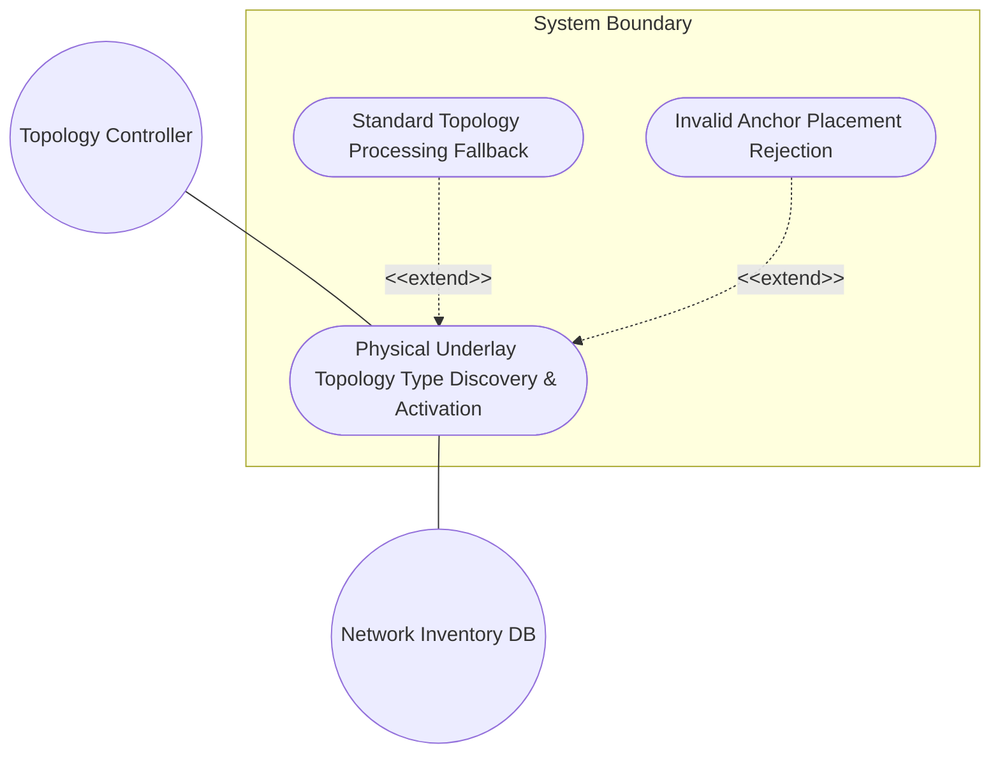
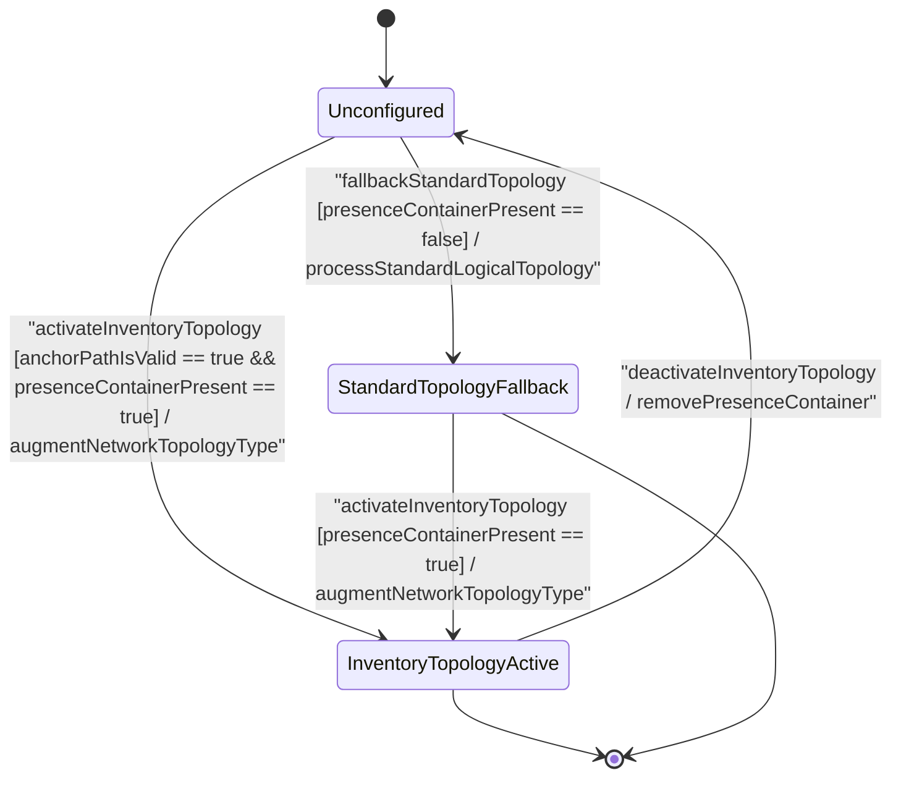

# Use Case: Physical Underlay Network Topology Type Discovery, Activation, and Base Network Topology Augmentation Verification

## Parent Epic
- [ ] #64 - [[ietf-network-inventory-topology]: Network Inventory Topology Mapping](https://github.com/gintatkinson/3dgs-037/blob/main/docs/epics/epic-05-ietf-network-inventory-topology.md) (Provides parent epic context for physical underlay topology mapping and inventory-topology presence container augmentation)

## 1. Actors
- **Primary Actor:** Topology Controller / Inventory Management Engine (`userActor`)
- **Secondary Actors:** Network Inventory Database (`ietf-network-inventory`), Base Network Topology Datastore (`ietf-network`)

## 2. Preconditions
- The base network topology datastore (`ietf-network`) is initialized with at least one network instance under `/nw:networks/nw:network`.
- The `ietf-network-inventory-topology` YANG module schema is loaded and compiled by the topology controller.

## 3. Trigger
The `userActor` initiates network type discovery or configures/activates the physical underlay inventory topology by querying or creating the `inventory-topology` presence container under `/nw:networks/nw:network/nw:network-types/nwit:inventory-topology`.

## 4. Main Success Scenario (Basic Flow)
1. Topology Controller (`userActor`) submits a network topology creation or query request targeting `/nw:networks/nw:network/nw:network-types`.
2. Topology Subsystem (`networkTypes`) verifies that the target path matches the anchor location `/nw:networks/nw:network/nw:network-types`.
3. Topology Subsystem instantiates or detects the presence container `nwit:inventory-topology` under `nw:network-types`.
4. Topology Subsystem evaluates `isInventoryTopology()` on the `inventoryTopology` object, returning `true`.
5. Topology Subsystem marks the network instance as an active Network Inventory Topology, enabling inventory mapping extensions (`ne-ref`, `port-ref`, `link-type`).
6. Topology Subsystem returns success status (`status : Status`) to the Topology Controller (`userActor`) and updates the `PropertyGrid` UI component to render the active "Inventory Topology" flag.

## 5. Alternate and Exception Flows
- **5a. Non-Presence Standard Topology Fallback (Branches from Basic Flow step 3):**
  1. Topology Subsystem detects that the `inventory-topology` presence container is absent under `/nw:networks/nw:network/nw:network-types`.
  2. Topology Subsystem falls back to standard logical network topology processing without activating inventory extensions, sets inventory topology state to inactive, and returns standard topology status.
- **5b. Invalid Parent Hierarchy Anchor Path Rejection (Branches from Basic Flow step 2):**
  1. Topology Controller attempts to attach the `inventory-topology` presence container at an anchor path outside `/nw:networks/nw:network/nw:network-types`.
  2. Topology Subsystem rejects the request due to schema anchor path violation, aborts container instantiation, and returns invalid placement error (`isValid : false`).
- **5c. Operational Read-Only Mutation Violation (Branches from Basic Flow step 3):**
  1. Topology Subsystem detects an unauthorized write or configuration attempt on a read-only operational state inventory topology node.
  2. Topology Subsystem rejects the configuration update, rolls back transient modifications, and returns operational state read-only violation error.

## 6. Postconditions (Guarantees)
- **Success Guarantee:** The network instance is successfully augmented with the `inventory-topology` presence container, marked as active physical underlay inventory topology, and UI state reflects the active inventory topology status.
- **Failure Guarantee:** In the event of invalid anchor path or operational state violation, no state changes are committed to the network datastore, and the network retains its original state with error notifications dispatched to `userActor`.

## UML Diagrams
### Use Case Diagram

### State Machine Diagram

## 7. Operational Context
> "This module augments the 'ietf-network' module by adding the 'inventory-topology' presence container to '/networks/network/network-types'. The presence of this container identifies a network as representing a network inventory topology. The network-inventory-topology model provides structured mapping between logical network topology entities defined in ietf-network-topology base models and physical hardware inventory entities managed in ietf-network-inventory, enabling network controllers to render, query, and manage physical underlay topologies alongside logical overlay models."

## 8. Realization Matrix
### Required User Stories
- [ ] #65 - [[ietf-network-inventory-topology]: Physical Underlay Topology Network Type Discovery, Activation, and Network Topology Augmentation Verification](https://github.com/gintatkinson/3dgs-037/blob/main/docs/user-stories/us-24-inventory-topology-type-activation.md) (Provides BDD scenarios and state machine verification for presence container activation and standard topology fallback)
### Required Features
- [ ] #60 - [[ietf-network-inventory-topology: Network Inventory Topology Type Augment]](https://github.com/gintatkinson/3dgs-037/blob/main/docs/features/feat-17-network-inventory-topology-type-augment.md) (Defines schema presence container inventory-topology under /nw:networks/nw:network/nw:network-types and UI PropertyGrid bindings)

## Source References
Structural Schema: https://github.com/ietf-ivy-wg/network-inventory-topology/blob/main/yang/ietf-network-inventory-topology.yang
Normative Specification: https://datatracker.ietf.org/doc/html/draft-ietf-ivy-network-inventory-topology
