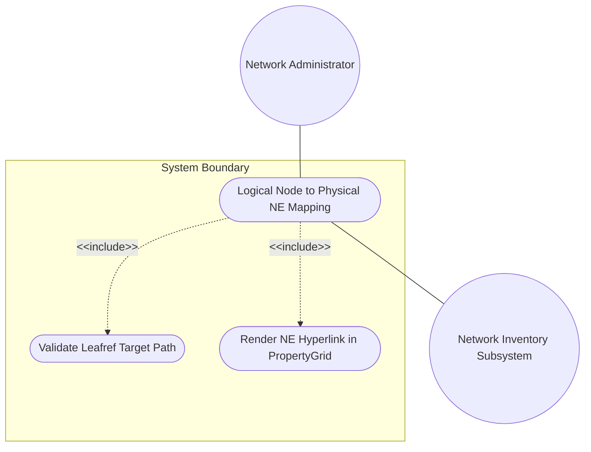
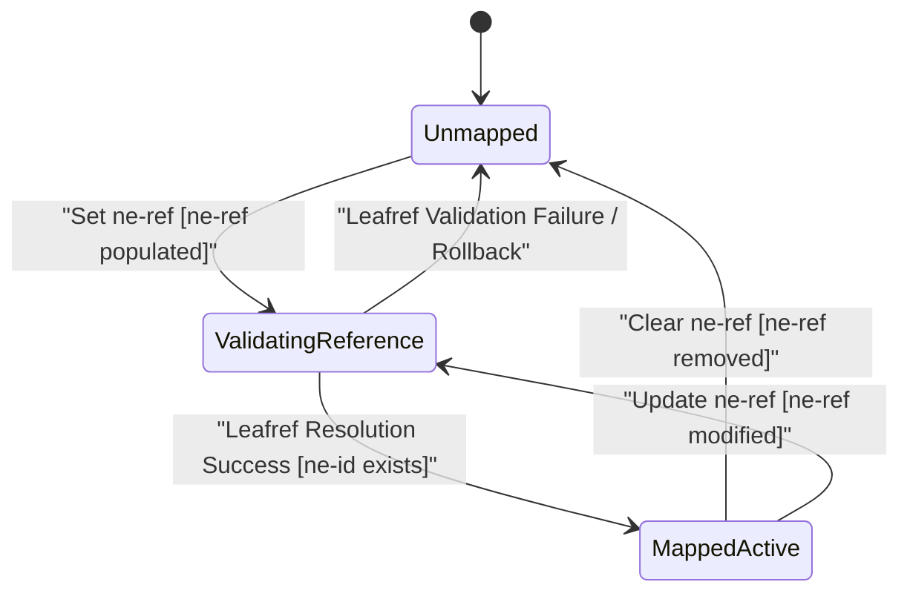

# Use Case: Logical Node to Physical Network Element (NE) Inventory Mapping and 1:1 Correlation

## Parent Epic
- [ ] #64 - [[ietf-network-inventory-topology]: Network Inventory Topology Mapping](https://github.com/gintatkinson/3dgs-037/blob/main/docs/epics/epic-05-ietf-network-inventory-topology.md) (Provides overarching network inventory topology mapping architecture and module definitions)

## 1. Actors
- **Primary Actor:** Network Administrator (System Operator / Controller API Client)
- **Secondary Actors:** Network Inventory Subsystem (`nwi:network-inventory`), Topology Mapping Engine (`nwit:inventory-mapping-attributes`), Visual Interface (`PropertyGrid` panel in `properties_view`)

## 2. Preconditions
- The standard network topology module (`ietf-network`) is active with at least one node existing at path `/nw:networks/nw:network/nw:node`.
- The network inventory subsystem (`ietf-network-inventory`) is populated with managed Network Elements under `/nwi:network-inventory/nwi:network-elements/nwi:network-element`.
- The `ietf-network-inventory-topology` module is loaded and has augmented `/nw:networks/nw:network/nw:node` with the `inventory-mapping-attributes` container.

## 3. Trigger
The Network Administrator or automated Orchestrator submits a request or selects a logical network topology node in the visual interface (`properties_view`) to establish or update its 1:1 mapping to a physical/logical Network Element (`ne-id`).

## 4. Main Success Scenario (Basic Flow)
1. Network Administrator selects a specific logical node (e.g., `"node-core-router-01"`) in the `PropertyGrid` within `properties_view`.
2. Topology Mapping Engine locates the node's schema anchor at `/nw:networks/nw:network/nw:node[node-id='node-core-router-01']/nwit:inventory-mapping-attributes`.
3. Network Administrator inputs or selects a valid target Network Element reference (`ne-ref` = `"ne-router-csr-9000-a"`).
4. Topology Mapping Engine validates that `"ne-router-csr-9000-a"` exists by resolving the leafref target path `/nwi:network-inventory/nwi:network-elements/nwi:network-element/nwi:ne-id`.
5. Network Inventory Subsystem confirms successful leafref resolution and returns the target Network Element metadata.
6. Topology Mapping Engine stores the `ne-ref` leafref binding in the network topology data store under `inventory-mapping-attributes`.
7. Visual Interface (`PropertyGrid`) updates to display the active state, rendering `"ne-router-csr-9000-a"` as an active clickable hyperlink navigating to the physical element detail view.

## 5. Alternate and Exception Flows
- **5a. Invalid ne-ref Type Format Failure (Branches from Basic Flow step 3):**
  1. Topology Mapping Engine detects that the submitted `ne-ref` value violates the `String` type constraint.
  2. Topology Mapping Engine rejects the attribute update, returns a schema type error to Network Administrator, and preserves the prior state without mutating `inventory-mapping-attributes`.
- **5b. Target Path Resolution Failure (Branches from Basic Flow step 4):**
  1. Topology Mapping Engine attempts to resolve the leafref target path `/nwi:network-inventory/nwi:network-elements/nwi:network-element/nwi:ne-id`, but finds the target container unpopulated or inaccessible.
  2. Topology Mapping Engine aborts the resolution process, flags the mapping status as target container unresolved, and notifies Network Administrator.
- **5c. Multiplicity Violation (Branches from Basic Flow step 3):**
  1. Network Administrator attempts to submit multiple `ne-ref` values for a single node, violating the `[0..1]` multiplicity constraint.
  2. Topology Mapping Engine identifies the cardinality violation, rejects the multi-value payload with a schema constraint error, and retains single-value constraint enforcement.
- **5d. Unresolvable Leafref ID Validation Rejection (Branches from Basic Flow step 4):**
  1. Topology Mapping Engine queries the Network Inventory Subsystem for the specified `ne-ref` ID (`ne-invalid-999`), but the ID is missing from `/nwi:network-inventory/nwi:network-elements/nwi:network-element/nwi:ne-id`.
  2. Topology Mapping Engine fails leafref validation, rolls back the pending mapping change, highlights the `PropertyGrid` input field with red error styling (`var(--color-error-border)`), and notifies Network Administrator.
- **5e. Invalid Node Container Anchoring Error (Branches from Basic Flow step 2):**
  1. Topology Mapping Engine receives a configuration payload targeting an invalid container path outside `/nw:networks/nw:network/nw:node/nwit:inventory-mapping-attributes`.
  2. Topology Mapping Engine rejects the misanchored container request, logs an invalid parent anchor exception, and maintains topology schema integrity.
- **5f. Disconnected Inventory Data Store Failure (Branches from Basic Flow step 4):**
  1. Topology Mapping Engine attempts to perform leafref validation against the network inventory data store, but encounters a database network disconnect or timeout.
  2. Topology Mapping Engine aborts the resolution transaction, records a temporary inventory service unavailable error, and keeps the node in its existing unmapped state.
- **5g. Concurrent Node Attribute Lock Exception (Branches from Basic Flow step 6):**
  1. Topology Mapping Engine attempts to commit the `ne-ref` leafref binding under `inventory-mapping-attributes`, but detects a concurrent lock conflict from another administrative session.
  2. Topology Mapping Engine aborts the lock acquisition, rolls back the attribute write, and prompts Network Administrator to retry the transaction.

## 6. Postconditions (Guarantees)
- **Success Guarantee:** The topology node is bound 1:1 to a verified Network Element via `ne-ref` anchored under `inventory-mapping-attributes`, rendered as a clickable hyperlink in `PropertyGrid` within `properties_view`.
- **Failure Guarantee:** The system rejects invalid or unresolvable references, rolls back modifications, displays error highlighting in `PropertyGrid`, and retains the original or unmapped state without data corruption.

## UML Diagrams
### Use Case Diagram

### State Machine Diagram

## 7. Operational Context
> Section 4.2 Node Inventory Mapping:
> "This module augments '/networks/network/node' by adding the 'inventory-mapping-attributes' container. The 'ne-ref' leaf within this container references the network element in the network inventory module that corresponds to the node in the network topology."

## 8. Realization Matrix
### Required User Stories
- [ ] #66 - [[ietf-network-inventory-topology]: Logical Node to Physical Network Element (NE) Leafref Mapping, 1:1 Correlation, and Unmapped Node Fallback](https://github.com/gintatkinson/3dgs-037/blob/main/docs/user-stories/us-25-node-inventory-element-mapping.md) (Provides user interaction requirements, 1:1 leafref binding logic, and unmapped state UI rendering)
### Required Features
- [ ] #61 - [[ietf-network-inventory-topology: Node Inventory Mapping Augment]](https://github.com/gintatkinson/3dgs-037/blob/main/docs/features/feat-18-node-inventory-mapping-augment.md) (Defines schema container, ne-ref leafref validation, target path constraints, and PropertyGrid UI integration)

## Source References
Structural Schema: https://github.com/ietf-ivy-wg/network-inventory-topology/blob/main/yang/ietf-network-inventory-topology.yang
Normative Specification: https://datatracker.ietf.org/doc/html/draft-ietf-ivy-network-inventory-topology
