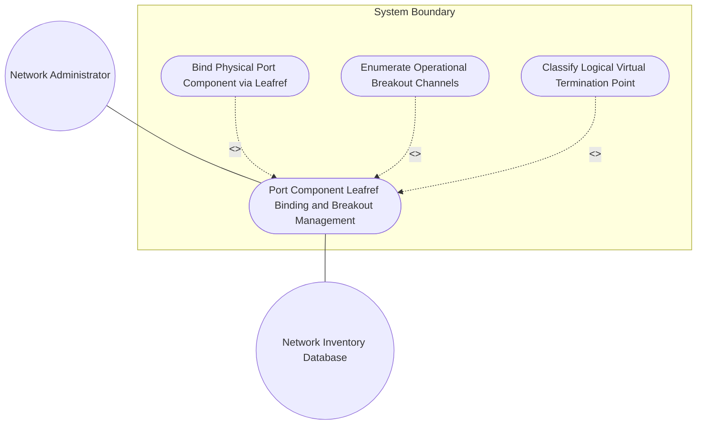
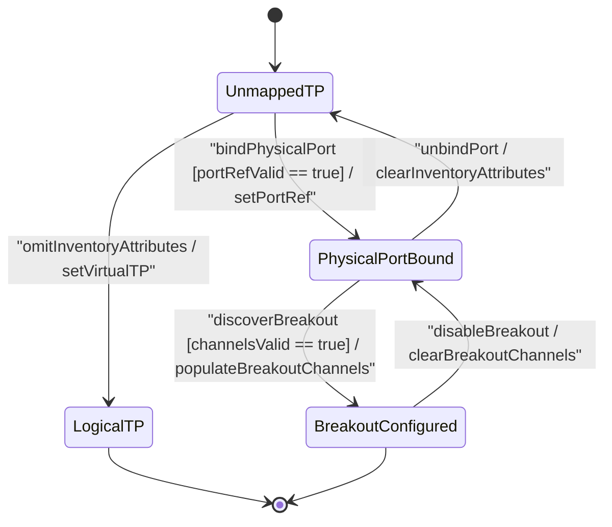

# Use Case: Port Component Leafref Binding, Port Breakout Mode Configuration (4x10G, 2x50G), and Child TP Management

## Parent Epic
- [ ] #64 - [[ietf-network-inventory-topology]: Network Inventory Topology Mapping](https://github.com/gintatkinson/3dgs-037/blob/main/docs/epics/epic-05-ietf-network-inventory-topology.md) (Provides parent epic framework defining structured mapping between logical network topology termination points and physical hardware inventory port components)

## 1. Actors
- **Primary Actor:** Network Administrator (`UserActor`)
- **Secondary Actors:** Network Inventory Database (`Hardware Inventory Controller`), Topology Manager

## 2. Preconditions
- Target network topology node and `TerminationPoint` (TP) instance exist in the topology model at path `/networks/network/node/termination-point`.
- Physical network inventory equipment and component records exist in `/nwi:network-inventory` or can be referenced via `port-ref` leafref.
- Primary Actor has administrative authorization to bind topology termination points to physical hardware assets and view operational port breakout channels.

## 3. Trigger
Network Administrator submits a physical inventory binding or port breakout configuration request for a topology termination point.

## 4. Main Success Scenario (Basic Flow)
1. Network Administrator selects target logical `TerminationPoint` entity and opens the `inventory-mapping-attributes` presence container.
2. Administrator populates `port-ref` leafref targeting physical hardware port component (e.g., `"/nwi:network-inventory/nil:equipment/nil:component[name='shelf1/slot0/port1']"`).
3. System validates `inventory-mapping-attributes` presence container and verifies `port-ref` leafref target exists in hardware inventory.
4. System establishes a 1:1 binding between logical topology TP and physical hardware port component.
5. System inspects physical port hardware capability for channelization / breakout support.
6. System populates operational read-only (`config false`) `port-breakout` presence container on the termination point.
7. System enumerates active `breakout-channel` list entries corresponding to hardware channelization (e.g. 4x10G, 2x50G, 4x100G).
8. System validates each `channel-id` key leaf as a valid 16-bit unsigned integer (`uint16`, range `0..65535`) unique to parent port scope.
9. System renders physical port binding and active breakout channel sub-ports in `components_table` (TableView UI element).
10. System updates `TerminationPoint` state to `PhysicalPortBound` (and `BreakoutConfigured` when channelized) and returns success status.

## 5. Alternate and Exception Flows
- **5a. Omitted inventory-mapping-attributes Container (Logical/Virtual TP Classification) (Branches from Basic Flow step 1):**
  1. System detects `inventory-mapping-attributes` presence container is absent from `TerminationPoint` instance.
  2. System classifies the TP as a logical or virtual interface without physical hardware correlation, renders `"No Inventory Mapping Assigned"` placeholder in UI, and retains unmapped state.
- **5b. Unresolvable port-ref Leafref Target (Branches from Basic Flow step 3):**
  1. System fails to resolve `port-ref` leafref string target against active `/nwi:network-inventory` component registry.
  2. System rejects physical port binding, flags unresolvable leafref error in `components_table`, and retains unmapped TP state.
- **5c. Attempted Write Mutation on config false port-breakout Container (Branches from Basic Flow step 6):**
  1. Administrator attempts direct configuration write to operational read-only (`config false`) `port-breakout` container.
  2. System rejects write operation with schema read-only violation error, aborts transaction, and preserves system operational state.
- **5d. Breakout Channel List Multiplicity Exceeded or Empty (Branches from Basic Flow step 7):**
  1. System encounters negative or corrupt channel list length, or allocation exceeding hardware maximum port channel density.
  2. System invalidates breakout enumeration, issues channel multiplicity exception, and reverts `port-breakout` container to un-channelized operational state.
- **5e. Channel-ID Range Violation [out of uint16 0..65535] or Duplicate Key (Branches from Basic Flow step 8):**
  1. System parses `channel-id` key leaf value outside valid `uint16` range (`<0` or `>65535`) or encounters duplicate `channel-id` within parent port scope.
  2. System rejects channel entry, flags key leaf validation error, and aborts channel sub-port rendering.
- **5f. Non-Breakout Hardware Capability Mismatch (Branches from Basic Flow step 5):**
  1. Physical hardware port component does not support channelization or breakout mode.
  2. System omits operational `port-breakout` container, maintains 1:1 physical port binding, and notifies Administrator of single-lane port operation.
- **5g. Inventory Database Connection Timeout during Binding Resolution (Branches from Basic Flow step 3):**
  1. System encounters database connection timeout while attempting to verify `port-ref` leafref against Network Inventory DB.
  2. System aborts leafref verification, logs connection timeout error, and sets TP mapping status to `ResolutionPending`.
- **5h. Unresolvable Equipment Room Reference Leafref Target (Branches from Basic Flow step 2):**
  1. Administrator submits an invalid or non-existent `equipment-room-ref` string in `inventory-mapping-attributes`.
  2. System fails leafref verification against location registry, displays location correlation error, and rejects attribute save.
- **5i. Component Name Leafref String Length Exception (Branches from Basic Flow step 2):**
  1. Administrator provides a malformed or oversized `component-name` parameter in mapping attributes.
  2. System flags string validation exception, rejects component association, and retains previous mapping configuration.
- **5j. CSS Layout Containment Boundary Rules Violation (Branches from Basic Flow step 9):**
  1. UI rendering engine detects invalid `contain: content` or `contain: strict` rules applied to scrollable child panels in `components_table`.
  2. System strips illegal containment rules, logs UI layout layout boundary warning, and forces recalculation of dynamic list virtualization bounds.
- **5k. TableView Skeleton Row Animated Loading Timeout (Branches from Basic Flow step 9):**
  1. Network Inventory API fails to return hardware breakout details within UI fetching timeout threshold while loading skeleton rows.
  2. System cancels skeleton row animation, displays data fetch timeout banner in `components_table`, and provides a manual retry action.
- **5l. Duplicate Channel-ID Collision across Parent Port Scope (Branches from Basic Flow step 8):**
  1. Hardware inventory driver reports identical `channel-id` key leaf values for multiple breakout sub-ports under the same parent port.
  2. System rejects duplicate sub-port registration, logs channel key collision error, and marks breakout state as `ChannelCollisionError`.
- **5m. UI Error State Border Highlight Assertion Failure (Branches from Basic Flow step 9):**
  1. Verification harness detects missing `var(--color-error-border)` CSS class during failed `port-ref` leafref resolution.
  2. System triggers UI style re-evaluation, applies computed error border styling, and logs UI visual constraint remediation.
- **5n. Hardware Interface Speed/Duplex Alignment Mismatch (Branches from Basic Flow step 5):**
  1. System identifies operational speed or duplex mismatch between breakout channel sub-port lanes and topology link capabilities.
  2. System flags speed/duplex alignment warning, displays channel configuration mismatch indicator, and prompts Administrator for speed adjustment.

## 6. Postconditions (Guarantees)
- **Success Guarantee:** Logical `TerminationPoint` is bound to a physical hardware port component via `inventory-mapping-attributes` `port-ref` leafref, operational breakout capability is enumerated in `port-breakout` with valid `uint16` `channel-id` sub-ports, and mapping is displayed in `components_table`.
- **Failure Guarantee:** Invalid `port-ref` leafrefs, out-of-bounds `channel-id` values (`>65535`), or illegal configuration writes to read-only `port-breakout` are rejected with appropriate error notifications, leaving prior termination point mapping state unmodified.

## UML Diagrams

### Use Case Diagram

### State Machine Diagram

## 7. Operational Context
> "The inventory-mapping-attributes container for a termination point establishes a 1:1 mapping between the logical termination point (TP) in the network topology and a physical port component in the network inventory. The inventory-mapping-attributes containers are defined as read-write (config true) to accommodate cases where automatic discovery is not possible. Furthermore, the port-breakout container (config false) represents the operational breakout capability of the physical port when hardware supports partitioning into multiple independent channels (e.g., 400G to 4x100G, 40G to 4x10G, 100G to 2x50G), listing each available channel sub-port by a unique 16-bit unsigned integer channel-id."

## 8. Realization Matrix

### Required User Stories
- [ ] #67 - [[ietf-network-inventory-topology]: Port Component Leafref Binding, Port Breakout Capability Configuration (e.g. 4x10G, 2x50G), Child TP Numbering, and Speed/Duplex Alignment](https://github.com/gintatkinson/3dgs-037/blob/main/docs/user-stories/us-26-termination-point-component-and-breakout-mode.md) (Validates 1:1 physical port leafref binding via inventory-mapping-attributes, operational port-breakout capability configuration, and uint16 channel-id enumeration)

### Required Features
- [ ] #62 - [[ietf-network-inventory-topology: Termination Point Inventory Mapping Augment]](https://github.com/gintatkinson/3dgs-037/blob/main/docs/features/feat-19-termination-point-inventory-mapping-augment.md) (Provides inventory-mapping-attributes presence container, port-ref leafref, port-breakout config false container, and breakout-channel uint16 list schema elements)

## Source References
Structural Schema: https://github.com/ietf-ivy-wg/network-inventory-topology/blob/main/yang/ietf-network-inventory-topology.yang
Normative Specification: https://datatracker.ietf.org/doc/html/draft-ietf-ivy-network-inventory-topology
