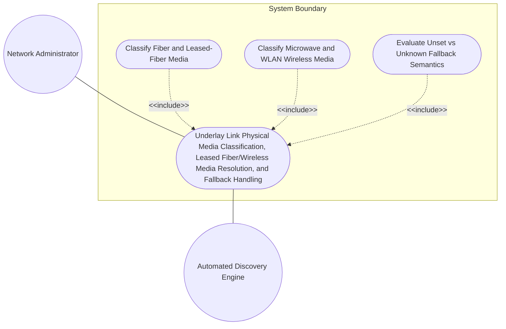
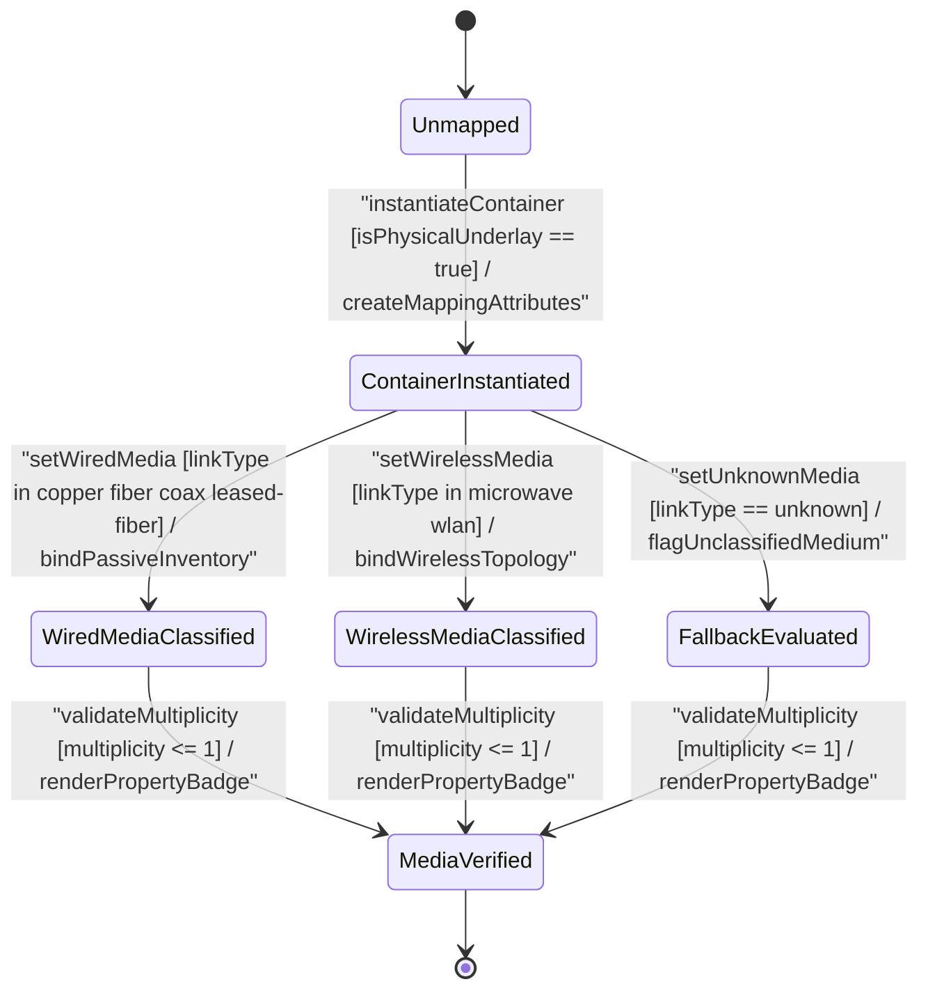

# Use Case: Underlay Link Physical Media Classification, Leased Fiber/Wireless Media Resolution, and Fallback Handling

## Parent Epic
- [ ] #64 - [[ietf-network-inventory-topology]: Network Inventory Topology Mapping](https://github.com/gintatkinson/3dgs-037/blob/main/docs/epics/epic-05-ietf-network-inventory-topology.md) (Provides overarching network inventory topology mapping framework for underlay physical link media classification)

## 1. Actors
- **Primary Actor:** Network Administrator (`UserActor`)
- **Secondary Actors:** Automated Discovery Engine, Inventory Database (`InventoryMappingAttributes`)

## 2. Preconditions
- Target network topology instance exists in `/nw:networks/nw:network`.
- Underlay topology link entity exists under `/nw:networks/nw:network/nt:link`.
- `ietf-network-inventory-topology` YANG module is loaded and `inventory-topology` network type flag is enabled.
- Network Administrator or Discovery Engine possesses credentials to inspect and configure link inventory mapping attributes.

## 3. Trigger
Network Administrator or Automated Discovery Engine initiates physical underlay media classification and inventory mapping for a network topology link.

## 4. Main Success Scenario (Basic Flow)
1. Actor identifies target `link` entity within `/nw:networks/nw:network/nt:link`.
2. Actor instantiates the `inventory-mapping-attributes` presence container at `/nw:networks/nw:network/nt:link/nwit:inventory-mapping-attributes` to classify the link as a lowest underlay physical link.
3. System validates presence of container, confirming the link operates at the lowest physical underlay abstraction layer.
4. Actor sets `link-type` leaf (`identityref` base `link-type`) to `"fiber"`.
5. System validates `link-type` against base identity `link-type` hierarchy and allowed derived identities (`copper`, `fiber`, `coax`, `microwave`, `wlan`, `unknown`, `leased-fiber`).
6. System checks multiplicity constraint `[0..1]` on `link-type` leaf.
7. System binds the physical link to passive optical network inventory model and updates link media state to `FiberClassified`.
8. System renders media classification badge in PropertyGrid layout container (`properties_view`).

## 5. Alternate and Exception Flows
- **5a. Absence of Presence Container for Upper-Layer Logical Link (Branches from Basic Flow step 2):**
  1. System detects `inventory-mapping-attributes` container is absent on target link.
  2. System classifies link as a higher-layer logical or virtual link, displays `"Logical / Upper-Layer Link (No Physical Inventory Mapping)"` in `properties_view`, and skips physical media resolution.
- **5b. Target Path Parent Topology Link Missing (Branches from Basic Flow step 2):**
  1. System detects target link path does not exist under `/nw:networks/nw:network/nt:link`.
  2. System rejects `inventory-mapping-attributes` instantiation, returns invalid parent link error, and aborts transaction.
- **5c. Inventory Topology Network Type Disabled (Branches from Basic Flow step 2):**
  1. System detects target network instance lacks `inventory-topology` network-type declaration.
  2. System blocks container augmentation, flags missing topology feature flag, and retains baseline network topology.
- **5d. Unrecognized Identityref Base Identity (Branches from Basic Flow step 5):**
  1. Actor attempts to set `link-type` to an identity string not extending base identity `link-type`.
  2. System rejects assignment, flags identityref schema validation failure, and restores prior leaf state.
- **5e. Identityref Namespace Resolution Error (Branches from Basic Flow step 5):**
  1. Actor provides an un-resolvable XML/JSON module prefix for `link-type` identityref.
  2. System applies red border highlight (`var(--color-error-border)`) in `properties_view`, logs prefix resolution error, and prompts for valid module namespace.
- **5f. Scalar Multiplicity Constraint Violation [0..1] (Branches from Basic Flow step 6):**
  1. Actor attempts to assign multiple identityref values or pass a JSON array to `link-type`.
  2. System enforces `[0..1]` scalar constraint, rejects array payload, and logs multiplicity error.
- **5g. Unsupported Link Type String Value (Branches from Basic Flow step 5):**
  1. Actor passes an unknown identity string outside allowed set (`copper`, `fiber`, `coax`, `microwave`, `wlan`, `unknown`, `leased-fiber`).
  2. System flags value error, displays invalid media badge, and rejects update.
- **5h. Unset Leaf vs Explicit Unknown Fallback Evaluation (Branches from Basic Flow step 4):**
  1. Discovery Engine completes physical link inspection but cannot determine physical media type.
  2. Engine explicitly sets `link-type` to `"unknown"` instead of leaving leaf unset, allowing system to distinguish an assessed unknown medium from an un-assessed link.
- **5i. Un-Assessed Link Unset Leaf Inspection (Branches from Basic Flow step 4):**
  1. System queries link where `link-type` leaf is omitted (unset).
  2. System evaluates leaf as un-assessed, displays `"Un-assessed Link Medium"` status, and prompts discovery trigger.
- **5j. Leased Fiber Specialization Resolution (Branches from Basic Flow step 4):**
  1. Actor configures `link-type` to `"leased-fiber"` for third-party leased optical connection.
  2. System resolves `leased-fiber` as a specialized sub-identity extending `fiber`, displays leased optical indicator, and binds external lease contract ID.
- **5k. Optical Fiber Passive Inventory Binding (Branches from Basic Flow step 7):**
  1. Actor configures `link-type` to `"fiber"`.
  2. System classifies optical link, binds to passive optical network inventory model, and updates status to `FiberClassified`.
- **5l. Metallic Copper Cable Passive Inventory Binding (Branches from Basic Flow step 7):**
  1. Actor configures `link-type` to `"copper"`.
  2. System classifies twisted-pair metallic link and binds to copper cable passive inventory parameters.
- **5m. Coaxial Cable Transmission Line Classification (Branches from Basic Flow step 7):**
  1. Actor configures `link-type` to `"coax"`.
  2. System classifies coaxial transmission line and binds to coax plant inventory model.
- **5n. Microwave Wireless Topology Binding (Branches from Basic Flow step 7):**
  1. Actor configures `link-type` to `"microwave"`.
  2. System resolves wireless media classification and links topology node to RFC 9656 microwave topology model.
- **5o. WLAN Wireless Access Topology Binding (Branches from Basic Flow step 7):**
  1. Actor configures `link-type` to `"wlan"`.
  2. System resolves WLAN wireless medium and binds link to wireless access inventory attributes.
- **5p. Read-Only State Rendering in PropertyGrid (Branches from Basic Flow step 8):**
  1. User views non-editable topology link in `properties_view`.
  2. System renders read-only media classification badge with corresponding optical/wireless/metallic icon.

## 6. Postconditions (Guarantees)
- **Success Guarantee:** `inventory-mapping-attributes` presence container is instantiated, `link-type` identityref is validated against allowed derived identities (`copper`, `fiber`, `coax`, `microwave`, `wlan`, `unknown`, `leased-fiber`), physical underlay status is established, and PropertyGrid in `properties_view` displays updated media classification badge.
- **Failure Guarantee:** Invalid target path, unauthorized identityref base, multiplicity violation, or malformed identity string is rejected, leaving link inventory mapping state unmodified.

## UML Diagrams
### Use Case Diagram

### State Machine Diagram

## 7. Operational Context
> "The inventory-mapping-attributes presence container augments the network topology link structure (/nw:networks/nw:network/nt:link) defined in the ietf-network-inventory-topology YANG module. The presence of this container designates a physical link operating at the lowest underlay abstraction level in the network hierarchy. This container provides lightweight media classification through the link-type leaf, which references identity base link-type. It serves as a discriminator linking logical topology links to specialized physical inventory models: wired media (fiber, copper, coax, leased-fiber), wireless media (microwave, wlan), or unknown medium when discovery systems cannot determine physical details. When discovery cannot classify the medium, link-type MUST be set to unknown rather than left unset, distinguishing an assessed unknown medium from an un-assessed link."

## 8. Realization Matrix
### Required User Stories
- [ ] #68 - [[ietf-network-inventory-topology]: Underlay Link Media Type Classification (copper, fiber, coax, microwave, wlan, leased-fiber, unknown), Unset vs Unknown Evaluation, and Passive Inventory Resolution](https://github.com/gintatkinson/3dgs-037/blob/main/docs/user-stories/us-27-link-inventory-media-type-classification.md) (Validates link-type identityref classification across wired, wireless, leased-fiber, and unknown fallback semantics)

### Required Features
- [ ] #63 - [[ietf-network-inventory-topology: Link Inventory Mapping Augment]](https://github.com/gintatkinson/3dgs-037/blob/main/docs/features/feat-20-link-inventory-mapping-augment.md) (Provides inventory-mapping-attributes presence container, link-type identityref leaf, and PropertyGrid UI integration in properties_view)

## Source References
Structural Schema: https://github.com/ietf-ivy-wg/network-inventory-topology/blob/main/yang/ietf-network-inventory-topology.yang (Clause: Section 5 / line 179-220)
Normative Specification: https://datatracker.ietf.org/doc/html/draft-ietf-ivy-network-inventory-topology (Clause: Section 4.3)
