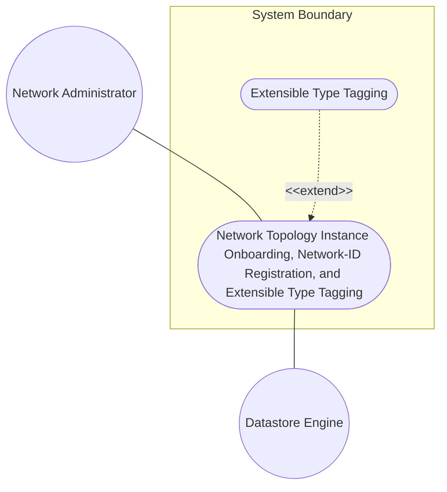
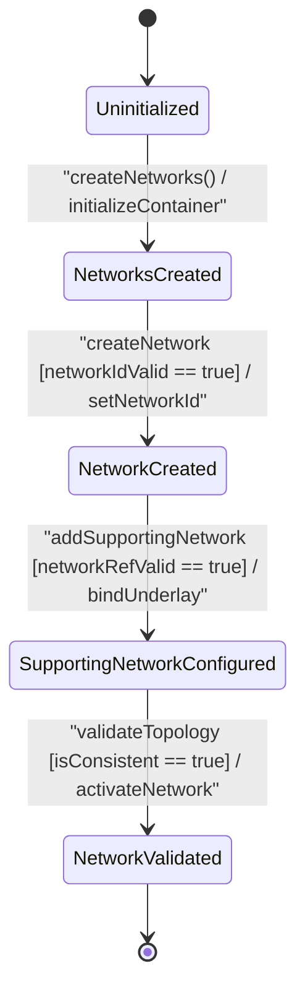

# Use Case: Network Topology Instance Onboarding, Network-ID Registration, and Extensible Type Tagging

## Parent Epic
- [ ] #90 - [[ietf-network-and-topology]: Network and Topology Base Models](https://github.com/gintatkinson/3dgs-037/blob/main/docs/epics/epic-07-ietf-network-and-topology.md) (Parent Epic defining base network and topology models)

## 1. Actors
- **Primary Actor:** Network Administrator
- **Secondary Actors:** Datastore Engine

## 2. Preconditions
- The system datastore container `/networks` is initialized and operational.
- The `Network Administrator` possesses valid authorization privileges to write topology data under `/networks/network`.

## 3. Trigger
The `Network Administrator` submits a network creation request containing a target `network-id` URI string, optional `network-types` presence flags, and optional `supporting-network` underlay references.

## 4. Main Success Scenario (Basic Flow)
1. `Network Administrator` submits a network onboarding request to `Datastore Engine` specifying `network-id` URI `"urn:ietf:params:xml:ns:yang:ietf-network?net=core-nw-01"`.
2. `Datastore Engine` parses the payload and verifies that `network-id` complies with the `inet:uri` string syntax constraints.
3. `Datastore Engine` checks `/networks/network` to confirm that `network-id` `"urn:ietf:params:xml:ns:yang:ietf-network?net=core-nw-01"` is unique within the datastore.
4. `Datastore Engine` validates all `supporting-network` entries by checking that each `network-ref` leafref points to an existing `network-id` in `/networks/network` and that no self-referential or cyclic underlay dependencies exist.
5. `Datastore Engine` initializes the optional `network-types` presence container (if specified in request) to enable downstream layer extensions.
6. `Datastore Engine` persists the new `network` instance under `/networks/network`, commits the transaction, and returns a successful status response to `Network Administrator`.

## 5. Alternate and Exception Flows
- **5a. Missing or Invalid Network-ID URI Format (Branches from Basic Flow step 2):**
  1. `Datastore Engine` detects that the submitted `network-id` is empty or violates the `inet:uri` syntax schema specification.
  2. `Datastore Engine` aborts the transaction, logs a syntax validation error, and returns an invalid URI error response to `Network Administrator`.

- **5b. Unresolvable Supporting Network Reference (Branches from Basic Flow step 4):**
  1. `Datastore Engine` evaluates the `supporting-network` list and finds a `network-ref` targeting a non-existent `network-id` URI.
  2. `Datastore Engine` aborts the transaction, rolls back transient changes, and returns a broken leafref target error response to `Network Administrator`.

- **5c. Self-Referential or Cyclic Supporting Network Dependency (Branches from Basic Flow step 4):**
  1. `Datastore Engine` traverses the supporting network graph and detects a direct self-reference (where `network-ref` equals `network-id`) or a circular multi-layer underlay loop.
  2. `Datastore Engine` aborts the transaction, flags a topological circular dependency error, and returns a cycle violation response to `Network Administrator`.

## 6. Postconditions (Guarantees)
- **Success Guarantee:** The `network` instance is fully instantiated and persisted in the datastore under `/networks/network` with a validated `network-id` URI key, optional active `network-types` presence container, and verified `supporting-network` underlay references.
- **Failure Guarantee:** The datastore state remains unmodified (transaction rolled back), no partial or invalid network entry is created, and an explicit error notification is returned to `Network Administrator`.

## UML Diagrams
### Use Case Diagram


### State Machine Diagram


## 7. Operational Context
```text
Section 4.1. Base Network Model

The base network model is defined by the "ietf-network" YANG module. It defines networks and their components at a high level of abstraction.

The data model for a network is represented by a container "networks" holding a list of "network" entries. Each network is identified by a "network-id".

A network can contain:
- network-types: This container acts as an extension point for specific types of networks. Presence of specific containers inside network-types indicates that the network is of that specific type.
- supporting-network: A network can be supported by one or more other networks (underlay networks). A supporting network is identified by its network-ref.

YANG Module ietf-network@2018-02-26.yang:

container networks {
  description
    "Serves as top-level container for a list of networks.";
  list network {
    key "network-id";
    description
      "Describes a network.
       A network instance is provided by an administrative domain.";
    leaf network-id {
      type network-id;
      description
        "Identifies a network.";
    }
    container network-types {
      description
        "Serves as an extension point for new network types.";
    }
    list supporting-network {
      key "network-ref";
      description
        "An underlay network, used to represent network topologies
         composing the network.";
      leaf network-ref {
        type leafref {
          path "/networks/network/network-id";
          require-instance false;
        }
        description
          "References the underlay network.";
      }
    }
  }
}
```

## 8. Realization Matrix
### Required User Stories
- [ ] #91 - [[ietf-network]: Base Network Instance Onboarding, Network-ID String Syntax Checking, and Supporting Network Multi-Layer Overlay Hierarchy Resolution](https://github.com/gintatkinson/3dgs-037/blob/main/docs/user-stories/us-32-network-instance-lifecycle.md) (Provides the BDD scenarios and behavioral requirements for network instance creation, URI syntax validation, presence container toggling, and multi-layer supporting network hierarchy resolution)

### Required Features
- [ ] #86 - [[ietf-network: Base Networks and Network Data Model]](https://github.com/gintatkinson/3dgs-037/blob/main/docs/features/feat-25-base-networks-and-network-data-model.md) (Provides base networks container, network-id URI key, network-types presence container, and supporting-network leafref hierarchy)

## Source References
Structural Schema: https://github.com/YangModels/yang/blob/main/standard/ietf/RFC/ietf-network%402018-02-26.yang
Normative Specification: https://datatracker.ietf.org/doc/rfc8345/
