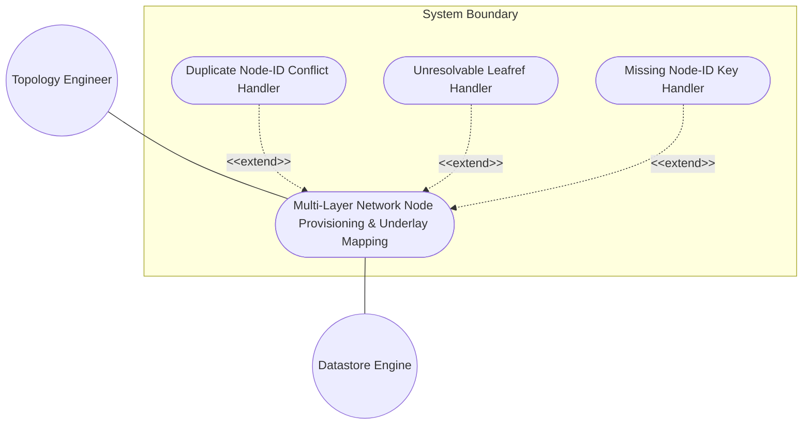
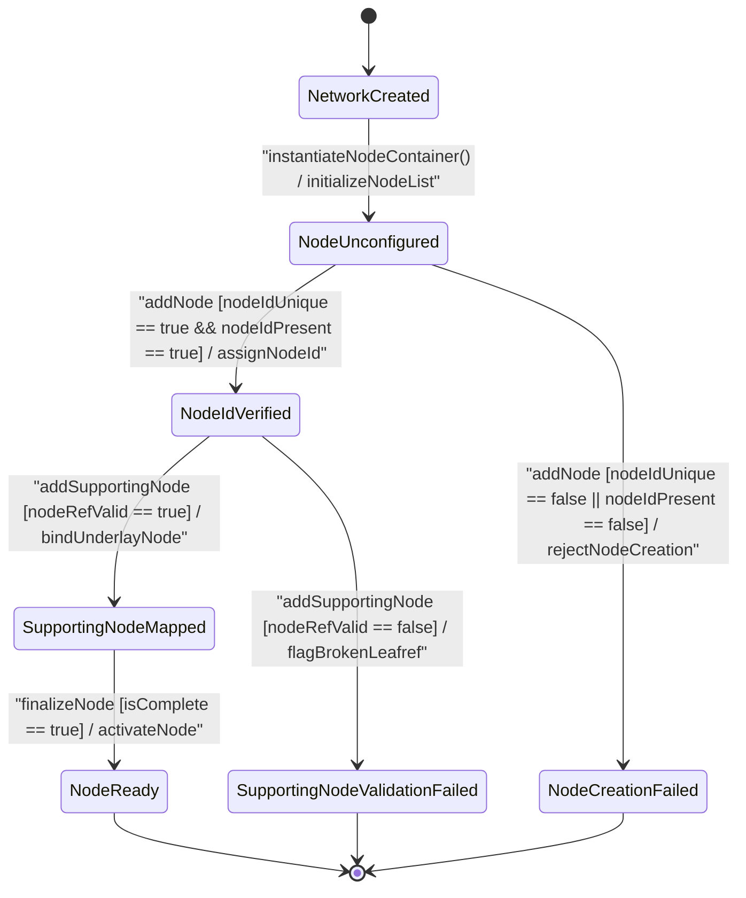

# Use Case: Multi-Layer Network Node Provisioning, Node-ID Unique Verification, and Supporting Node Underlay Mapping

## Parent Epic
- [ ] #90 - [[ietf-network-and-topology]: Network and Topology Base Models](https://github.com/gintatkinson/3dgs-037/blob/main/docs/epics/epic-07-ietf-network-and-topology.md) (Provides parent epic context for multi-layer network graph modeling, generic node abstractions, and underlay supporting-node hierarchy traversal)

## 1. Actors
- **Primary Actor:** Topology Engineer (`userActor`)
- **Secondary Actors:** Datastore Engine (`ietf-network` Datastore Subsystem), Base Network Engine

## 2. Preconditions
- The base network topology datastore (`ietf-network`) is initialized with at least one network instance under `/nw:networks/nw:network`.
- The `ietf-network` YANG module schema is loaded and compiled by the Datastore Engine.
- The target containing network ID (e.g., `"overlay-nw-1"`) exists and is active within the datastore.

## 3. Trigger
The `userActor` initiates node provisioning or submits a configuration payload to create a new `node` instance under `/nw:networks/nw:network[network-id='overlay-nw-1']/nw:node`.

## 4. Main Success Scenario (Basic Flow)
1. Topology Engineer (`userActor`) submits a node creation request specifying `node-id` (e.g., `"router-alpha"`) for target network `"overlay-nw-1"`.
2. Datastore Engine (`subsystemComponent`) receives the request and verifies that `node-id` is non-empty and unique within the target network scope `/nw:networks/nw:network[network-id='overlay-nw-1']`.
3. Datastore Engine instantiates the `Node` domain object, executes `setNodeId("router-alpha")`, and persists the node under `/nw:networks/nw:network[network-id='overlay-nw-1']/nw:node[node-id='router-alpha']`.
4. Topology Engineer (`userActor`) submits a supporting node mapping request specifying underlay `network-ref` (`"underlay-nw-01"`) and `node-ref` (`"phys-switch-01"`).
5. Datastore Engine (`supportingNode`) executes `validateNodeRef("underlay-nw-01", "phys-switch-01")`, confirms underlay target leafref validity (`require-instance false`), binds the underlay mapping to `"router-alpha"`, and returns success status (`status : Status`) to `userActor`.
6. Datastore Engine updates the `TableView` component bound to `/nw:networks/nw:network/nw:node` within container `elements_view` to render the newly provisioned node and its supporting node count.

## 5. Alternate and Exception Flows
- **5a. Duplicate Node-ID Conflict (Branches from Basic Flow step 2):**
  1. Datastore Engine (`subsystemComponent`) checks the existing node inventory in network `"overlay-nw-1"` and detects an existing node with identical `node-id` = `"router-alpha"`.
  2. Datastore Engine rejects the node creation transaction, aborts node object instantiation, rolls back transient modifications, and returns a key uniqueness conflict error (`status : DuplicateNodeIdError`) to `userActor`.
- **5b. Unresolvable Supporting Node Leafrefs (Branches from Basic Flow step 5):**
  1. Datastore Engine (`supportingNode`) evaluates `validateNodeRef("underlay-nw-01", "non-existent-node")` and detects that the referenced target underlay node cannot be resolved in the specified underlay network.
  2. Datastore Engine flags the broken leafref target constraint, displays an error badge with tooltip in the `TableView` component in container `elements_view`, and returns a leafref validation failure warning (`isValid : false`) to `userActor`.
- **5c. Missing Mandatory Node-ID Key (Branches from Basic Flow step 2):**
  1. Datastore Engine (`subsystemComponent`) validates the node creation payload and detects that the mandatory key leaf `node-id` is omitted or empty.
  2. Datastore Engine rejects the payload due to mandatory schema key violation, aborts transaction processing, and returns a missing mandatory key error (`status : MissingMandatoryKeyError`) to `userActor`.
- **5d. Unresolvable Supporting Network Leafref (Branches from Basic Flow step 5):**
  1. Datastore Engine (`supportingNode`) evaluates the `network-ref` key leaf within `supporting-node` and detects that the target underlay network `"non-existent-underlay-nw"` does not exist in `/nw:networks/nw:network`.
  2. Datastore Engine rejects the underlay node binding, logs an invalid supporting-network leafref violation, and returns a target network resolution failure (`status : InvalidSupportingNetworkRef`) to `userActor`.
- **5e. Non-Existent Containing Parent Network Target (Branches from Basic Flow step 1):**
  1. Datastore Engine (`subsystemComponent`) inspects the target network path `/nw:networks/nw:network[network-id='non-existent-nw']` and determines that the specified parent network is not provisioned in the datastore.
  2. Datastore Engine rejects the node creation request, aborts node container insertion, and returns a missing parent container error (`status : ParentNetworkNotFound`) to `userActor`.
- **5f. Self-Referential Underlay Node Loop Prevention (Branches from Basic Flow step 5):**
  1. Datastore Engine (`supportingNode`) validates the supporting node mapping and detects that `network-ref` and `node-ref` point directly back to `"overlay-nw-1"` and `"router-alpha"` (creating a circular self-referential underlay mapping).
  2. Datastore Engine rejects the supporting node entry, prevents circular graph dependency, and returns a circular underlay mapping error (`status : CircularUnderlayReferenceError`) to `userActor`.

## 6. Postconditions (Guarantees)
- **Success Guarantee:** The node object is created with a unique `node-id`, successfully stored under `/nw:networks/nw:network/nw:node`, bound to valid underlay supporting node references (`network-ref`, `node-ref`), and rendered in the `TableView` LUI component within container `elements_view`.
- **Failure Guarantee:** In the event of a duplicate `node-id`, missing mandatory key, or unresolvable leafref, the transaction is rejected or flagged with error badges, no corrupt node entries are persisted in the datastore, and error notifications are returned to `userActor`.

## UML Diagrams
### Use Case Diagram


### State Machine Diagram


## 7. Operational Context
> The node data model is defined by the "ietf-network" YANG module.
> A node is identified by a node-id, which is unique within the containing network.
> A node can be supported by lower-layer nodes. A supporting node is defined by a network-ref (which refers to the supporting network) and a node-ref (which refers to the supporting node in that network).
> 
> ```yang
> list node {
>   key "node-id";
>   description
>     "The nodes that the network contains.";
>   leaf node-id {
>     type node-id;
>     description
>       "The identifier of a node in the container network.";
>   }
>   list supporting-node {
>     key "network-ref node-ref";
>     description
>       "Identifies the node, or nodes, that support this node.";
>     leaf network-ref {
>       type leafref {
>         path "/nw:networks/nw:network/nw:network-id";
>         require-instance false;
>       }
>       description
>         "This leaf identifies the network that supports the node.";
>     }
>     leaf node-ref {
>       type leafref {
>         path "/nw:networks/nw:network[nw:network-id=current()/../network-ref]/nw:node/nw:node-id";
>         require-instance false;
>       }
>       description
>         "This leaf identifies the node that supports the node.";
>     }
>   }
> }
> ```

## 8. Realization Matrix
### Required User Stories
- [ ] #92 - [[ietf-network]: Abstract and Physical Node Creation, Node-ID Uniqueness Verification, and Underlay Supporting Node Traversal](https://github.com/gintatkinson/3dgs-037/blob/main/docs/user-stories/us-33-node-creation-and-supporting-node-mapping.md) (Provides BDD scenarios and state machine transitions for node instantiation, scope uniqueness verification, and supporting node compound leafref binding)
### Required Features
- [ ] #87 - [[ietf-network: Node Data Model and Supporting Nodes]](https://github.com/gintatkinson/3dgs-037/blob/main/docs/features/feat-26-node-data-model-and-supporting-nodes.md) (Defines schema container node under /ietf-network:networks/network/node, supporting-node leafrefs, and TableView LUI bindings)
- [ ] #86 - [[ietf-network: Base Networks and Network Data Model]](https://github.com/gintatkinson/3dgs-037/blob/main/docs/features/feat-25-base-networks-and-network-data-model.md) (Provides parent networks/network container context and base network instance lifecycle)

## Source References
Structural Schema: https://github.com/YangModels/yang/blob/main/standard/ietf/RFC/ietf-network%402018-02-26.yang
Normative Specification: https://datatracker.ietf.org/doc/rfc8345/
