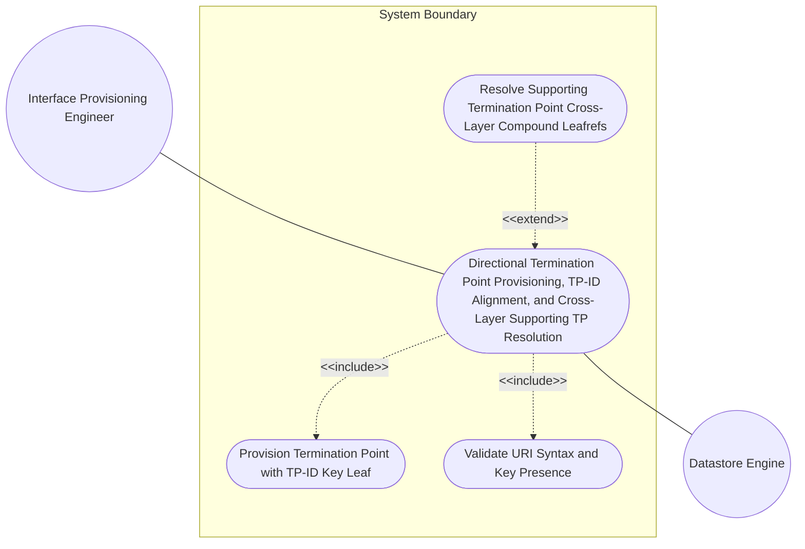
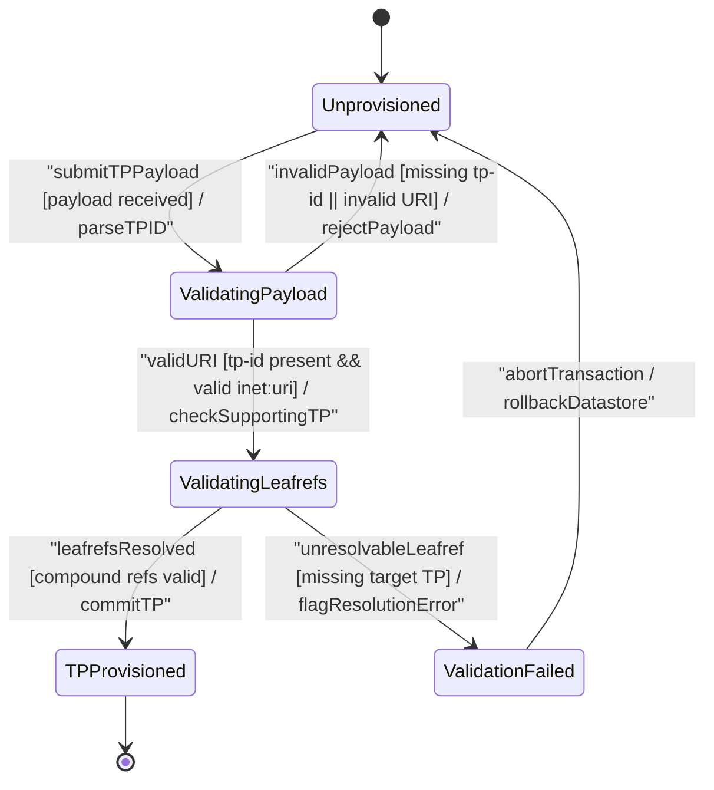

# Use Case: Directional Termination Point Provisioning, TP-ID Alignment, and Cross-Layer Supporting TP Resolution

## Parent Epic
- [ ] #90 - [[ietf-network-and-topology]: Network and Topology Base Models](https://github.com/gintatkinson/3dgs-037/blob/main/docs/epics/epic-07-ietf-network-and-topology.md) (Provides the base network and topology model container hierarchy within which termination points are scoped and anchored.)

## 1. Actors
- **Primary Actor:** Interface Provisioning Engineer (`UserActor`)
- **Secondary Actors:** Datastore Engine (`Topology Datastore`), Topology Manager

## 2. Preconditions
- Target network container `/networks/network` and parent node `/networks/network/node` instances exist in the active datastore.
- The Interface Provisioning Engineer is authenticated and authorized to perform topology configuration and termination point binding operations.
- Target underlay network, node, and termination point instances exist (or are defined) for supporting-termination-point cross-layer leafref resolution.

## 3. Trigger
Interface Provisioning Engineer submits a configuration request to create or update a `termination-point` entry with `tp-id` and optional `supporting-termination-point` bindings on a target network node.

## 4. Main Success Scenario (Basic Flow)
1. Interface Provisioning Engineer selects target network node (`/networks/network[network-id]/node[node-id]`) in the TableView UI element.
2. Engineer submits a `termination-point` creation payload specifying the mandatory `tp-id` key leaf (formatted as a valid `inet:uri` identifier, e.g., `"urn:ietf:params:xml:ns:yang:ietf-network-topology?tp=eth-0"`).
3. Datastore Engine validates the `tp-id` key leaf for mandatory presence and valid URI syntax compliance.
4. Engineer populates optional `supporting-termination-point` list entries specifying the compound keys `network-ref`, `node-ref`, and `tp-ref`.
5. Datastore Engine validates the compound leafref dependencies (`../../../nw:supporting-node/nw:network-ref`, `../../../nw:supporting-node/nw:node-ref`, and `/nw:networks/nw:network[nw:network-id=current()/../network-ref]/nw:node[nw:node-id=current()/../node-ref]/termination-point/tp-id`).
6. Datastore Engine commits the `termination-point` container into the active datastore and establishes cross-layer binding.
7. Topology Manager updates the UI view elements, rendering the provisioned termination point and its supporting TP resolution chain.

## 5. Alternate and Exception Flows
- **5a. Missing Mandatory tp-id Key Leaf Rejection (Branches from Basic Flow step 2):**
  1. Datastore Engine detects `termination-point` creation payload lacks mandatory `tp-id` key leaf.
  2. Datastore Engine rejects transaction with schema validation error (`missing-element`), aborts instantiation, and leaves datastore unmodified.
- **5b. Invalid tp-id URI Syntax Format Error (Branches from Basic Flow step 2):**
  1. Datastore Engine detects `tp-id` string value violates `inet:uri` typedef syntax rules (e.g., missing URI scheme or illegal characters).
  2. Datastore Engine rejects write operation with data type syntax error (`invalid-value`), logs URI parsing failure, and notifies Engineer.
- **5c. Unresolvable supporting-termination-point Compound Leafrefs (Branches from Basic Flow step 5):**
  1. Datastore Engine checks compound leafrefs `network-ref`, `node-ref`, and `tp-ref` against active network topology instances.
  2. Datastore Engine fails to locate referenced supporting termination point in targeted network/node.
  3. Datastore Engine flags leafref resolution error, logs unresolvable cross-layer target, and prevents invalid supporting TP binding.
- **5d. Duplicate tp-id Key Leaf Collision on Target Node (Branches from Basic Flow step 2):**
  1. Datastore Engine detects an existing `termination-point` list entry under target node with identical `tp-id` URI key.
  2. Datastore Engine rejects creation payload with duplicate key collision error (`data-exists`), aborts transaction, and retains existing termination point record.
- **5e. Circular Supporting Termination Point Dependency Loop (Branches from Basic Flow step 5):**
  1. Topology Manager detects a circular cross-layer mapping loop where supporting termination point references cycle back to the origin TP.
  2. Datastore Engine aborts transaction, flags circular dependency violation, and notifies Engineer of topology mapping constraint failure.
- **5f. Unresolvable Supporting Network Reference (Branches from Basic Flow step 4):**
  1. Datastore Engine evaluates `network-ref` leafref path (`../../../nw:supporting-node/nw:network-ref`) for `supporting-termination-point`.
  2. Datastore Engine fails to resolve `network-ref` against active network containers in the datastore, rejects supporting TP entry, and logs missing network dependency.
- **5g. Unresolvable Supporting Node Reference (Branches from Basic Flow step 4):**
  1. Datastore Engine evaluates `node-ref` leafref path (`../../../nw:supporting-node/nw:node-ref`) for `supporting-termination-point`.
  2. Datastore Engine determines specified node does not exist within target supporting network, aborts leafref resolution, and returns node reference validation error.
- **5h. Non-Existent Parent Node Instance (Branches from Basic Flow step 1):**
  1. Engineer attempts to provision a termination point under a non-existent parent node container path.
  2. Datastore Engine fails container path lookup, issues hierarchy target error (`instance-required`), and rejects payload instantiation.
- **5i. UI Dynamic Containment Layout Bounds Exception (Branches from Basic Flow step 7):**
  1. Topology Manager UI encounters dynamic layout bounds calculation overflow when rendering deep supporting TP hierarchy chains in TableView.
  2. System applies virtualized scroll boundaries, clears invalid CSS containment, and forces UI redraw without interrupting datastore state.

## 6. Postconditions (Guarantees)
- **Success Guarantee:** Target `termination-point` instance is successfully provisioned under `/networks/network/node` with a unique, valid `inet:uri` `tp-id` key leaf, cross-layer `supporting-termination-point` compound leafrefs are validated, and the TP is bound to the node.
- **Failure Guarantee:** In the event of missing key leaves, malformed URI syntax, unresolvable leafrefs, or duplicate key collisions, the transaction is rejected and rolled back without modifying existing datastore states.

## UML Diagrams
### Use Case Diagram

### State Machine Diagram

## 7. Operational Context
> **Normative Specification Section 4.4 - Termination Points:**
> "A termination point can terminate a link. Depending on the type of topology, a termination point could, for example, refer to a port or an interface."

## 8. Realization Matrix
### Required User Stories
- [ ] #93 - [[ietf-network-topology: Directional Termination Point Provisioning, TP-ID Alignment, and Supporting Termination Point Cross-Layer Resolution]](https://github.com/gintatkinson/3dgs-037/blob/main/docs/user-stories/us-34-termination-point-binding.md) (Defines BDD scenarios for directional TP instantiation, tp-id URI alignment, and supporting-termination-point compound key leafref binding)
### Required Features
- [ ] #88 - [[ietf-network-topology: Termination Point Data Model]](https://github.com/gintatkinson/3dgs-037/blob/main/docs/features/feat-27-termination-point-data-model.md) (Provides schema container definitions for ietf-network-topology termination-point and supporting-termination-point lists)
- [ ] #87 - [[ietf-network: Node Data Model and Supporting Nodes]](https://github.com/gintatkinson/3dgs-037/blob/main/docs/features/feat-26-node-data-model-and-supporting-nodes.md) (Provides parent node model and supporting node references required for cross-layer termination point resolution)

## Source References
Structural Schema: https://github.com/YangModels/yang/blob/main/standard/ietf/RFC/ietf-network-topology%402018-02-26.yang
Normative Specification: https://datatracker.ietf.org/doc/rfc8345/
