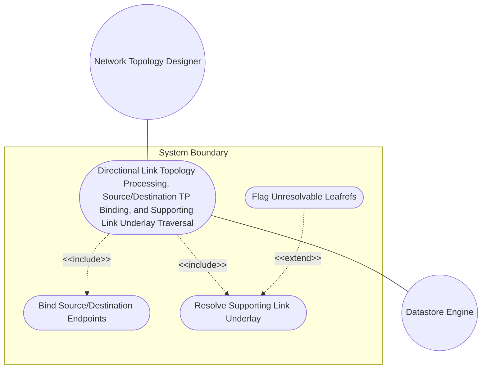
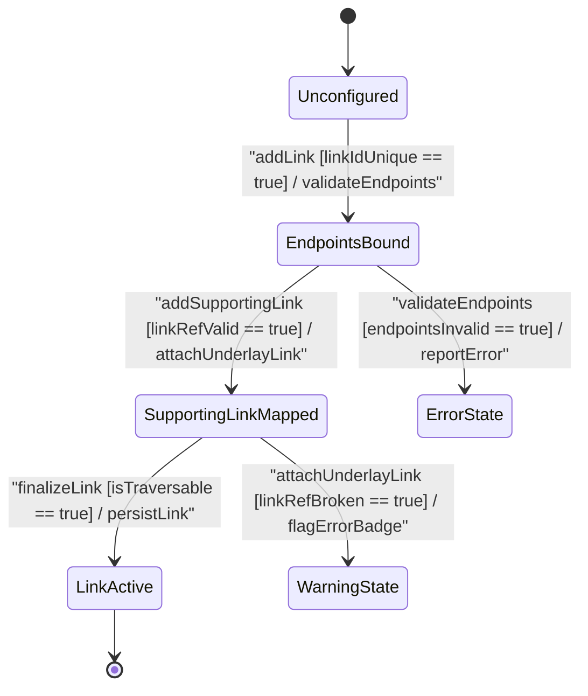

# Use Case: Directional Link Topology Processing, Source/Destination TP Binding, and Supporting Link Underlay Traversal

## Parent Epic
- [ ] #90 - [[ietf-network-and-topology]: Network and Topology Base Models](https://github.com/gintatkinson/3dgs-037/blob/main/docs/epics/epic-07-ietf-network-and-topology.md) (Parent Epic defining base network and topology models)

## 1. Actors
- **Primary Actor:** Network Topology Designer (`userActor`)
- **Secondary Actors:** Datastore Engine (`datastoreEngine`)

## 2. Preconditions
- The target network instance (e.g. `"overlay-nw-1"`) exists and is initialized in the topology datastore.
- Source node (e.g. `"router-1"`) and destination node (e.g. `"router-2"`) exist within the containing network topology and possess instantiated termination points (e.g. `"ge-0/0/0"`).

## 3. Trigger
The Network Topology Designer (`userActor`) initiates a request to provision a directional link container (`link`) connecting a specified source node/termination point to a destination node/termination point, optionally linking to lower-layer supporting links.

## 4. Main Success Scenario (Basic Flow)
1. `userActor` submits a request to instantiate a directional link entry with `link-id` (e.g. `"link-alpha"`), `source-node` (`"router-1"`), `source-tp` (`"ge-0/0/0"`), `dest-node` (`"router-2"`), and `dest-tp` (`"ge-0/0/0"`).
2. `datastoreEngine` validates that `link-id` is unique within the target network and verifies the presence of the mandatory key leaf.
3. `datastoreEngine` resolves leafref paths for `source-node`, `source-tp`, `dest-node`, and `dest-tp` against existing node and termination point entities in the active topology datastore.
4. `userActor` specifies one or more underlay `supporting-link` entries containing `network-ref` (e.g. `"underlay-nw-01"`) and `link-ref` (e.g. `"phys-link-99"`).
5. `datastoreEngine` validates underlay supporting link leafref references, persists the link instance under `/nw:networks/nw:network/nt:link`, updates the `elements_view` TableView representation, and notifies `userActor` of successful link binding.

## 5. Alternate and Exception Flows
- **5a. Missing mandatory link-id key leaf (Branches from Basic Flow step 2):**
  1. `datastoreEngine` detects that the link creation request payload lacks the mandatory `link-id` key leaf string.
  2. `datastoreEngine` aborts link container creation, logs a schema validation exception, and returns an error response to `userActor`.
- **5b. Duplicate link-id key leaf within network context (Branches from Basic Flow step 2):**
  1. `datastoreEngine` identifies an existing link entry with the identical `link-id` key string within the containing network.
  2. `datastoreEngine` rejects link instantiation, aborts the transaction, and returns a key conflict error notification to `userActor`.
- **5c. Unresolvable source-node reference in same network context (Branches from Basic Flow step 3):**
  1. `datastoreEngine` fails to resolve `source-node` leafref (`node-ref`) against existing node instances in the containing network context.
  2. `datastoreEngine` rejects source endpoint binding, rolls back transient link state, and returns an unresolvable source node error to `userActor`.
- **5d. Unresolvable source-tp reference on source node (Branches from Basic Flow step 3):**
  1. `datastoreEngine` validates `source-tp` leafref (`tp-ref`) and finds that the specified termination point does not exist on `source-node`.
  2. `datastoreEngine` aborts link binding, releases allocated endpoint resources, and returns a missing source termination point error to `userActor`.
- **5e. Unresolvable dest-node reference in same network context (Branches from Basic Flow step 3):**
  1. `datastoreEngine` fails to resolve `dest-node` leafref (`node-ref`) against existing node instances in the containing network context.
  2. `datastoreEngine` rejects destination endpoint binding, clears partial link configuration, and notifies `userActor` of the invalid destination node error.
- **5f. Unresolvable dest-tp reference on destination node (Branches from Basic Flow step 3):**
  1. `datastoreEngine` validates `dest-tp` leafref (`tp-ref`) and finds that the specified termination point does not exist on `dest-node`.
  2. `datastoreEngine` aborts link binding, rolls back transaction, and returns a missing destination termination point error to `userActor`.
- **5g. Missing mandatory network-ref key leaf in supporting-link (Branches from Basic Flow step 4):**
  1. `datastoreEngine` checks the `supporting-link` entry payload and detects a missing mandatory `network-ref` key leaf.
  2. `datastoreEngine` rejects the supporting-link attachment, flags the list entry as malformed, and returns a missing supporting network key error to `userActor`.
- **5h. Missing mandatory link-ref key leaf in supporting-link (Branches from Basic Flow step 4):**
  1. `datastoreEngine` checks the `supporting-link` entry payload and detects a missing mandatory `link-ref` key leaf.
  2. `datastoreEngine` rejects the supporting-link attachment, aborts underlay binding, and returns a missing supporting link key error to `userActor`.
- **5i. Unresolvable supporting-link underlay network-ref (Branches from Basic Flow step 5):**
  1. `datastoreEngine` evaluates `network-ref` leafref pointing to `/nw:networks/nw:network/nw:network-id` and finds no matching underlay network topology instance.
  2. `datastoreEngine` marks the supporting link state as broken, renders an error badge on `elements_view`, and issues a warning diagnostic while retaining overlay link configuration.
- **5j. Unresolvable supporting-link underlay link-ref (Branches from Basic Flow step 5):**
  1. `datastoreEngine` evaluates `link-ref` leafref pointing to target link `/nw:networks/nw:network[network-id=...]/nt:link/nt:link-id` and finds no matching underlay link.
  2. `datastoreEngine` marks the underlay dependency as unresolvable, highlights the table row in `elements_view` with error styling, and alerts `userActor`.
- **5k. Invalid termination point tp-id format or missing key leaf (Branches from Basic Flow step 3):**
  1. `datastoreEngine` validates target `source-tp` or `dest-tp` identifiers against `inet:uri` type constraints and detects an invalid format or missing `tp-id` key leaf on the node.
  2. `datastoreEngine` rejects link association with the non-compliant termination point and returns a schema validation error to `userActor`.
- **5l. Unresolvable supporting-termination-point references (Branches from Basic Flow step 5):**
  1. `datastoreEngine` evaluates supporting termination point leafrefs (`network-ref`, `node-ref`, `tp-ref`) on bound endpoints and finds missing underlay termination point mappings.
  2. `datastoreEngine` flags the affected link endpoints with degraded cross-layer dependency status, logs a warning diagnostic, and notifies `userActor`.

## 6. Postconditions (Guarantees)
- **Success Guarantee:** The directional link container is instantiated, source and destination endpoint leafrefs are validated and bound, underlay supporting link dependencies are recorded, and the topology representation in `elements_view` is updated.
- **Failure Guarantee:** Link creation is rejected or rolled back, no corrupted or unkeyed link entries are written to the datastore, and diagnostic error details are reported to `userActor`.

## UML Diagrams
### Use Case Diagram

### State Machine Diagram

## 7. Operational Context
Section 4.3. Link Data Model
The link data model is defined by the "ietf-network-topology" YANG module.
A link is identified by a link-id, which is unique within the containing network.
A link connects a source node to a destination node. Specifically, a link connects a source termination point on a source node to a destination termination point on a destination node.
augment "/nw:networks/nw:network" {
  list link {
    key "link-id";
    leaf link-id {
      type link-id;
    }
    container source {
      leaf source-node { type node-ref; }
      leaf source-tp { type tp-ref; }
    }
    container destination {
      leaf dest-node { type node-ref; }
      leaf dest-tp { type tp-ref; }
    }
    list supporting-link {
      key "network-ref link-ref";
      leaf network-ref {
        type leafref {
          path "/nw:networks/nw:network/nw:network-id";
          require-instance false;
        }
      }
      leaf link-ref {
        type leafref {
          path "/nw:networks/nw:network[nw:network-id=current()/../network-ref]/nt:link/nt:link-id";
          require-instance false;
        }
      }
    }
  }
}

## 8. Realization Matrix
### Required User Stories
- [ ] #94 - [[ietf-network-topology]: Directional Link Instantiation, Source/Destination TP Leafref Binding, and Underlay Supporting Link Path Resolution](https://github.com/gintatkinson/3dgs-037/blob/main/docs/user-stories/us-35-directional-link-instantiation-and-traversal.md) (Provides BDD scenarios for directional link instantiation, source/destination TP binding, and underlay supporting link traversal)

### Required Features
- [ ] #89 - [[ietf-network-topology: Link Data Model and Supporting Links]](https://github.com/gintatkinson/3dgs-037/blob/main/docs/features/feat-28-link-data-model-and-supporting-links.md) (Provides link list container, link-id key leaf, source/destination sub-containers, and supporting-link underlay list structure)
- [ ] #88 - [[ietf-network-topology: Termination Point Data Model]](https://github.com/gintatkinson/3dgs-037/blob/main/docs/features/feat-27-termination-point-data-model.md) (Provides termination-point definitions on nodes referenced by source-tp and dest-tp leafrefs)

## Source References
Structural Schema: https://github.com/YangModels/yang/blob/main/standard/ietf/RFC/ietf-network-topology%402018-02-26.yang
Normative Specification: https://datatracker.ietf.org/doc/rfc8345/
