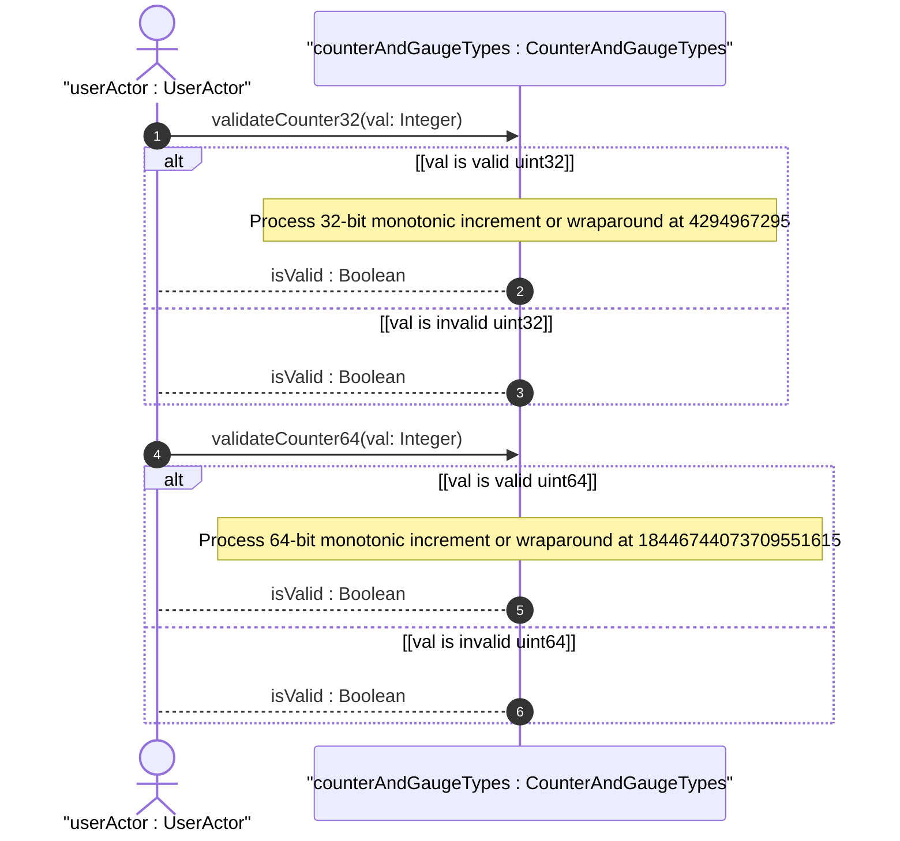
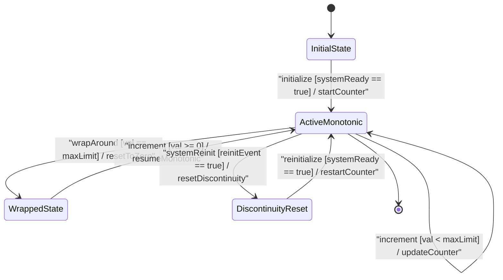

issue_id: 6

# User Story: Counter32 and Counter64 Monotonic Increment and Wraparound Behavior

## Parent Epic
- [ ] #5 - [[ietf-yang-types]: Common YANG Data Types](https://github.com/gintatkinson/3dgs-037/blob/main/docs/epics/epic-01-ietf-yang-types.md) (Parent Epic for common YANG data types)

## Domain Object Mapping
- **Primary Domain Objects:** `CounterAndGaugeTypes`, `ParentContainer`
- **Actor/Role:** `TelemetryCollector` or `userActor : UserActor`

## BDD Scenario (OOA/OOD Realization)
### Scenario 1: Counter32 Monotonic Increase and Wraparound
**Given** a telemetry data tree node holding a `yang:counter32` value at maximum capacity 4294967295
**When** a telemetry metric increment event is processed by `CounterAndGaugeTypes`
**Then** the `counter32` value MUST wrap around to 0 and continue monotonically increasing.

### Scenario 2: Counter64 High-Capacity Monotonic Increment and Wraparound
**Given** a high-capacity telemetry data tree node holding a `yang:counter64` value at maximum capacity 18446744073709551615
**When** a high-volume telemetry metric increment event is processed by `CounterAndGaugeTypes`
**Then** the `counter64` value MUST wrap around to 0 and resume monotonic incrementing.

## UML Sequence Diagram

## UML State Machine Diagram

## Operational Context
> "The counter32 type represents a non-negative integer that monotonically increases until it reaches a maximum value of 2^32-1 (4294967295 decimal), when it wraps around and starts increasing again from zero. Counters have no defined 'initial' value, and thus, a single value of a counter has (in general) no information content. Discontinuities in the monotonically increasing value normally occur at re-initialization of the management system and at other times as specified in the description of a schema node using this type."
>
> "The counter64 type represents a non-negative integer that monotonically increases until it reaches a maximum value of 2^64-1 (18446744073709551615 decimal), when it wraps around and starts increasing again from zero. Counters have no defined 'initial' value, and thus, a single value of a counter has (in general) no information content. Discontinuities in the monotonically increasing value normally occur at re-initialization of the management system and at other times as specified in the description of a schema node using this type."

## Required Features Matrix
- [ ] #1 - [[ietf-yang-types]: Counter and Gauge Data Types](https://github.com/gintatkinson/3dgs-037/blob/main/docs/features/feat-01-counter-and-gauge-types.md) (Validates counter32 and counter64 monotonic wraparound semantics)

## Source References
Structural Schema: https://github.com/YangModels/yang/blob/main/standard/ietf/RFC/ietf-yang-types%402025-12-22.yang
Normative Specification: https://datatracker.ietf.org/doc/rfc9911/
