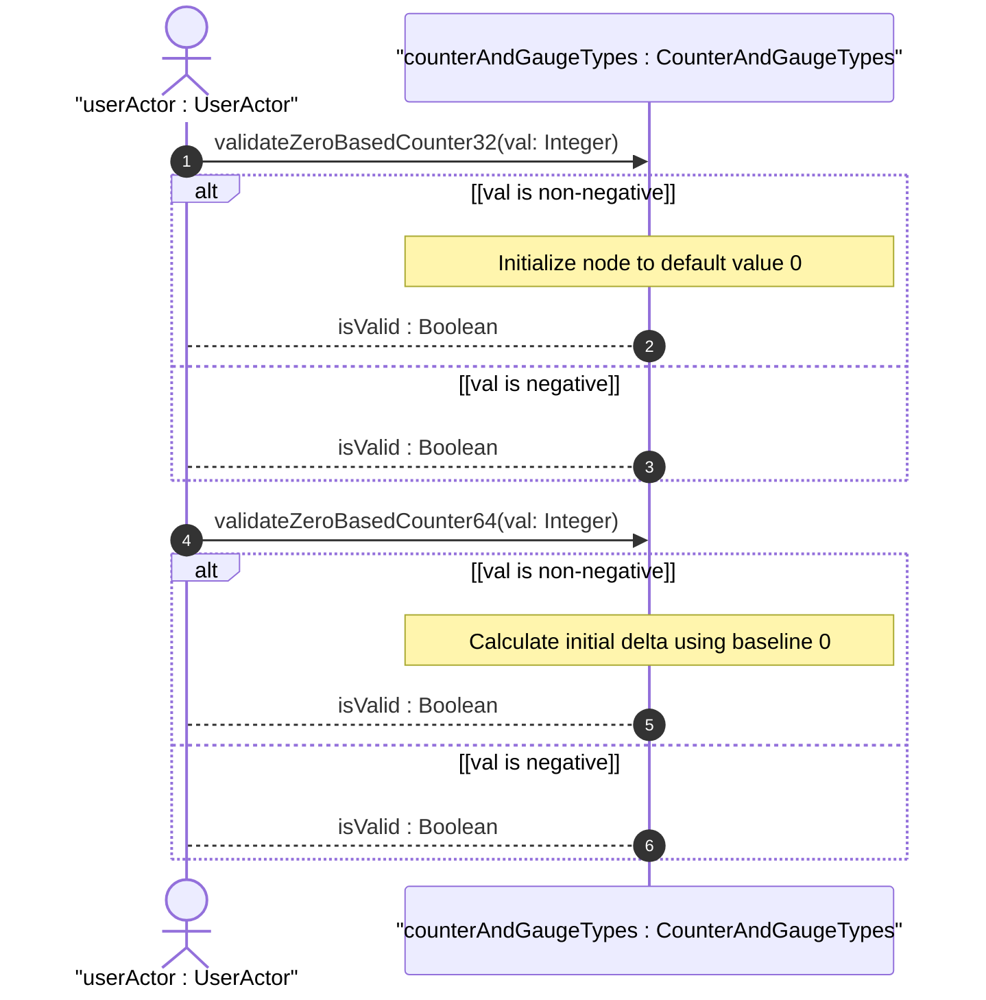
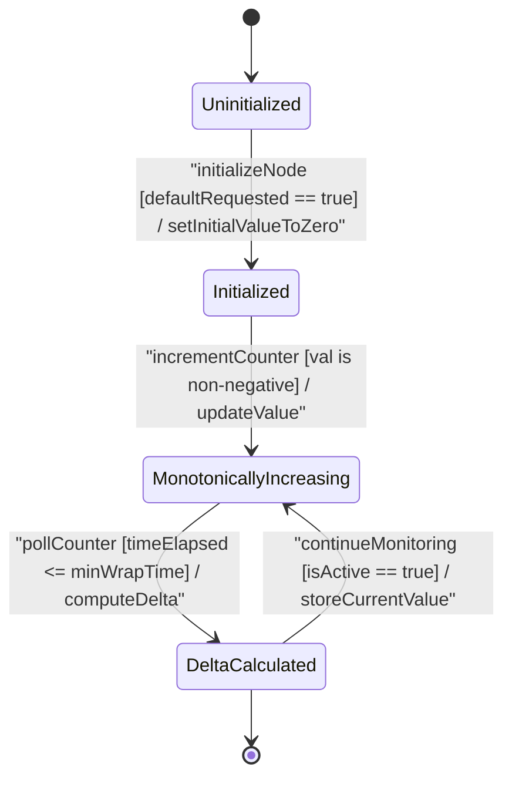

issue_id: 7

# User Story: Zero-Based Counter Default Initialization and Initial Delta Computation

## Parent Epic
- [ ] #5 - [[ietf-yang-types]: Common YANG Data Types](https://github.com/gintatkinson/3dgs-037/blob/main/docs/epics/epic-01-ietf-yang-types.md) (Parent Epic for common YANG data types)

## Domain Object Mapping
- **Primary Domain Objects:** CounterAndGaugeTypes, ParentContainer
- **Actor/Role:** userActor : UserActor

## BDD Scenario (OOA/OOD Realization)

### Scenario 1: Zero-Based Counter Default Initialization to Zero
**Given** a new data tree node instantiated with type `yang:zero-based-counter32` or `yang:zero-based-counter64`
**When** the node is created without an explicit initial value
**Then** the node value MUST default to 0.

### Scenario 2: Initial Delta Calculation Upon First Poll
**Given** a management station discovering a newly created data tree node of type `yang:zero-based-counter32` or `yang:zero-based-counter64` with initial value 0
**When** an initial poll reads a positive counter value within the minimum wrap time
**Then** the management station MUST calculate the initial delta using 0 as the initial baseline value.

## UML Sequence Diagram


## UML State Machine Diagram


## Operational Context
```yang
  typedef zero-based-counter32 {
    type counter32;
    default "0";
    description
      "The zero-based-counter32 type represents a counter32
       that has the defined 'initial' value zero.

       A data tree node using this type will be set to zero (0)
       on creation and will thereafter increase monotonically until
       it reaches a maximum value of 2^32-1 (4294967295 decimal),
       when it wraps around and starts increasing again from zero.

       Provided that an application discovers a new data tree node
       using this type within the minimum time to wrap, it can use
       the 'initial' value as a delta.  It is important for a
       management station to be aware of this minimum time and the
       actual time between polls, and to discard data if the actual
       time is too long or there is no defined minimum time.

       In the value set and its semantics, this type is equivalent
       to the ZeroBasedCounter32 textual convention of the SMIv2.";
    reference
      "RFC 4502: Remote Network Monitoring Management Information
                 Base Version 2";
  }

  typedef zero-based-counter64 {
    type counter64;
    default "0";
    description
      "The zero-based-counter64 type represents a counter64 that
       has the defined 'initial' value zero.

       A data tree node using this type will be set to zero (0)
       on creation and will thereafter increase monotonically until
       it reaches a maximum value of 2^64-1 (18446744073709551615
       decimal), when it wraps around and starts increasing again
       from zero.

       Provided that an application discovers a new data tree node
       using this type within the minimum time to wrap, it can use
       the 'initial' value as a delta.  It is important for a
       management station to be aware of this minimum time and the
       actual time between polls, and to discard data if the actual
       time is too long or there is no defined minimum time.

       In the value set and its semantics, this type is equivalent
       to the ZeroBasedCounter64 textual convention of the SMIv2.";
    reference
      "RFC 2856: Textual Conventions for Additional High Capacity
                 Data Types";
  }
```

## Required Features Matrix
- [ ] #1 - [[ietf-yang-types]: Counter and Gauge Data Types](https://github.com/gintatkinson/3dgs-037/blob/main/docs/features/feat-01-counter-and-gauge-types.md) (Validates zero-based-counter32 and zero-based-counter64 initialization and initial delta calculation)

## Source References
Structural Schema: https://github.com/YangModels/yang/blob/main/standard/ietf/RFC/ietf-yang-types%402025-12-22.yang
Normative Specification: https://datatracker.ietf.org/doc/rfc9911/
