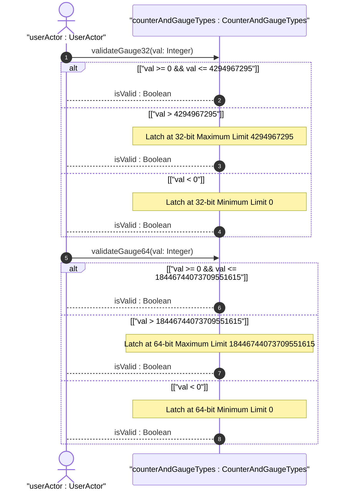
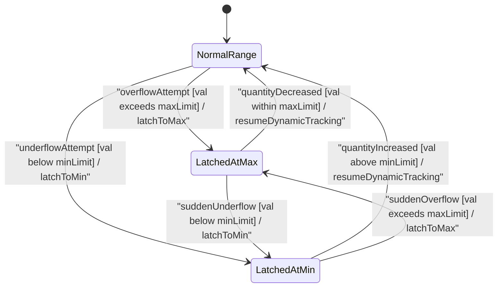

issue_id: 8

# User Story: Gauge32 and Gauge64 Dynamic Range and Boundary Latching Behavior

## Parent Epic
- [ ] #5 - [[ietf-yang-types]: Common YANG Data Types](https://github.com/gintatkinson/3dgs-037/blob/main/docs/epics/epic-01-ietf-yang-types.md) (Parent Epic for common YANG data types)

## Domain Object Mapping
- **Primary Domain Objects:** `CounterAndGaugeTypes`, `ParentContainer`
- **Actor/Role:** `userActor : UserActor` (ResourceMonitor)

## BDD Scenario (OOA/OOD Realization)

### Scenario 1: Gauge32 Dynamic Variation and Maximum Boundary Latching
**Given** a telemetry node instantiated with type `yang:gauge32` currently holding a value of 4294967290
**When** the monitored resource quantity increases by 10 units beyond $2^{32}-1$ (4294967295)
**Then** the `gauge32` value MUST latch at the maximum limit of 4294967295 without wrapping around, and subsequently decrease dynamically when the monitored quantity drops below 4294967295.

### Scenario 2: Gauge32 Minimum Boundary Latching on Underflow Attempt
**Given** a telemetry node instantiated with type `yang:gauge32` currently holding a value of 5
**When** the monitored resource quantity decreases by 10 units below zero
**Then** the `gauge32` value MUST latch at the minimum limit of 0 without underflowing to a negative value, and subsequently increase dynamically when the monitored quantity rises above 0.

### Scenario 3: Gauge64 Dynamic Variation and Maximum Boundary Latching
**Given** a telemetry node instantiated with type `yang:gauge64` currently holding a value of 18446744073709551610
**When** the monitored high-capacity resource quantity increases by 10 units beyond $2^{64}-1$ (18446744073709551615)
**Then** the `gauge64` value MUST latch at the maximum limit of 18446744073709551615 without wrapping around, and subsequently decrease dynamically when the monitored quantity drops below $2^{64}-1$.

### Scenario 4: Gauge64 Minimum Boundary Latching on Underflow Attempt
**Given** a telemetry node instantiated with type `yang:gauge64` currently holding a value of 50
**When** the monitored high-capacity resource quantity decreases by 100 units below zero
**Then** the `gauge64` value MUST latch at the minimum limit of 0 without underflowing to a negative value, and subsequently increase dynamically when the monitored quantity rises above 0.

## UML Sequence Diagram

## UML State Machine Diagram

## Operational Context

### gauge32 Typedef Description (RFC 9911 Section 3.5 / ietf-yang-types@2025-12-22.yang)
> "The gauge32 type represents a non-negative integer, which
>  may increase or decrease, but shall never exceed a maximum
>  value, nor fall below a minimum value.  The maximum value
>  cannot be greater than 2^32-1 (4294967295 decimal), and
>  the minimum value cannot be smaller than 0.  The value of
>  a gauge32 has its maximum value whenever the information
>  being modeled is greater than or equal to its maximum
>  value, and has its minimum value whenever the information
>  being modeled is smaller than or equal to its minimum value.
>  If the information being modeled subsequently decreases below
>  the maximum value, the gauge32 also decreases; likewise, if
>  the information increases above the minimum value, the
>  gauge32 also increases.
>
>  In the value set and its semantics, this type is equivalent
>  to the Gauge32 type of the SMIv2."

### gauge64 Typedef Description (RFC 9911 Section 3.6 / ietf-yang-types@2025-12-22.yang)
> "The gauge64 type represents a non-negative integer, which
>  may increase or decrease, but shall never exceed a maximum
>  value, nor fall below a minimum value.  The maximum value
>  cannot be greater than 2^64-1 (18446744073709551615), and
>  the minimum value cannot be smaller than 0.  The value of
>  a gauge64 has its maximum value whenever the information
>  being modeled is greater than or equal to its maximum
>  value, and has its minimum value whenever the information
>  being modeled is smaller than or equal to its minimum value.
>  If the information being modeled subsequently decreases
>  below (increases above) the maximum (minimum) value, the
>  gauge64 also decreases (increases).
>
>  In the value set and its semantics, this type is equivalent
>  to the CounterBasedGauge64 SMIv2 textual convention defined
>  in RFC 2856"

## Required Features Matrix
- [ ] #1 - [[ietf-yang-types]: Counter and Gauge Data Types](https://github.com/gintatkinson/3dgs-037/blob/main/docs/features/feat-01-counter-and-gauge-types.md) (Validates gauge32 and gauge64 dynamic variation and min/max latching boundaries)

## Source References
Structural Schema: https://github.com/YangModels/yang/blob/main/standard/ietf/RFC/ietf-yang-types%402025-12-22.yang
Normative Specification: https://datatracker.ietf.org/doc/rfc9911/
