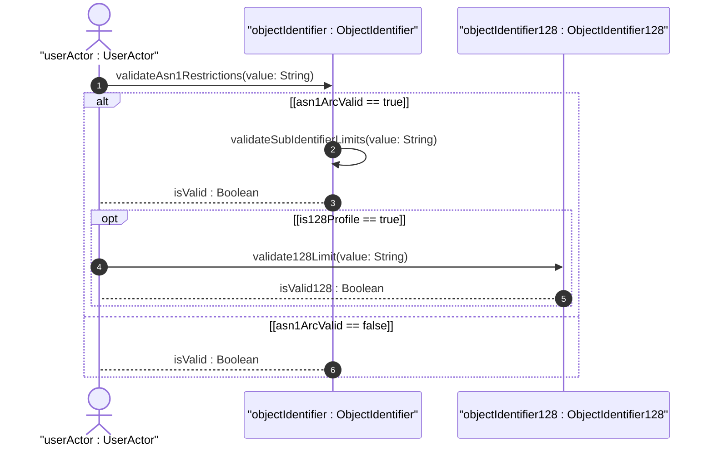
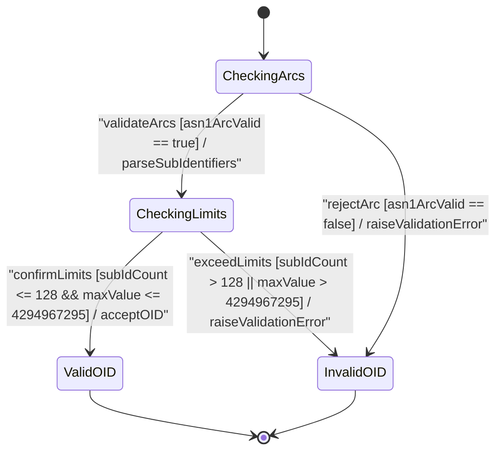

issue_id: 9

# User Story: Object Identifier ASN.1 Arc Hierarchy and 128-Subidentifier Boundary Validation

## Parent Epic
- [ ] #5 - [[ietf-yang-types]: Common YANG Data Types](https://github.com/gintatkinson/3dgs-037/blob/main/docs/epics/epic-01-ietf-yang-types.md) (Parent Epic for common YANG data types)

## Domain Object Mapping
- **Primary Domain Objects:** `IdentifierTypes`, `ObjectIdentifier`, `ObjectIdentifier128`
- **Actor/Role:** `userActor : UserActor`

## BDD Scenario (OOA/OOD Realization)
**Given** a YANG model validator or runtime schema processor initialized with `IdentifierTypes` definitions
**When** a client submits an object identifier string value for validation under `object-identifier` or `object-identifier-128`
**Then** the validator verifies that the value consists of dot-separated non-negative integer sub-identifiers conforming to ASN.1 top arc rules (first arc 0..2; second arc 0..39 if first arc is 0 or 1; minimum 2 sub-identifiers; each sub-identifier <= 2^32-1), and enforces the 128 sub-identifier boundary when validating `object-identifier-128`.

### Scenario 1: Validating ASN.1 Root Arc & Sub-Identifier Numeric Range Restrictions for `object-identifier`
**Given** an `ObjectIdentifier` instance representing the YANG `object-identifier` typedef
**When** the validator receives an OID string such as `"1.3.6.1.4.1"` or `"2.999.1"`
**Then** `validateAsn1Restrictions()` confirms the first arc is within `0..2` and second arc is within `0..39` when the first arc is `0` or `1`
**And** `validateSubIdentifierLimits()` verifies that each sub-identifier is a non-negative integer not exceeding $2^{32}-1$ (4294967295) with at least two sub-identifiers present, returning `isValid = true`.

### Scenario 2: Validating SMIv2 128-Subidentifier Limit for `object-identifier-128`
**Given** an `ObjectIdentifier128` instance extending `ObjectIdentifier` with the SMIv2 128 sub-identifier restriction
**When** a client submits an OID containing 128 or fewer sub-identifiers (e.g. 128 dot-separated integer arcs)
**Then** `validate128Limit()` checks the total sub-identifier count against the pattern `[0-9]*(\.[0-9]*){1,127}`
**And** returns `isValid128 = true`.

### Scenario 3: Rejecting Invalid ASN.1 Root Arcs or Exceeded Sub-Identifier Bounds
**Given** an invalid OID string such as `"0.40.1"` (second arc > 39 when first arc is 0), `"3.1.2"` (first arc > 2), `"1"` (less than 2 sub-identifiers), or an OID with 129 sub-identifiers under `object-identifier-128`
**When** the schema validator invokes `validateAsn1Restrictions()`, `validateSubIdentifierLimits()`, or `validate128Limit()`
**Then** validation fails and returns `isValid = false` or `isValid128 = false`, raising a schema validation error.

## UML Sequence Diagram

## UML State Machine Diagram

## Operational Context
> "The object-identifier type represents administratively assigned names in a registration-hierarchical-name tree. Values of this type are denoted as a sequence of numerical non-negative sub-identifier values. Each sub-identifier value MUST NOT exceed 2^32-1 (4294967295). Sub-identifiers are separated by single dots and without any intermediate whitespace. The ASN.1 standard restricts the value space of the first sub-identifier to 0, 1, or 2. Furthermore, the value space of the second sub-identifier is restricted to the range 0 to 39 if the first sub-identifier is 0 or 1. Finally, the ASN.1 standard requires that an object identifier has always at least two sub-identifiers. The pattern captures these restrictions. Although the number of sub-identifiers is not limited, module designers should realize that there may be implementations that stick with the SMIv2 limit of 128 sub-identifiers. This type is a superset of the SMIv2 OBJECT IDENTIFIER type since it is not restricted to 128 sub-identifiers. Hence, this type SHOULD NOT be used to represent the SMIv2 OBJECT IDENTIFIER type; the object-identifier-128 type SHOULD be used instead."

> "This type represents object-identifiers restricted to 128 sub-identifiers. In the value set and its semantics, this type is equivalent to the OBJECT IDENTIFIER type of the SMIv2."

## Required Features Matrix
- [ ] #2 - [[ietf-yang-types]: Identifier Data Types](https://github.com/gintatkinson/3dgs-037/blob/main/docs/features/feat-02-identifier-types.md) (Validates object-identifier ASN.1 arc restrictions and object-identifier-128 sub-identifier limits)

## Source References
Structural Schema: https://github.com/YangModels/yang/blob/main/standard/ietf/RFC/ietf-yang-types%402025-12-22.yang
Normative Specification: https://datatracker.ietf.org/doc/rfc9911/
