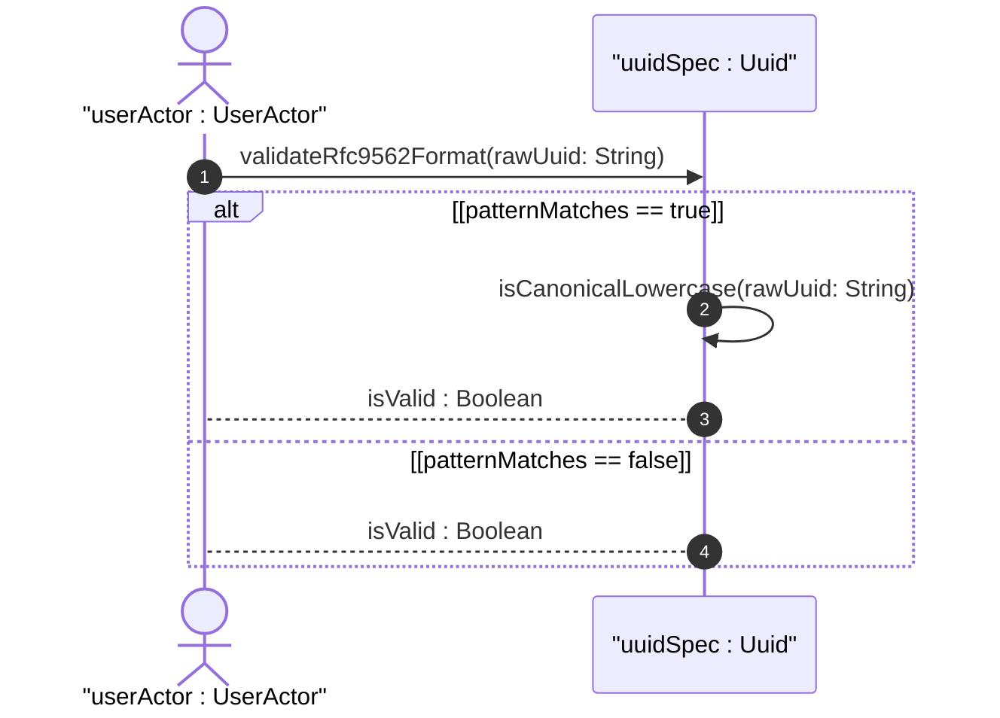
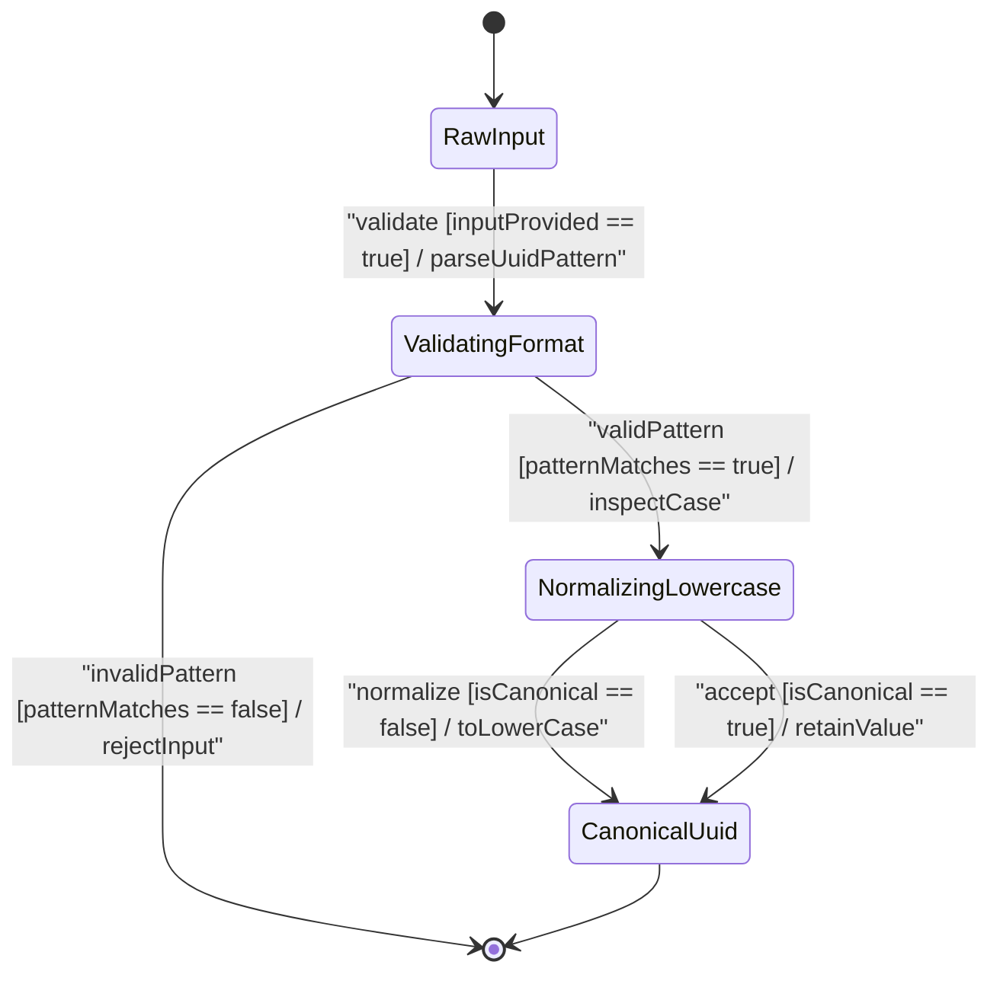

issue_id: 10

# User Story: RFC 9562 UUID Pattern Validation and Canonical Lowercase Normalization

## Parent Epic
- [ ] #5 - [[ietf-yang-types]: Common YANG Data Types](https://github.com/gintatkinson/3dgs-037/blob/main/docs/epics/epic-01-ietf-yang-types.md) (Parent Epic for common YANG data types)

## Domain Object Mapping
- **Primary Domain Objects:** IdentifierTypes, Uuid
- **Actor/Role:** UuidNormalizer or userActor : UserActor

## BDD Scenario (OOA/OOD Realization)

### Scenario 1: Validation and canonicalization of valid UUID with uppercase characters
**Given** a raw input string `"F81D4FAE-7DEC-11D0-A765-00A0C91E6BF6"` matching the 36-character `8-4-4-4-12` hex pattern
**When** the `UuidNormalizer` parses and validates the string against RFC 9562 pattern `[0-9a-fA-F]{8}-[0-9a-fA-F]{4}-[0-9a-fA-F]{4}-[0-9a-fA-F]{4}-[0-9a-fA-F]{12}`
**Then** the pattern validation succeeds and the string is normalized to canonical lowercase `"f81d4fae-7dec-11d0-a765-00a0c91e6bf6"`

### Scenario 2: Rejection of malformed or invalid length UUID strings
**Given** a raw input string `"f81d4fae-7dec-11d0-a765-00a0c91e6bf6-00"` not conforming to the 36-character `8-4-4-4-12` hyphenated structure
**When** the `UuidNormalizer` validates the string against the RFC 9562 UUID pattern
**Then** pattern validation fails and an invalid UUID format error is returned

## UML Sequence Diagram


## UML State Machine Diagram


## Operational Context
```yang
  typedef uuid {
    type string {
      pattern '[0-9a-fA-F]{8}-[0-9a-fA-F]{4}-[0-9a-fA-F]{4}-'
            + '[0-9a-fA-F]{4}-[0-9a-fA-F]{12}';
    }
    description
      "A Universally Unique IDentifier in the string representation
       defined in RFC 9562.  The canonical representation uses
       lowercase characters.

       The following is an example of a UUID in string
       representation:
       f81d4fae-7dec-11d0-a765-00a0c91e6bf6.
      ";
    reference
      "RFC 9562: Universally Unique IDentifiers (UUIDs)";
  }
```

## Required Features Matrix
- [ ] #2 - [[ietf-yang-types]: Identifier Data Types](https://github.com/gintatkinson/3dgs-037/blob/main/docs/features/feat-02-identifier-types.md) (Validates RFC 9562 UUID format and canonical lowercase representation)

## Source References
Structural Schema: https://github.com/YangModels/yang/blob/main/standard/ietf/RFC/ietf-yang-types%402025-12-22.yang
Normative Specification: https://datatracker.ietf.org/doc/rfc9911/
