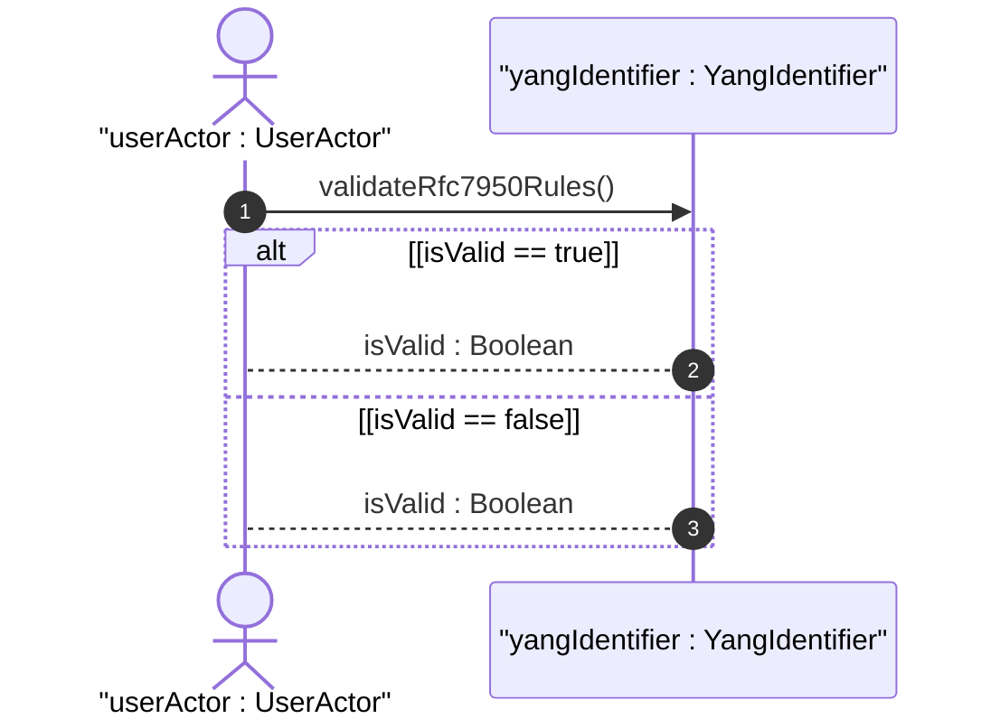
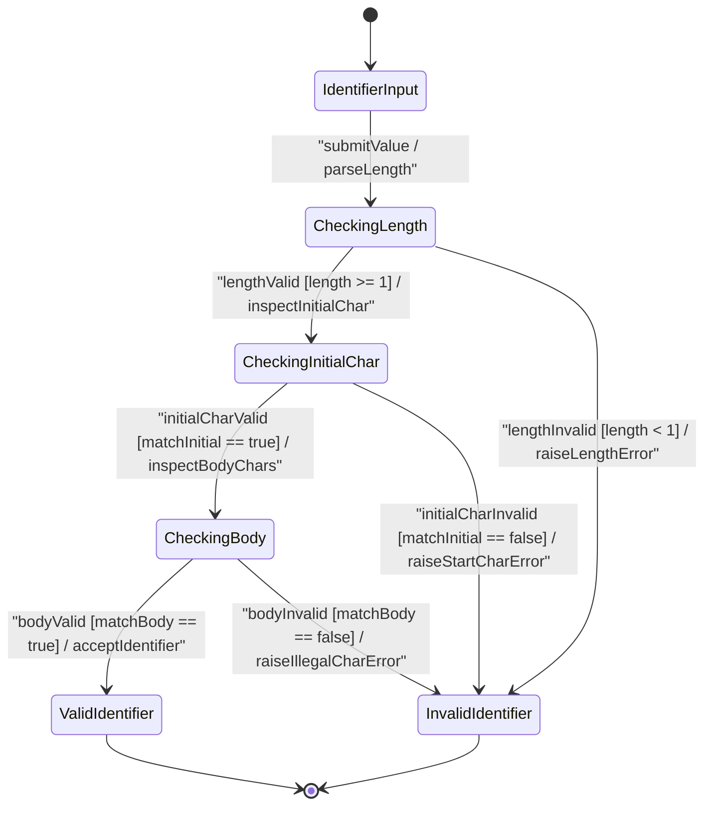

issue_id: 11

# User Story: RFC 7950 YANG Identifier Syntax Rules and Length Restriction Validation

## Parent Epic
- [ ] #5 - [[ietf-yang-types]: Common YANG Data Types](https://github.com/gintatkinson/3dgs-037/blob/main/docs/epics/epic-01-ietf-yang-types.md) (Parent Epic for common YANG data types)

## Domain Object Mapping
- **Primary Domain Objects:** `IdentifierTypes`, `YangIdentifier`
- **Actor/Role:** `userActor : UserActor`

## BDD Scenario (OOA/OOD Realization)
**Given** a YANG schema parser or runtime validator initialized with `IdentifierTypes` definitions
**When** a client submits a string identifier for validation under the `yang-identifier` typedef
**Then** the validator verifies that the identifier string has a minimum length of 1, starts with an alphabetic character (`[a-zA-Z]`) or an underscore (`_`), is followed by valid subsequent characters (`[a-zA-Z0-9\-_.]`), permits leading 'xml' prefixes in YANG 1.1 contexts, and rejects any strings with illegal characters or invalid initial characters.

### Scenario 1: Validating Standard RFC 7950 YANG 1.1 Identifiers
**Given** a `YangIdentifier` instance representing the YANG `yang-identifier` typedef
**When** the validator evaluates valid identifier strings such as `"interfaces"`, `"_bgp-peer.1"`, or `"xml-element"`
**Then** `validateRfc7950Rules()` checks that the string length is $\ge 1$, initial character matches `[a-zA-Z_]`, and remaining characters match `[a-zA-Z0-9\-_.]`
**And** confirms the value is valid, returning `isValid = true`.

### Scenario 2: Validating Lifting of Leading 'xml' Prefix Restriction in YANG 1.1
**Given** a `YangIdentifier` instance operating in a YANG 1.1 (RFC 7950) context
**When** identifier strings starting with 'xml' or 'XML' such as `"xml-element"`, `"XmlNode"`, or `"xml_config"` are provided
**Then** `validateRfc7950Rules()` accepts the strings as valid YANG 1.1 identifiers without raising legacy YANG 1.0 (RFC 6020 / RFC 6991) restriction errors
**And** returns `isValid = true`.

### Scenario 3: Rejecting Identifiers Failing Initial Character or Illegal Character Rules
**Given** a `YangIdentifier` instance
**When** invalid strings such as `"123-node"` (starts with digit), `"-interface"` (starts with hyphen), `".yang-node"` (starts with dot), or `"interface:eth0"` (contains colon) are evaluated
**Then** `validateRfc7950Rules()` rejects the input and returns `isValid = false`, raising a schema validation error.

### Scenario 4: Rejecting Empty Identifiers Violating Minimum Length Restriction
**Given** a `YangIdentifier` instance enforcing length constraint `1..max`
**When** an empty string `""` (length < 1) is submitted for validation
**Then** `validateRfc7950Rules()` rejects the input as violating the minimum length boundary and returns `isValid = false`.

## UML Sequence Diagram

## UML State Machine Diagram

## Operational Context
> "A YANG identifier string as defined by the 'identifier' rule in Section 14 of RFC 7950. An identifier must start with an alphabetic character or an underscore followed by an arbitrary sequence of alphabetic or numeric characters, underscores, hyphens, or dots.
>
> This definition conforms to YANG 1.1 defined in RFC 7950. In RFC 6991, this definition excluded all identifiers starting with any possible combination of the lowercase or uppercase character sequence 'xml', as required by YANG 1 defined in RFC 6020. If this type is used in a YANG 1 context, then this restriction still applies."

## Required Features Matrix
- [ ] #2 - [[ietf-yang-types]: Identifier Data Types](https://github.com/gintatkinson/3dgs-037/blob/main/docs/features/feat-02-identifier-types.md) (Validates RFC 7950 YANG 1.1 identifier syntax and character rules)

## Source References
Structural Schema: https://github.com/YangModels/yang/blob/main/standard/ietf/RFC/ietf-yang-types%402025-12-22.yang
Normative Specification: https://datatracker.ietf.org/doc/rfc9911/
