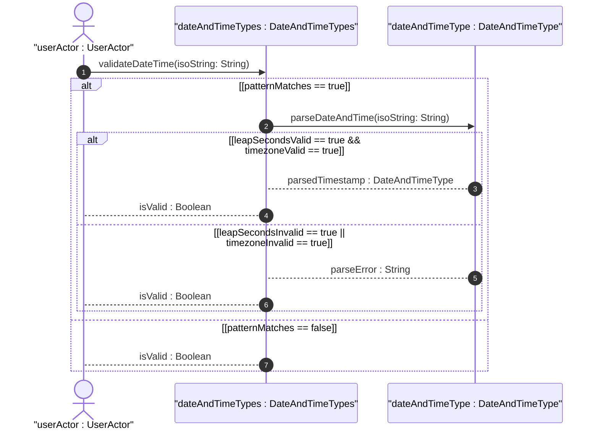
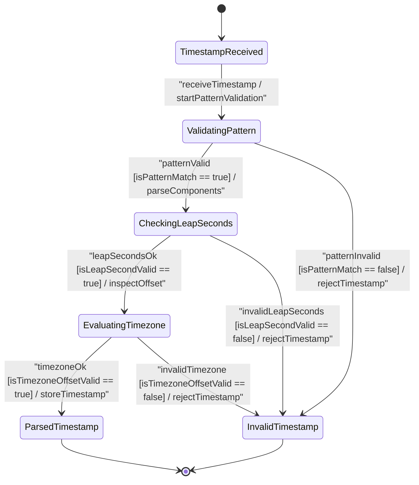

issue_id: 12

# User Story: RFC 3339 Date and Time Timestamp Parsing, Fractional Seconds, and RFC 9557 Timezone Offset Semantics

## Parent Epic
- [ ] #5 - [[ietf-yang-types]: Common YANG Data Types](https://github.com/gintatkinson/3dgs-037/blob/main/docs/epics/epic-01-ietf-yang-types.md) (Parent Epic for common YANG data types)

## Compliance Table
| Verification Rule | Compliance Status | Rationale |
| --- | --- | --- |
| Lifeline Aliasing | Compliant | Lifelines explicitly aliased using `actor userActor as "userActor : UserActor"` and `participant name as "name : Classifier"` syntax |
| Open Return Arrows | Compliant | Return messages strictly use open arrowheads (`-->`) without closed arrowheads |
| Return Value Signatures | Compliant | Return messages represent assignment signatures (`isValid : Boolean`, `parsedTimestamp : DateAndTimeType`) |
| BDD Scenarios | Compliant | Formatted with explicit Given-When-Then criteria matching OOA/OOD realization |

## Domain Object Mapping
- **Primary Domain Objects:** DateAndTimeTypes, DateAndTimeType, DateType, TimeType
- **Actor/Role:** DateTimeParser or userActor : UserActor

## BDD Scenario (OOA/OOD Realization)
**Given** a date and time timestamp parsing service configured with RFC 3339, RFC 9557, and RFC 9911 schema rules
**When** a user submits timestamp inputs for `date-and-time`, `date`, `date-no-zone`, `time`, or `time-no-zone`
**Then** timestamps with optional fractional seconds (e.g., `2026-08-04T01:22:08.123456Z`) MUST be successfully parsed
**And** leap second timestamps with seconds value `60` (e.g., `2026-12-31T23:59:60Z`) MUST be permitted
**And** timezone offset `Z` MUST be interpreted as UTC representation with unknown local timezone reference point
**And** timezone offset `+00:00` MUST be interpreted as UTC representation with explicit UTC local timezone reference point per RFC 9557 Section 2
**And** any timezone offset appended to `date-no-zone` or `time-no-zone` values MUST be strictly rejected as invalid.

## UML Sequence Diagram

## UML State Machine Diagram

## Operational Context
> "The date-and-time type is a profile of the ISO 8601 standard for representation of dates and times using the Gregorian calendar. The profile is defined by the date-time production in Section 5.6 of RFC 3339 and the update defined in Section 2 of RFC 9557. The value of 60 for seconds is allowed only in the case of leap seconds."
>
> "(a) The date-and-time type does not allow negative years."
>
> "(b) The time-offset Z indicates that the date-and-time value is reported in UTC and that the local time zone reference point is unknown. The time-offset +00:00 indicates that the date-and-time value is reported in UTC and that the local time zone reference point is UTC (see Section 2 of RFC 9557)."
>
> "The date type represents a time-interval of the length of a day, i.e., 24 hours. It includes an optional time zone offset."
>
> "The date-no-zone type represents a date without the optional time zone offset information."
>
> "The time type represents an instance of time of zero duration that recurs every day. It includes an optional time zone offset. The value of 60 for seconds is allowed only in the case of leap seconds."
>
> "The time-no-zone type represents a time instance without the optional time zone offset information."
> -- RFC 9911 Sections 3.11-3.15 / `ietf-yang-types@2025-12-22.yang`

## Required Features Matrix
- [ ] #3 - [[ietf-yang-types]: Date and Time Data Types](https://github.com/gintatkinson/3dgs-037/blob/main/docs/features/feat-03-date-and-time-types.md) (Validates RFC 3339 and RFC 9557 date-and-time, date, and time parsing semantics)

## Source References
Structural Schema: https://github.com/YangModels/yang/blob/main/standard/ietf/RFC/ietf-yang-types%402025-12-22.yang
Normative Specification: https://datatracker.ietf.org/doc/rfc9911/
