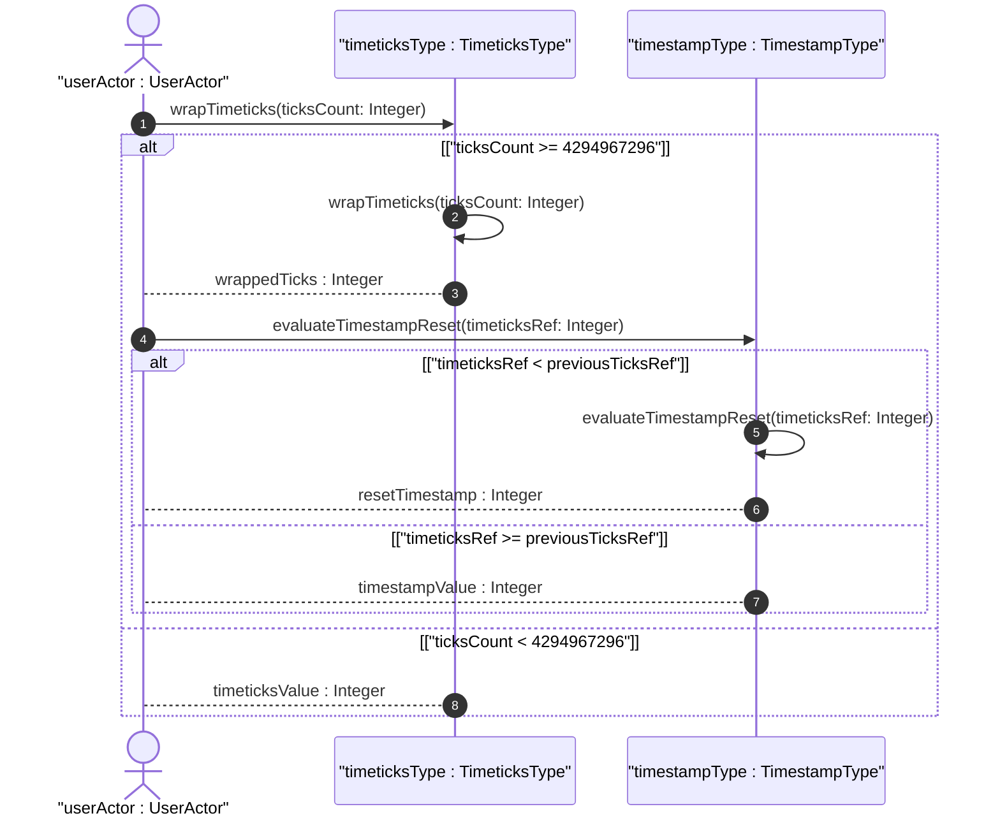
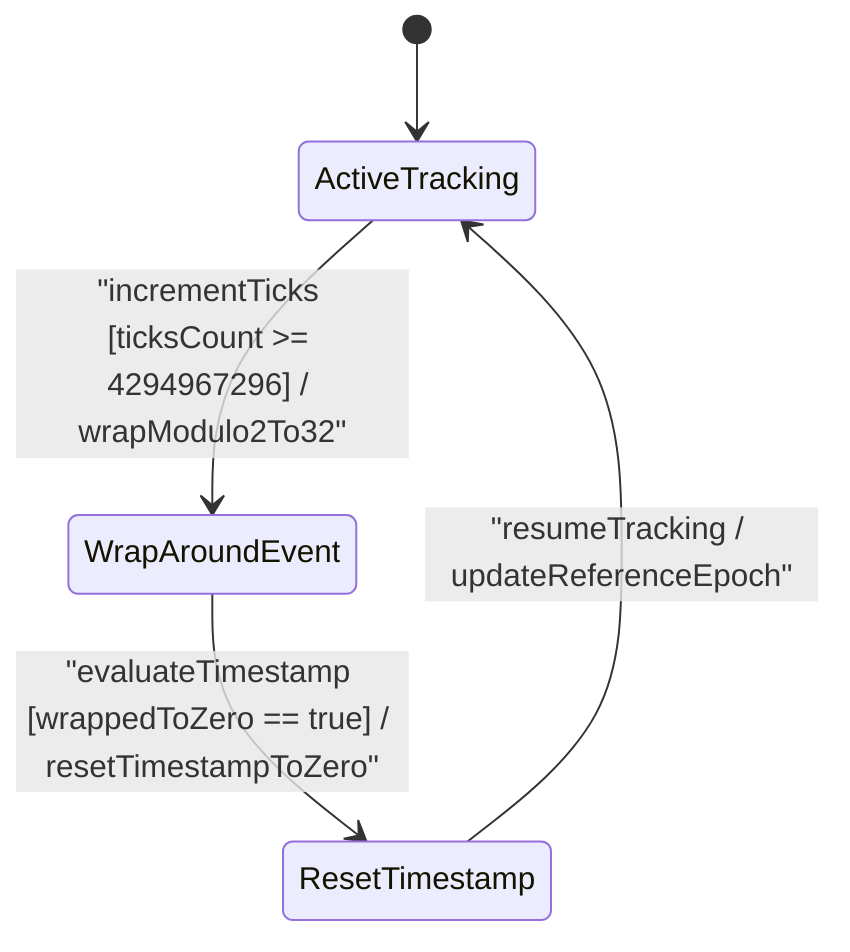

issue_id: 13

# User Story: Timeticks Modulo 2^32 Arithmetic and Associated Timestamp Reset

## Parent Epic
- [ ] #5 - [[ietf-yang-types]: Common YANG Data Types](https://github.com/gintatkinson/3dgs-037/blob/main/docs/epics/epic-01-ietf-yang-types.md) (Parent Epic for common YANG data types)

## Domain Object Mapping
- **Primary Domain Objects:** `DateAndTimeTypes`, `TimeticksType`, `TimestampType`
- **Actor/Role:** `EpochTracker` or `userActor : UserActor`

## BDD Scenario (OOA/OOD Realization)
**Given** an active `timeticks` schema node instance tracking time in hundredths of a second between reference epochs near the 32-bit boundary (value `4294967290`), and an associated `timestamp` instance holding an occurrence time prior to wrap-around  
**When** 10 hundredths of a second elapse causing the `timeticks` count to increment past `4294967295`  
**Then** `timeticks` wraps around modulo 2^32 to value `4`  
**And** the associated `timestamp` instance evaluates the wrap-around event and resets to `0` because the occurrence took place prior to the timeticks reset after ~497 days  

## UML Sequence Diagram


## UML State Machine Diagram


## Operational Context
```yang
  typedef timeticks {
    type uint32;
    description
      "The timeticks type represents a non-negative integer that
       represents the time, modulo 2^32 (4294967296 decimal), in
       hundredths of a second between two epochs.  When a schema
       node is defined that uses this type, the description of
       the schema node identifies both of the reference epochs.

       In the value set and its semantics, this type is equivalent
       to the TimeTicks type of the SMIv2.";
    reference
      "RFC 2578: Structure of Management Information Version 2
                 (SMIv2)";
  }

  typedef timestamp {
    type timeticks;
    description
      "The timestamp type represents the value of an associated
       timeticks schema node instance at which a specific occurrence
       happened.  The specific occurrence must be defined in the
       description of any schema node defined using this type.  When
       the specific occurrence occurred prior to the last time the
       associated timeticks schema node instance was zero, then the
       timestamp value is zero.

       Note that this requires all timestamp values to be reset to
       zero when the value of the associated timeticks schema node
       instance reaches 497+ days and wraps around to zero.

       The associated timeticks schema node must be specified
       in the description of any schema node using this type.

       In the value set and its semantics, this type is equivalent
       to the TimeStamp textual convention of the SMIv2.";
    reference
      "RFC 2579: Textual Conventions for SMIv2";
  }
```

## Required Features Matrix
- [ ] #3 - [[ietf-yang-types]: Date and Time Data Types](https://github.com/gintatkinson/3dgs-037/blob/main/docs/features/feat-03-date-and-time-types.md) (Validates timeticks modulo 2^32 wrap-around and associated timestamp reset logic)

## Source References
Structural Schema: https://github.com/YangModels/yang/blob/main/standard/ietf/RFC/ietf-yang-types%402025-12-22.yang
Normative Specification: https://datatracker.ietf.org/doc/rfc9911/
