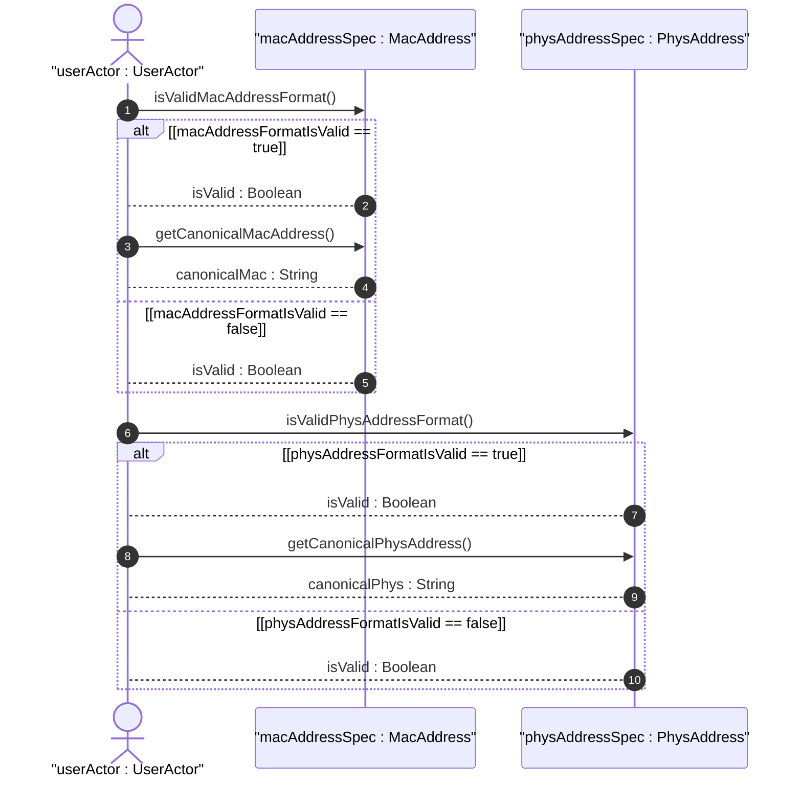
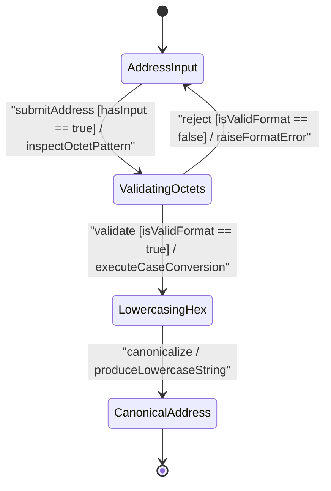

issue_id: 14

# User Story: IEEE 802 MAC Address and Physical Media Address Validation and Lowercase Canonicalization

## Parent Epic
- [ ] #5 - [[ietf-yang-types]: Common YANG Data Types](https://github.com/gintatkinson/3dgs-037/blob/main/docs/epics/epic-01-ietf-yang-types.md) (Parent Epic for common YANG data types)

## Domain Object Mapping
- **Primary Domain Objects:** `AddressAndStringTypes`, `MacAddress`, `PhysAddress`, `HexString`
- **Actor/Role:** `NetworkAddressNormalizer` or `userActor : UserActor`

## BDD Scenario (OOA/OOD Realization)

### Scenario 1: IEEE 802 48-bit MAC Address Validation and Lowercase Canonicalization
**Given** a network address string `"08:00:27:00:A1:4C"` provided for `mac-address` validation
**When** `isValidMacAddressFormat()` is evaluated on `MacAddress` and `getCanonicalMacAddress()` is invoked
**Then** format validation returns `true` verifying exactly 6 colon-separated hexadecimal octets, and the output string is lowercased to `"08:00:27:00:a1:4c"`.

### Scenario 2: Invalid MAC Address Octet Count Rejection
**Given** an malformed MAC address string `"08:00:27:00:A1"` containing only 5 octets
**When** `isValidMacAddressFormat()` is evaluated on `MacAddress`
**Then** format validation returns `false` rejecting the input for violating 48-bit 6-octet constraints.

### Scenario 3: Variable Octet Physical Media Address Validation and Canonicalization
**Given** a physical media address string `"00:11:22:33:44:55:66:77"` with 8 octets
**When** `isValidPhysAddressFormat()` is evaluated on `PhysAddress` and `getCanonicalPhysAddress()` is invoked
**Then** format validation returns `true` recognizing valid variable-length colon-separated octets, and canonical lowercase format is produced.

### Scenario 4: Hex-String Digit Pair Validation and Lowercasing
**Given** an arbitrary hexadecimal binary string `"A1:B2:C3:D4"` for `hex-string` validation
**When** `isValidHexStringFormat()` is evaluated on `HexString` and `getCanonicalHexString()` is invoked
**Then** format validation returns `true` verifying valid colon-separated digit pairs, and the canonical lowercase representation `"a1:b2:c3:d4"` is returned.

## UML Sequence Diagram

## UML State Machine Diagram

## Operational Context
> "The mac-address type represents a 48-bit IEEE 802 Media Access Control (MAC) address. The canonical representation uses lowercase characters. Note that there are IEEE 802 MAC addresses with a different length that this type cannot represent. The phys-address type may be used to represent physical addresses of varying length. In the value set and its semantics, this type is equivalent to the MacAddress textual convention of the SMIv2."
> — RFC 9911 Section 3.28 / ietf-yang-types@2025-12-22.yang

> "Represents media- or physical-level addresses represented as a sequence of octets, each octet represented by two hexadecimal numbers. Octets are separated by colons. The canonical representation uses lowercase characters. In the value set and its semantics, this type is equivalent to the PhysAddress textual convention of the SMIv2."
> — RFC 9911 Section 3.27 / ietf-yang-types@2025-12-22.yang

> "A hexadecimal string with octets represented as hex digits separated by colons. The canonical representation uses lowercase characters."
> — RFC 9911 Section 3.30 / ietf-yang-types@2025-12-22.yang

## Required Features Matrix
- [ ] #4 - [[ietf-yang-types]: Address and String Data Types](https://github.com/gintatkinson/3dgs-037/blob/main/docs/features/feat-04-address-and-string-types.md) (Validates MAC address 48-bit octet format, physical media address variable octets, and canonical lowercasing)

## Source References
Structural Schema: https://github.com/YangModels/yang/blob/main/standard/ietf/RFC/ietf-yang-types%402025-12-22.yang
Normative Specification: https://datatracker.ietf.org/doc/rfc9911/
