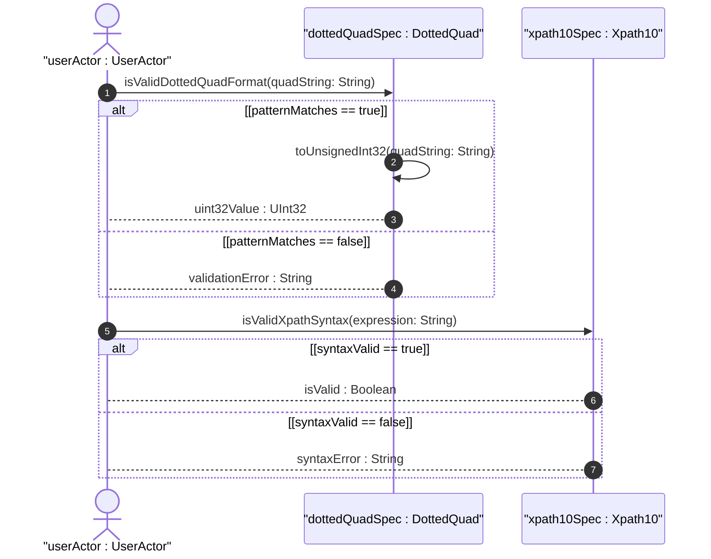
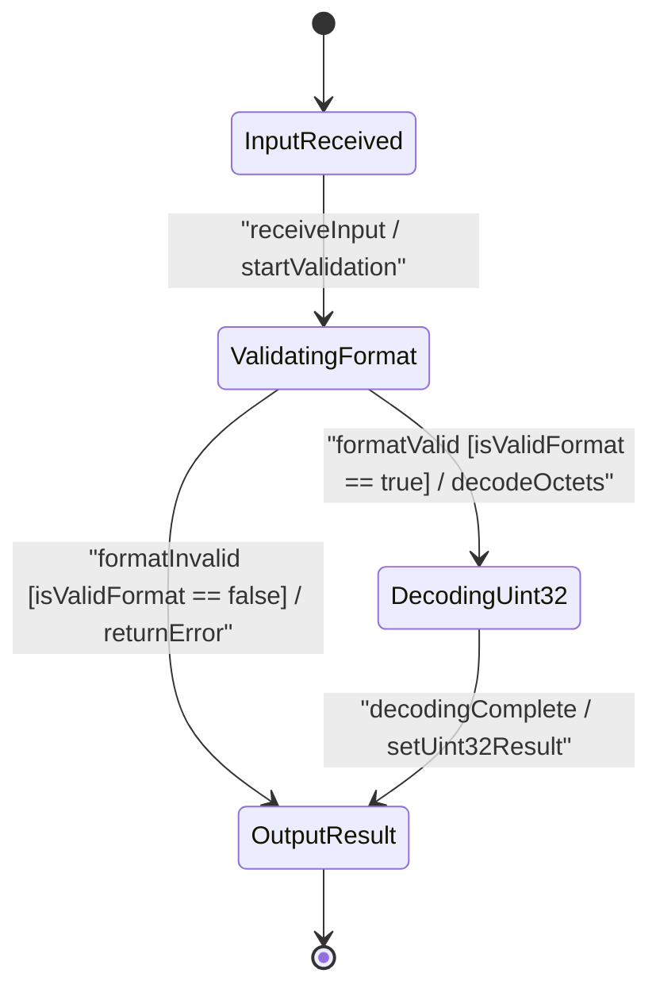

issue_id: 15

# User Story: Dotted-Quad Decimal Parsing to Unsigned Int32 and XPath 1.0 Expression Syntax Validation

## Parent Epic
- [ ] #5 - [[ietf-yang-types]: Common YANG Data Types](https://github.com/gintatkinson/3dgs-037/blob/main/docs/epics/epic-01-ietf-yang-types.md) (Parent Epic for common YANG data types)

## Domain Object Mapping
- **Primary Domain Objects:** `AddressAndStringTypes`, `DottedQuad`, `Xpath10`, `LanguageTag`
- **Actor/Role:** `userActor : UserActor`

## BDD Scenario (OOA/OOD Realization)
**Given** an unparsed input string representing dotted-quad decimal notation, an XPath 1.0 query expression, or an RFC 5646 language tag
**When** `userActor` submits the string payload to `dottedQuadSpec`, `xpath10Spec`, or `LanguageTag` validator
**Then** `dottedQuadSpec` validates the 4-octet decimal pattern (0..255 per octet) and decodes it to an Unsigned Int32 representation, `xpath10Spec` verifies valid XPath 1.0 expression syntax within the defined schema context, and `LanguageTag` formats RFC 5646 language tags to canonical lowercasing.

## UML Sequence Diagram

## UML State Machine Diagram

## Operational Context
> "An unsigned 32-bit number expressed in the dotted-quad notation, i.e., four octets written as decimal numbers and separated with the '.' (full stop) character."
> — RFC 9911 Section 3.29 (`dotted-quad`)

> "This type represents an XPATH 1.0 expression. When a schema node is defined that uses this type, the description of the schema node MUST specify the XPath context in which the XPath expression is evaluated."
> — RFC 9911 Section 3.31 (`xpath1.0`)

> "A language tag according to RFC 5646 (BCP 47). The canonical representation uses lowercase characters. Values of this type must be well-formed language tags, in conformance with the definition of well-formed tags in BCP 47. Implementations MAY further limit the values they accept to those permitted by a 'validating' processor, as defined in BCP 47."
> — RFC 9911 Section 3.32 (`language-tag`)

## Required Features Matrix
- [ ] #4 - [[ietf-yang-types]: Address and String Data Types](https://github.com/gintatkinson/3dgs-037/blob/main/docs/features/feat-04-address-and-string-types.md) (Validates dotted-quad decimal notation parsing, XPath 1.0 syntax evaluation, and BCP 47 language tag formatting)

## Source References
Structural Schema: https://github.com/YangModels/yang/blob/main/standard/ietf/RFC/ietf-yang-types%402025-12-22.yang
Normative Specification: https://datatracker.ietf.org/doc/rfc9911/
