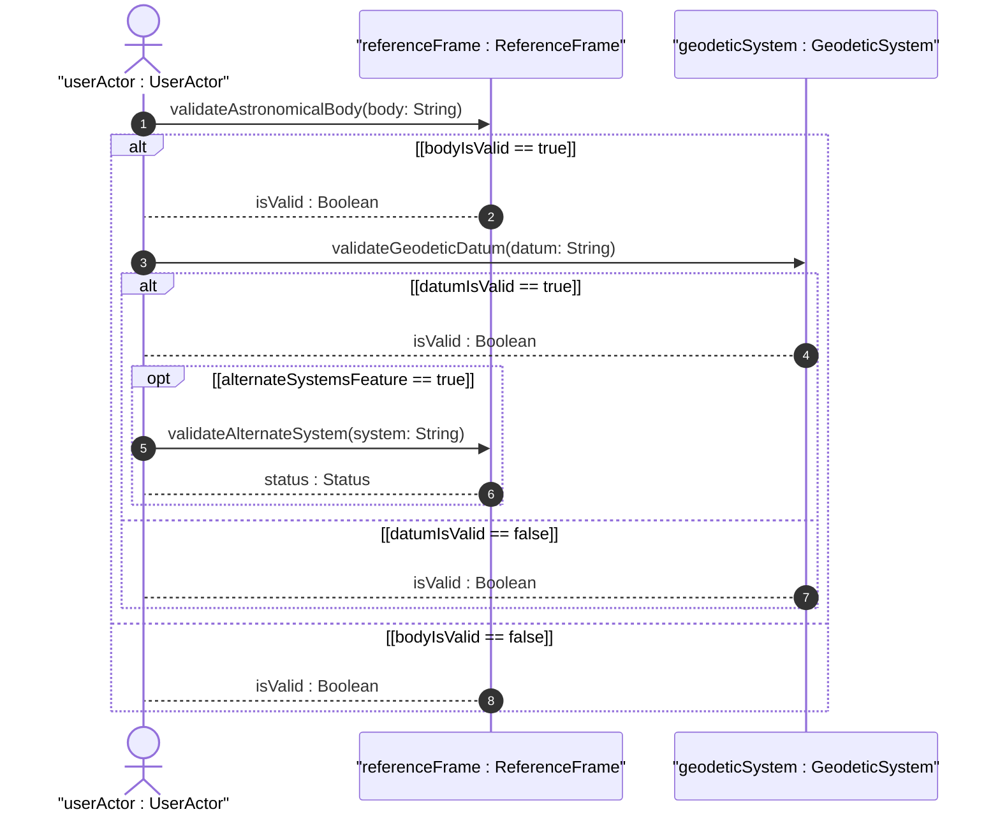
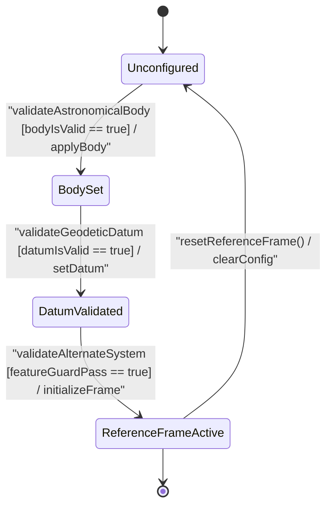

# User Story: [ietf-geo-location]: Geodetic Reference Frame Validation

## Parent Epic
- [ ] #38 - [[ietf-geo-location]: Geographic Location Management](https://github.com/gintatkinson/3dgs-037/blob/main/docs/epics/epic-03-ietf-geo-location.md) (Parent Epic defining geographic location reference frames)

## Domain Object Mapping
- **Primary Domain Objects:** `ReferenceFrame`, `GeodeticSystem`
- **Actor/Role:** `UserActor` (External client/operator configuring the geodetic reference frame)

## BDD Scenario (OOA/OOD Realization)

### Scenario 1: Default Astronomical Body Resolution
**Given** a `ReferenceFrame` object instantiated without explicit configuration parameters  
**When** `validateAstronomicalBody` is invoked with an omitted or default body value  
**Then** the `ReferenceFrame` MUST assign `"earth"` as the active astronomical body and return `isValid : Boolean` as `true`.

### Scenario 2: Custom Astronomical Body Validation (Mars)
**Given** an active `ReferenceFrame` instance  
**When** `validateAstronomicalBody` is called with custom body identifier `"mars"`  
**Then** the system MUST validate `"mars"` against the printable ASCII pattern `'[ -@\[-\^_-~]*'` and transition to state `BodySet`.

### Scenario 3: Geodetic Datum Validation (WGS-84 and EGM96)
**Given** a `ReferenceFrame` in state `BodySet`  
**When** `validateGeodeticDatum` is called on `GeodeticSystem` with datum `"wgs-84"` or `"egm96"`  
**Then** `GeodeticSystem` MUST confirm the datum is registered in the geodetic datum registry, set the active datum, and return `isValid : Boolean` as `true`.

### Scenario 4: Alternate System Feature Guard Verification
**Given** a `ReferenceFrame` with validated astronomical body and geodetic datum  
**When** `validateAlternateSystem` is called with an alternate coordinate system identifier  
**Then** the system MUST check the `alternate-systems` feature guard, returning `status : Status` as success if enabled, or rejecting with error if disabled.

## UML Sequence Diagram

## UML State Machine Diagram

## Operational Context
The frame of reference ('reference-frame') defines what the location values refer to and their meaning. The referred-to object can be any astronomical body. It could be a planet such as Earth or Mars, a moon such as Enceladus, an asteroid such as Ceres, or even a comet such as 1P/Halley. This value is specified in 'astronomical-body' and is defined by the International Astronomical Union <http://www.iau.org>. The default 'astronomical-body' value is 'earth'.

In addition to identifying the astronomical body, we also need to define the meaning of the coordinates (e.g., latitude and longitude) and the definition of 0-height. This is done with a 'geodetic-datum' value. The default value for 'geodetic-datum' is 'wgs-84' (i.e., the World Geodetic System [WGS84]), which is used by the Global Positioning System (GPS) among many others. We define an IANA registry for specifying standard values for the 'geodetic-datum'.

In addition to the 'geodetic-datum' value, we allow overriding the coordinate and height accuracy using 'coord-accuracy' and 'height-accuracy', respectively. When specified, these values override the defaults implied by the 'geodetic-datum' value.

Finally, we define an optional feature that allows for changing the system for which the above values are defined. This optional feature adds an 'alternate-system' value to the reference frame. This value is normally not present, which implies the natural universe is the system. The use of this value is intended to allow for creating virtual realities or perhaps alternate coordinate systems. The definition of alternate systems is outside the scope of this document.

## Required Features Matrix
- [ ] #34 - [[ietf-geo-location]: Geodetic Reference Frame](https://github.com/gintatkinson/3dgs-037/blob/main/docs/features/feat-09-geodetic-reference-frame.md) (Provides schema definition and validation methods for astronomical body, alternate system, and feature guard checks)
- [ ] #35 - [[ietf-geo-location]: Geodetic System and Accuracy Bounds](https://github.com/gintatkinson/3dgs-037/blob/main/docs/features/feat-10-geodetic-system-and-accuracy.md) (Provides geodetic datum validation including default WGS-84 and custom EGM96 data bounds)

## Source References
Structural Schema: https://github.com/YangModels/yang/blob/main/standard/ietf/RFC/ietf-geo-location%402022-02-11.yang
Normative Specification: https://datatracker.ietf.org/doc/rfc9179/
