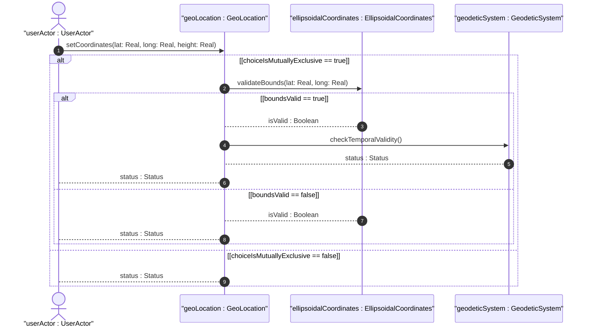
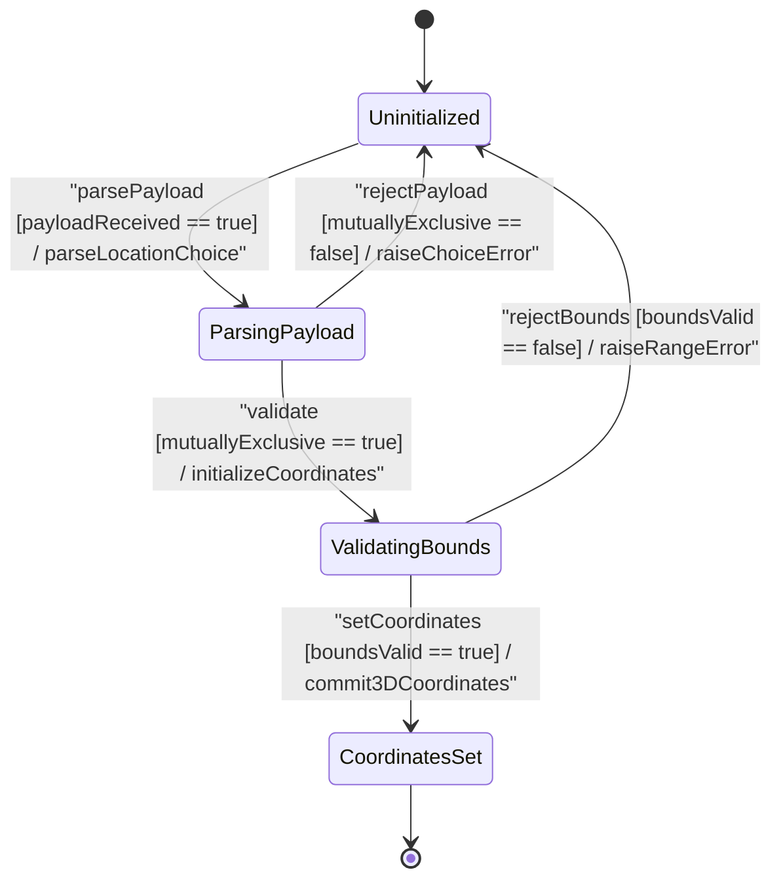

# User Story: [ietf-geo-location]: 3D Coordinates and Altitude Parsing

## Parent Epic
- [ ] #38 - [[ietf-geo-location]: Geographic Location Management](https://github.com/gintatkinson/3dgs-037/blob/main/docs/epics/epic-03-ietf-geo-location.md) (Parent Epic providing overall governance for geographic location management and spatial data models)

## Domain Object Mapping
- **Primary Domain Objects:** `GeoLocation`, `EllipsoidalCoordinates`, `CartesianCoordinates`, `GeodeticSystem`
- **Actor/Role:** `userActor : UserActor`

## BDD Scenario (OOA/OOD Realization)

### Scenario 1: Valid Ellipsoidal Coordinates and Altitude Parsing
**Given** a request to configure a `GeoLocation` instance using ellipsoidal position parameters  
**When** `setCoordinates(lat: Real, long: Real, height: Real)` is invoked with `latitude = 37.774900`, `longitude = -122.419400`, and `height = 15.500000`  
**Then** the `EllipsoidalCoordinates` object is initialized with valid 3D coordinates and altitude, and returns `status : Status` as success.

### Scenario 2: Valid Cartesian Coordinates Parsing
**Given** a request to configure a `GeoLocation` instance using 3D geocentric coordinates  
**When** `setCoordinates(x: Real, y: Real, z: Real)` is invoked with `x = -2696667.123456`, `y = -4294025.654321`, and `z = 3887802.987654` meters  
**Then** the `CartesianCoordinates` object is initialized with valid geocentric axes, and returns `status : Status` as success.

### Scenario 3: Latitude Out-of-Bounds Rejection
**Given** a `GeoLocation` instance undergoing coordinate boundary evaluation  
**When** `validateBounds(lat: Real, long: Real)` is executed with a latitude value `95.123400` exceeding the valid range `[-90.0, 90.0]`  
**Then** validation MUST fail, rejecting the payload and returning `isValid : Boolean` as false.

### Scenario 4: Longitude Out-of-Bounds Rejection
**Given** a `GeoLocation` instance undergoing coordinate boundary evaluation  
**When** `validateBounds(lat: Real, long: Real)` is executed with a longitude value `-185.500000` exceeding the valid range `[-180.0, 180.0]`  
**Then** validation MUST fail, rejecting the payload and returning `isValid : Boolean` as false.

### Scenario 5: Location Choice Mutual Exclusivity Enforcement
**Given** an incoming `GeoLocation` payload containing both `ellipsoid` and `cartesian` coordinate choice branches  
**When** the validator evaluates choice mutual exclusivity for the location selection  
**Then** the payload MUST be rejected with a mutual exclusivity violation error and return `status : Status` as failure.

## UML Sequence Diagram

## UML State Machine Diagram

## Operational Context
> "This is the location on, or relative to, the astronomical object. It is specified using two or three coordinate values. These values are given either as 'latitude', 'longitude', and an optional 'height', or as Cartesian coordinates of 'x', 'y', and 'z'. For the standard location choice, 'latitude' and 'longitude' are specified as decimal degrees, and the 'height' value is in fractions of meters. For the Cartesian choice, 'x', 'y', and 'z' are in fractions of meters. In both choices, the exact meanings of all the values are defined by the 'geodetic-datum' value in Section 2.1."

## Required Features Matrix
- [ ] #36 - [[ietf-geo-location]: Geographic Coordinates and Altitude](https://github.com/gintatkinson/3dgs-037/blob/main/docs/features/feat-11-coordinates-and-altitude.md) (Provides structural container definition and range constraints for 3D ellipsoidal and Cartesian coordinate choices)
- [ ] #35 - [[ietf-geo-location]: Geodetic System and Accuracy Bounds](https://github.com/gintatkinson/3dgs-037/blob/main/docs/features/feat-10-geodetic-system-and-accuracy.md) (Provides geodetic reference datum definitions and temporal validity metadata checks for coordinate measurements)

## Source References
Structural Schema: https://github.com/YangModels/yang/blob/main/standard/ietf/RFC/ietf-geo-location%402022-02-11.yang
Normative Specification: https://datatracker.ietf.org/doc/rfc9179/
