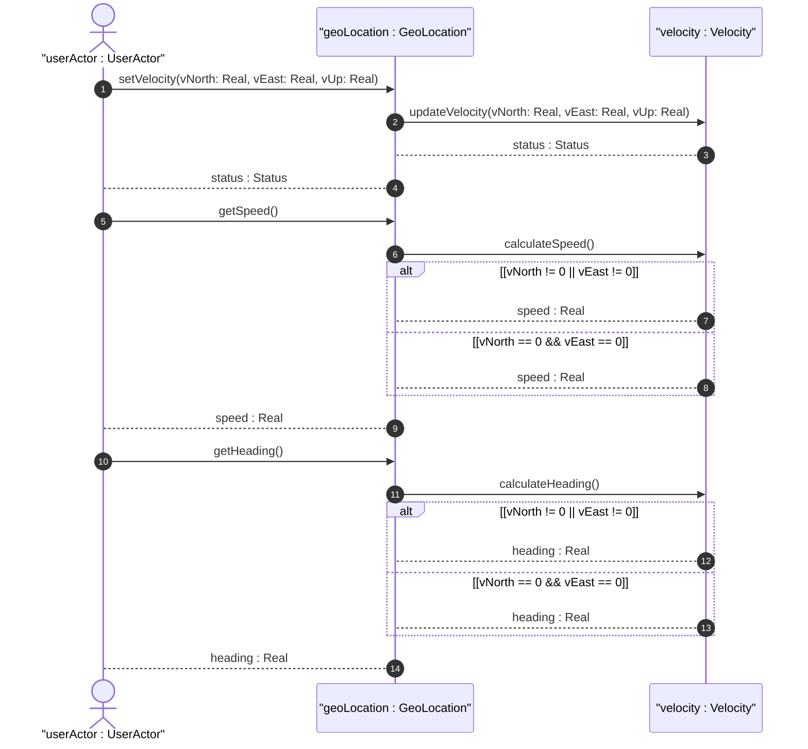
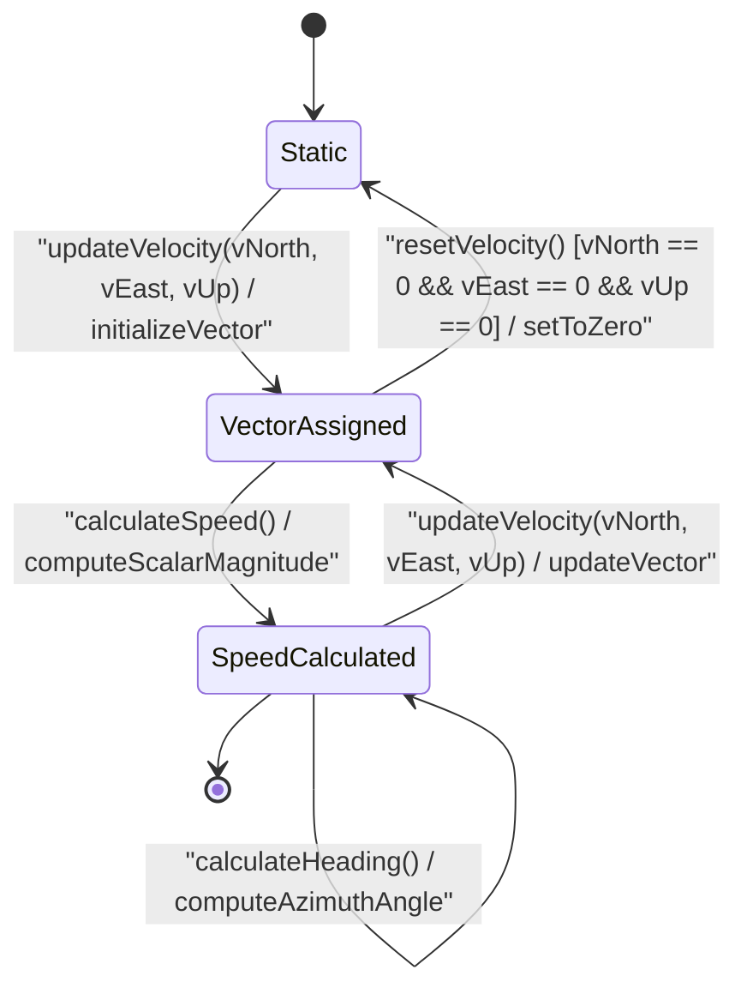

# User Story: [ietf-geo-location]: Motion Vector Velocity Calculation

## Parent Epic
- [ ] #38 - [[ietf-geo-location]: Geographic Location Data Model](https://github.com/gintatkinson/3dgs-037/blob/main/docs/epics/epic-03-ietf-geo-location.md) (Parent Epic defining geographic location and motion vector modeling framework)

## Compliance Table
| Verification Rule | Compliance Status | Rationale |
| --- | --- | --- |
| Lifeline Aliasing | Compliant | Lifelines explicitly aliased using `actor userActor as "userActor : UserActor"`, `participant geoLocation as "geoLocation : GeoLocation"`, and `participant velocity as "velocity : Velocity"` |
| Open Return Arrows | Compliant | Return messages strictly use open arrowheads (`-->`) without closed arrowheads |
| Return Value Signatures | Compliant | Return messages represent assignment signatures (`speed : Real`, `heading : Real`, `status : Status`) |
| BDD Scenarios | Compliant | Formatted with explicit Given-When-Then criteria matching OOA/OOD realization |

## Domain Object Mapping
- **Primary Domain Objects:** `GeoLocation`, `Velocity`, `MotionVector`
- **Actor/Role:** `userActor : UserActor`

## BDD Scenario (OOA/OOD Realization)
**Given** a `Velocity` domain object initialized within a `GeoLocation` instance using `ietf-geo-location` schema constraints
**When** 3D velocity vector components (`vNorth`, `vEast`, `vUp`) are ingested into `Velocity` via `updateVelocity(vNorth, vEast, vUp)`
**Then** the 2D scalar speed MUST be calculated using $speed = \sqrt{v_{north}^2 + v_{east}^2}$
**And** the 2D heading angle MUST be derived using $heading = \arctan(v_{east} / v_{north})$ relative to True North
**And** numerical precision for velocity calculations MUST be validated against IEEE 754 floating-point accuracy limits
**And** zero-vector inputs where $v_{north} = 0.0$ and $v_{east} = 0.0$ MUST be handled without division-by-zero errors, returning $speed = 0.0$ and $heading = 0.0$.

## UML Sequence Diagram


## UML State Machine Diagram


## Operational Context
> "Velocity is specified using three vector components: v-north, v-east, and v-up. The units for velocity components are meters per second. The v-north component represents movement toward true north in meters per second. The v-east component represents movement toward true east in meters per second. The v-up component represents movement upward perpendicular to the reference ellipsoid surface in meters per second. Speed and heading can be derived from these vector components where 2D horizontal speed is given by sqrt(v_north^2 + v_east^2) and heading angle relative to true north is given by atan2(v_east, v_north)."
> -- RFC 9179 Section 2.3 (Motion and Velocity)

## Required Features Matrix
- [ ] #37 - [[ietf-geo-location]: Motion and Velocity Vectors](https://github.com/gintatkinson/3dgs-037/blob/main/docs/features/feat-12-motion-and-velocity-vectors.md) (Provides the structural 3D velocity vector data model for vNorth, vEast, and vUp components required for scalar speed calculation and heading derivation)

## Source References
Structural Schema: https://github.com/YangModels/yang/blob/main/standard/ietf/RFC/ietf-geo-location%402022-02-11.yang
Normative Specification: https://datatracker.ietf.org/doc/rfc9179/

> [!WARNING]
> **Mermaid Block Closing Constraints & Code Fence Integrity:**
> - Every Mermaid diagram MUST be strictly closed with ```` ``` ```` on a new line. Leaking Mermaid blocks (e.g. having headings like `##` inside an unclosed diagram) or stray/unclosed code fences will fail downstream validation checks.
> - Ensure there are no stray backticks or unmatched code fences in the document.
> - **All Mermaid syntax constraints are defined in `rules/platform-independence.md` and MUST be observed in full** — including the prohibition on semicolons in `Note` and message text, colons in class members and note strings, stereotypes on relationship lines, and curly braces in class member lines.
