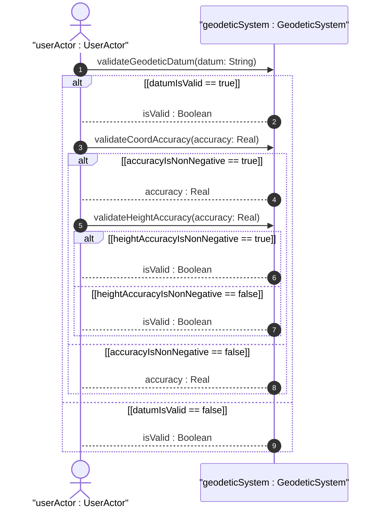
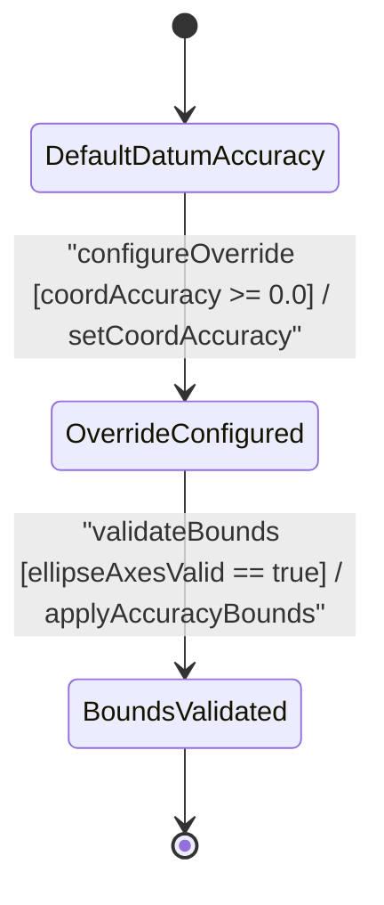

# User Story: [ietf-geo-location]: Location Uncertainty Ellipse Bounds

## Parent Epic
- [ ] #38 - [[ietf-geo-location]: Geographic Location Management](https://github.com/gintatkinson/3dgs-037/blob/main/docs/epics/epic-03-ietf-geo-location.md) (Parent Epic for geographic location management)

## Domain Object Mapping
- **Primary Domain Objects:** `GeodeticSystem`, `GeoLocation`, `ReferenceFrame`
- **Actor/Role:** `userActor : UserActor`

## BDD Scenario (OOA/OOD Realization)

### Scenario 1: Default Datum Accuracy Resolution
**Given** a geographic location configured with `geodetic-datum` set to `"wgs-84"` without explicit coordinate accuracy overrides  
**When** horizontal coordinate accuracy parameters are requested from `GeodeticSystem`  
**Then** system resolves accuracy bounds derived from the default datum specifications.

### Scenario 2: Horizontal Coordinate Accuracy Override Resolution
**Given** a `GeodeticSystem` instance with default datum `"wgs-84"`  
**When** `validateCoordAccuracy(accuracy: Real)` is invoked with an explicit value `0.000005`  
**Then** the explicit coordinate accuracy `0.000005` MUST override the default datum accuracy and return `accuracy : Real`.

### Scenario 3: Vertical Height Accuracy Override Resolution
**Given** a `GeodeticSystem` instance with height accuracy configuration  
**When** `validateHeightAccuracy(accuracy: Real)` is executed with value `0.050000`  
**Then** vertical height accuracy MUST be registered as `0.050000` meters with fraction-digits 6 precision and return `isValid : Boolean`.

### Scenario 4: Uncertainty Ellipse Semi-Axis Bounds Evaluation
**Given** semi-major and semi-minor axis uncertainty parameters derived from `coord-accuracy` and orientation angle bounds  
**When** uncertainty ellipse geometry is evaluated for horizontal confidence intervals  
**Then** semi-major and semi-minor axis values MUST form a valid closed uncertainty ellipse bounded by coordinate accuracy limits.

### Scenario 5: Non-Negative Constraint Validation Rejection
**Given** a request to configure coordinate or height accuracy with a negative value `-0.001`  
**When** `validateCoordAccuracy(accuracy: Real)` or `validateHeightAccuracy(accuracy: Real)` evaluates the argument  
**Then** validation MUST fail and return `isValid : Boolean` as false due to non-negative constraint violation.

## UML Sequence Diagram

## UML State Machine Diagram

## Operational Context
> "In addition to identifying the astronomical body, we also need to define the meaning of the coordinates (e.g., latitude and longitude) and the definition of 0-height. This is done with a 'geodetic-datum' value. The default value for 'geodetic-datum' is 'wgs-84' (i.e., the World Geodetic System [WGS84]), which is used by the Global Positioning System (GPS) among many others. We define an IANA registry for specifying standard values for the 'geodetic-datum'.
> In addition to the 'geodetic-datum' value, we allow overriding the coordinate and height accuracy using 'coord-accuracy' and 'height-accuracy', respectively. When specified, these values override the defaults implied by the 'geodetic-datum' value."

## Required Features Matrix
- [ ] #35 - [[ietf-geo-location]: Geodetic System and Accuracy Bounds](https://github.com/gintatkinson/3dgs-037/blob/main/docs/features/feat-10-geodetic-system-and-accuracy.md) (Provides structural definition and baseline validation operations for geodetic system datum and coordinate/height accuracy overrides)

## Source References
Structural Schema: https://github.com/YangModels/yang/blob/main/standard/ietf/RFC/ietf-geo-location%402022-02-11.yang
Normative Specification: https://datatracker.ietf.org/doc/rfc9179/
