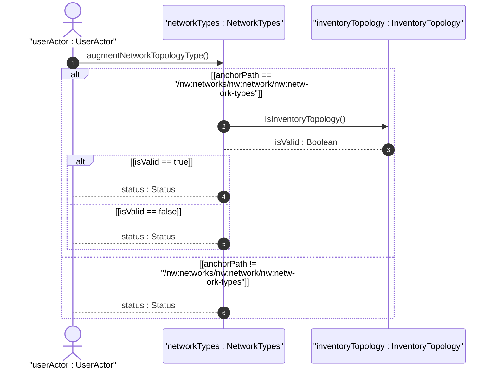
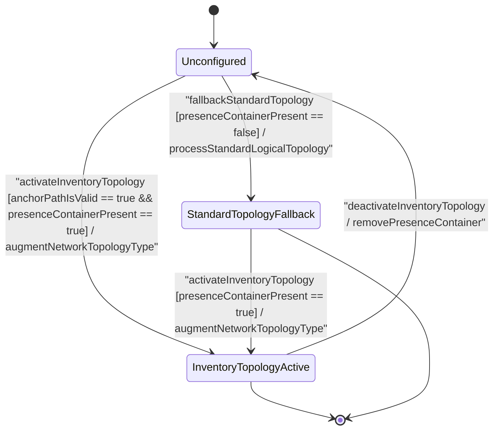

# User Story: [ietf-network-inventory-topology]: Physical Underlay Topology Network Type Discovery, Activation, and Network Topology Augmentation Verification

## Parent Epic
- [ ] #64 - [[ietf-network-inventory-topology]: Network Inventory Topology Mapping](https://github.com/gintatkinson/3dgs-037/blob/main/docs/epics/epic-05-ietf-network-inventory-topology.md) (Provides parent epic context for physical underlay topology mapping and inventory-topology presence container augmentation)

## Domain Object Mapping
- **Primary Domain Objects:** `NetworkTypes`, `InventoryTopology`
- **Actor/Role:** `userActor : UserActor` (Topology controller / inventory management engine)

## BDD Scenario (OOA/OOD Realization)

### Scenario 1: Discovery and Activation of Physical Underlay Topology Network Type
**Given** a network instance under `/nw:networks/nw:network`  
**When** `userActor` activates the network inventory topology by creating the presence container `/nw:networks/nw:network/nw:network-types/nwit:inventory-topology`  
**Then** `networkTypes` MUST execute `augmentNetworkTopologyType()` and return `status : Status` indicating successful network type activation.

### Scenario 2: Base Network Topology Augmentation Anchor Verification
**Given** an augmented network configuration request  
**When** `userActor` verifies the augmentation anchor path against `/nw:networks/nw:network/nw:network-types`  
**Then** `inventoryTopology` MUST evaluate `isInventoryTopology()` and return `isValid : Boolean` as true, confirming correct base network topology node placement.

### Scenario 3: Non-Inventory Network Type Fallback
**Given** a standard logical network instance without the `inventory-topology` presence container  
**When** `userActor` inspects network properties for inventory capability flags  
**Then** the subsystem MUST fall back to standard logical topology processing without active inventory topology extensions and return `status : Status`.

### Scenario 4: Invalid Container Placement Rejection
**Given** a network type configuration request  
**When** `userActor` attempts to attach the `inventory-topology` container at an anchor path outside `/nw:networks/nw:network/nw:network-types`  
**Then** schema validation MUST fail, rejecting the invalid container placement, and return `isValid : Boolean` as false.

## UML Sequence Diagram

## UML State Machine Diagram

## Operational Context
> "This module augments the 'ietf-network' module by adding the 'inventory-topology' presence container to '/networks/network/network-types'. The presence of this container identifies a network as representing a network inventory topology. The network-inventory-topology model provides structured mapping between logical network topology entities defined in ietf-network-topology base models and physical hardware inventory entities managed in ietf-network-inventory, enabling network controllers to render, query, and manage physical underlay topologies alongside logical overlay models."

## Required Features Matrix
- [ ] #60 - [[ietf-network-inventory-topology: Network Inventory Topology Type Augment]](https://github.com/gintatkinson/3dgs-037/blob/main/docs/features/feat-17-network-inventory-topology-type-augment.md) (Defines the presence container inventory-topology under /nw:networks/nw:network/nw:network-types)

## Source References
Structural Schema: https://github.com/ietf-ivy-wg/network-inventory-topology/blob/main/yang/ietf-network-inventory-topology.yang
Normative Specification: https://datatracker.ietf.org/doc/html/draft-ietf-ivy-network-inventory-topology
