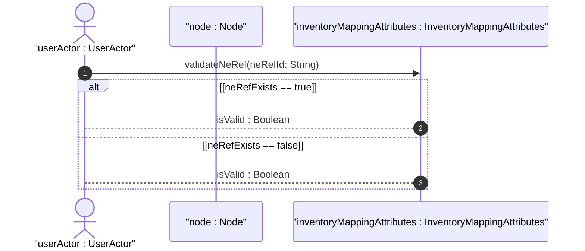
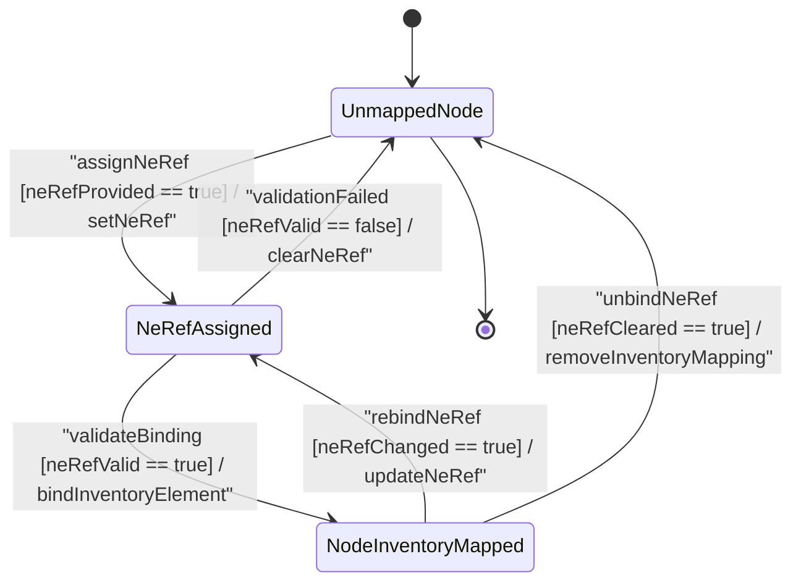

# User Story: [ietf-network-inventory-topology]: Logical Node to Physical Network Element (NE) Leafref Mapping, 1:1 Correlation, and Unmapped Node Fallback

## Parent Epic
- [ ] #64 - [[ietf-network-inventory-topology]: Network Inventory Topology Mapping](https://github.com/gintatkinson/3dgs-037/blob/main/docs/epics/epic-05-ietf-network-inventory-topology.md) (Parent Epic defining network inventory topology mapping attributes and node to physical network element correlation)

## Domain Object Mapping
- **Primary Domain Objects:** `Node`, `InventoryMappingAttributes`, `NetworkElement`
- **Actor/Role:** `userActor : UserActor` (Network Architect / Topology Administrator)

## BDD Scenario (OOA/OOD Realization)

### Scenario 1: Valid 1:1 Correlation between Topology Node and Physical Network Element
**Given** an unmapped topology node `"node-core-router-01"` and a valid physical network element `"ne-router-csr-9000-a"` in the network inventory data store  
**When** `userActor` invokes `mapNodeInventory(nodeId: "node-core-router-01", neRef: "ne-router-csr-9000-a")`  
**Then** `inventoryMappingAttributes` MUST validate the reference via `validateNeRef("ne-router-csr-9000-a")`, returning `isValid : Boolean` as true, establishing 1:1 correlation and returning `status : Status` indicating successful mapping.

### Scenario 2: Unmapped Node Fallback Handling
**Given** a topology node `"node-edge-switch-02"` without an `inventory-mapping-attributes` container or with an empty `ne-ref`  
**When** `userActor` requests node configuration attributes or invokes `mapNodeInventory(nodeId: "node-edge-switch-02", neRef: "")`  
**Then** the system MUST fall back to `UnmappedNode` state, returning `status : Status` indicating unmapped placeholder status without raising validation errors.

### Scenario 3: Rejection of Invalid or Unresolvable Network Element Reference
**Given** a non-existent network element ID `"ne-invalid-999"`  
**When** `userActor` attempts to bind topology node `"node-core-router-01"` via `mapNodeInventory(nodeId: "node-core-router-01", neRef: "ne-invalid-999")`  
**Then** `validateNeRef("ne-invalid-999")` MUST return `isValid : Boolean` as false, rejecting the update, preserving the previous configuration state, and returning `status : Status` indicating validation failure.

### Scenario 4: Updating and Re-binding Node Inventory Mapping
**Given** a mapped topology node `"node-core-router-01"` correlated with network element `"ne-router-csr-9000-a"`  
**When** `userActor` updates the inventory binding to a new valid network element `"ne-router-csr-9000-b"` via `mapNodeInventory(nodeId: "node-core-router-01", neRef: "ne-router-csr-9000-b")`  
**Then** `validateNeRef("ne-router-csr-9000-b")` MUST validate the new leafref target, re-bind the node mapping, and return `status : Status` confirming successful re-correlation.

## UML Sequence Diagram

## UML State Machine Diagram

## Operational Context
> "The ietf-network-inventory-topology YANG module augments the abstract network topology model defined in ietf-network by adding the inventory-mapping-attributes container to the node container. Within this container, the ne-ref leaf provides a leafref pointing to /nwi:network-inventory/nwi:network-elements/nwi:network-element/nwi:ne-id. This leafref establishes a 1:1 correlation between a logical network topology node and its corresponding physical or logical network element managed within the network inventory subsystem. When a node lacks inventory mapping attributes or contains an empty ne-ref, the system provides an unmapped node fallback state allowing unconstrained topology rendering while presenting edit triggers for inventory binding."

## Required Features Matrix
- [ ] #61 - [[ietf-network-inventory-topology: Node Inventory Mapping Augment]](https://github.com/gintatkinson/3dgs-037/blob/main/docs/features/feat-18-node-inventory-mapping-augment.md) (Provides inventory-mapping-attributes container with ne-ref leafref pointing to network element inventory)

## Source References
Structural Schema: https://github.com/ietf-ivy-wg/network-inventory-topology/blob/main/yang/ietf-network-inventory-topology.yang
Normative Specification: https://datatracker.ietf.org/doc/html/draft-ietf-ivy-network-inventory-topology
