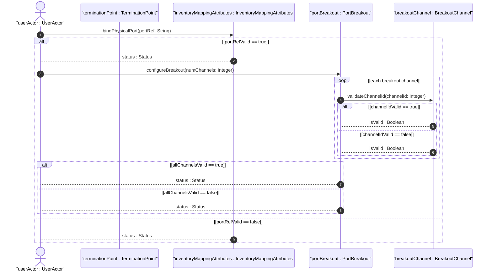
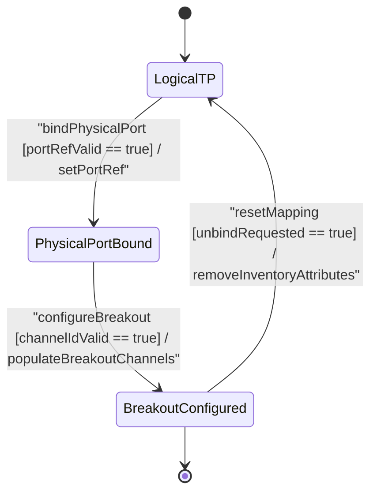

# User Story: [ietf-network-inventory-topology]: Port Component Leafref Binding, Port Breakout Capability Configuration (e.g. 4x10G, 2x50G), Child TP Numbering, and Speed/Duplex Alignment

## Parent Epic
- [ ] #64 - [[ietf-network-inventory-topology]: Network Inventory Topology Mapping](https://github.com/gintatkinson/3dgs-037/blob/main/docs/epics/epic-05-ietf-network-inventory-topology.md) (Parent Epic defining structured mapping between logical network topology entities and physical network inventory assets)

## Domain Object Mapping
- **Primary Domain Objects:** `TerminationPoint`, `InventoryMappingAttributes`, `PortBreakout`, `BreakoutChannel`
- **Actor/Role:** `userActor : UserActor` (network topology administrator / hardware inventory controller)

## BDD Scenario (OOA/OOD Realization)

### Scenario 1: Physical Termination Point 1:1 Port Component Leafref Binding
**Given** a network topology `TerminationPoint` instance representing a physical interface  
**When** `userActor` populates `inventory-mapping-attributes` with a valid `port-ref` leafref string (`"/nwi:network-inventory/nil:equipment/nil:component[name='shelf1/slot0/port1']"`)  
**Then** `bindPhysicalPort(portRef: String)` MUST establish a 1:1 mapping between the logical TP and physical port component in the inventory and return `status : Status` indicating successful binding.

### Scenario 2: Port Breakout Capability Configuration and Channel Enumeration
**Given** a bound physical `TerminationPoint` instance supporting multi-channel breakout  
**When** `userActor` provisions `port-breakout` channelization (e.g. 4x10G or 2x50G) with `numChannels` sub-ports  
**Then** `configureBreakout(numChannels: Integer)` MUST enumerate `breakout-channel` entries, validate each `channel-id` (`uint16`, `0..65535`) via `validateChannelId(channelId: Integer)` returning `isValid : Boolean` as true, and return `status : Status`.

### Scenario 3: Logical/Virtual Termination Point Classification
**Given** a logical or virtual termination point in the topology model  
**When** the `inventory-mapping-attributes` container is omitted from the `TerminationPoint` instance  
**Then** the system MUST classify the TP as a logical interface without physical port mapping and display `"No Inventory Mapping Assigned"` in the UI.

### Scenario 4: Invalid Port Reference or Duplicate Channel ID Rejection
**Given** a `TerminationPoint` undergoing mapping or breakout configuration  
**When** `userActor` provides an unresolvable `port-ref` leafref or a duplicate/out-of-bounds `channel-id`  
**Then** validation MUST fail, rejecting the invalid configuration, returning `isValid : Boolean` as false and `status : Status` with an error state.

## UML Sequence Diagram

## UML State Machine Diagram

## Operational Context
> "The inventory-mapping-attributes container for a termination point establishes a 1:1 mapping between the logical termination point (TP) in the network topology and a physical port component in the network inventory. The inventory-mapping-attributes containers are defined as read-write (config true) to accommodate cases where automatic discovery is not possible. Furthermore, the port-breakout container (config false) represents the operational breakout capability of the physical port when hardware supports partitioning into multiple independent channels (e.g., 400G to 4x100G, 40G to 4x10G, 100G to 2x50G), listing each available channel sub-port by a unique 16-bit unsigned integer channel-id."

## Required Features Matrix
- [ ] #62 - [[ietf-network-inventory-topology: Termination Point Inventory Mapping Augment]](https://github.com/gintatkinson/3dgs-037/blob/main/docs/features/feat-19-termination-point-inventory-mapping-augment.md) (Provides inventory-mapping-attributes container with 1:1 port-ref leafref binding, port-breakout container, and uint16 breakout-channel channel-id enumeration)

## Source References
Structural Schema: https://github.com/ietf-ivy-wg/network-inventory-topology/blob/main/yang/ietf-network-inventory-topology.yang
Normative Specification: https://datatracker.ietf.org/doc/html/draft-ietf-ivy-network-inventory-topology
