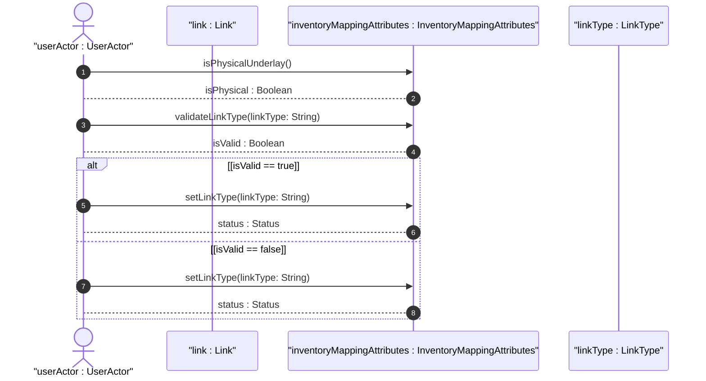
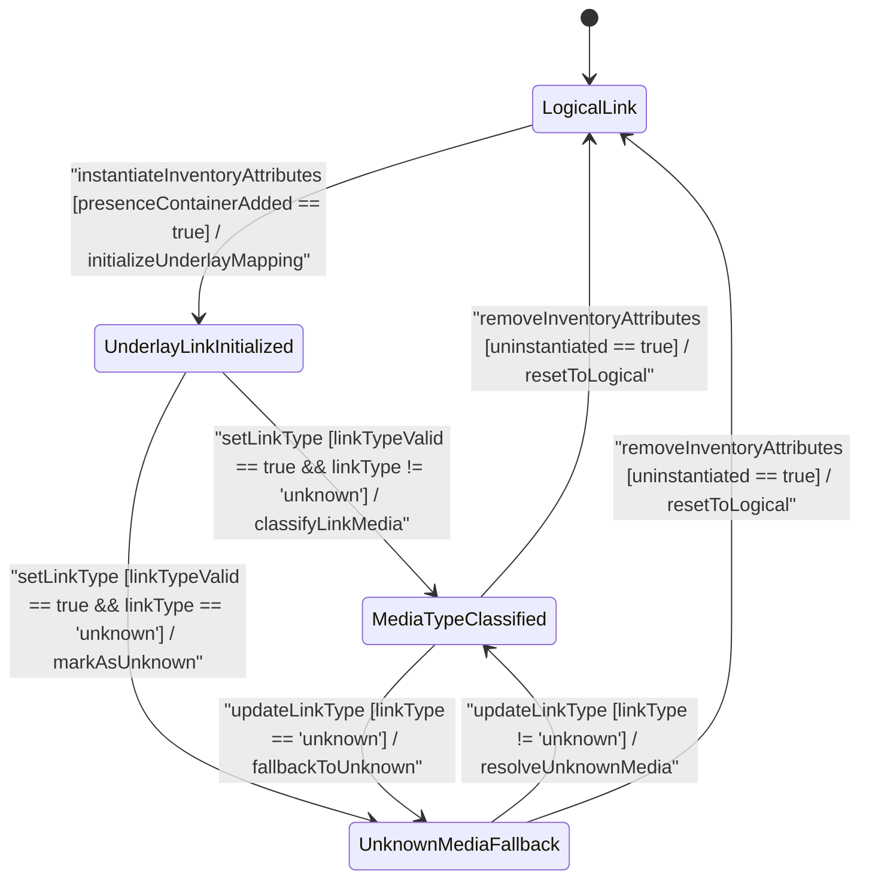

# User Story: [ietf-network-inventory-topology]: Underlay Link Media Type Classification (copper, fiber, coax, microwave, wlan, leased-fiber, unknown), Unset vs Unknown Evaluation, and Passive Inventory Resolution

## Parent Epic
- [ ] #64 - [[ietf-network-inventory-topology]: Network Inventory Topology Mapping](https://github.com/gintatkinson/3dgs-037/blob/main/docs/epics/epic-05-ietf-network-inventory-topology.md) (Parent Epic defining structured mapping between logical network topology entities and physical network inventory assets)

## Domain Object Mapping
- **Primary Domain Objects:** `Link`, `InventoryMappingAttributes`, `LinkType`, `Fiber`, `LeasedFiber`, `Copper`, `Coax`, `Microwave`, `Wlan`, `Unknown`
- **Actor/Role:** `userActor : UserActor` (network topology administrator / automated network discovery engine)

## BDD Scenario (OOA/OOD Realization)

### Scenario 1: Physical Underlay Link Media Type Classification
**Given** a network topology `Link` instance representing a physical connection  
**When** `userActor` instantiates `inventory-mapping-attributes` and sets `link-type` to a valid wired or wireless identity (`"copper"`, `"fiber"`, `"coax"`, `"microwave"`, `"wlan"`)  
**Then** `validateLinkType(linkType: String)` MUST return `isValid : Boolean` as true, `setLinkType(linkType: String)` MUST apply the classification returning `status : Status`, and `isPhysicalUnderlay()` MUST return `isPhysical : Boolean` as true.

### Scenario 2: Derived Leased-Fiber Identity Specialization and Passive Inventory Linkage
**Given** a third-party leased optical fiber connection in the physical underlay topology  
**When** `userActor` provisions `link-type` with derived identity `"leased-fiber"`  
**Then** `validateLinkType(linkType: String)` MUST verify that `leased-fiber` extends base identity `fiber`, apply the specialization returning `status : Status`, and resolve the link to passive network inventory model resources.

### Scenario 3: Discovery Fallback to Unknown Identity vs Unset Evaluation
**Given** an automated discovery engine scanning physical underlay links  
**When** physical media discovery fails to identify the medium and sets `link-type` to `"unknown"`  
**Then** `setLinkType(linkType: String)` MUST mark the media type as explicitly `unknown` returning `status : Status`, distinguishing it from an un-assessed link where `link-type` leaf is unset (`[0..1]`).

### Scenario 4: Logical Upper-Layer Link Classification (Absence of Inventory Mapping Attributes)
**Given** a logical or virtual overlay link in the network topology  
**When** the `inventory-mapping-attributes` presence container is omitted from the `Link` instance  
**Then** `isPhysicalUnderlay()` MUST return `isPhysical : Boolean` as false, classifying the link as a higher-layer logical entity without physical underlay inventory mapping.

## UML Sequence Diagram

## UML State Machine Diagram

## Operational Context
> "The inventory-mapping-attributes container for a link designates a physical link at the lowest underlay abstraction level in the network hierarchy. This container provides lightweight media classification through the link-type leaf, which references identity base link-type. Wired media (fiber, copper, coax) link to passive network inventory models, while wireless media (microwave, wlan) link to wireless-specific inventory models. Derived identities like leased-fiber specialize optical fiber for third-party operator links, and unknown identity provides an explicit fallback when discovery systems cannot classify the physical medium."

## Required Features Matrix
- [ ] #63 - [[ietf-network-inventory-topology: Link Inventory Mapping Augment]](https://github.com/gintatkinson/3dgs-037/blob/main/docs/features/feat-20-link-inventory-mapping-augment.md) (Provides inventory-mapping-attributes presence container augmenting network topology links with lightweight link-type media classification)

## Source References
Structural Schema: https://github.com/ietf-ivy-wg/network-inventory-topology/blob/main/yang/ietf-network-inventory-topology.yang
Normative Specification: https://datatracker.ietf.org/doc/html/draft-ietf-ivy-network-inventory-topology
