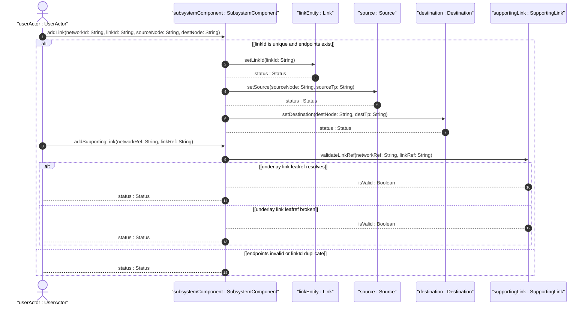
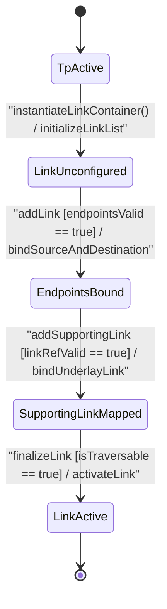

# User Story: [ietf-network-topology]: Directional Link Instantiation, Source/Destination TP Leafref Binding, and Underlay Supporting Link Path Resolution

## Parent Epic
- [ ] #90 - [[ietf-network-and-topology]: Network and Topology Base Models](https://github.com/gintatkinson/3dgs-037/blob/main/docs/epics/epic-07-ietf-network-and-topology.md) (Parent Epic defining base network and topology models)

## Domain Object Mapping
- **Primary Domain Objects:** `Network`, `Link`, `Source`, `Destination`, `SupportingLink`, `SubsystemComponent`
- **Actor/Role:** `userActor : UserActor` (network topology designer)

## BDD Scenario (OOA/OOD Realization)

### Scenario 1: Point-to-Point Directional Link Instantiation and Endpoint Binding
**Given** an active network topology `"overlay-nw-1"` containing nodes `"router-1"` and `"router-2"` with termination points `"ge-0/0/0"`  
**When** `userActor` creates a `Link` instance `"link-alpha"` with source node `"router-1"`, source TP `"ge-0/0/0"`, destination node `"router-2"`, and destination TP `"ge-0/0/0"`  
**Then** `addLink("overlay-nw-1", "link-alpha", "router-1", "router-2")` returns `true` and the directional link is bound between the specified endpoints.

### Scenario 2: Supporting Link Underlay Reference Resolution
**Given** an overlay topological link `"link-alpha"` in network `"overlay-nw-1"`  
**When** `userActor` attaches a `SupportingLink` entry with `networkRef` = `"underlay-nw-01"` and `linkRef` = `"phys-link-99"`  
**Then** `validateLinkRef("underlay-nw-01", "phys-link-99")` returns `isValid : Boolean` as `true` and the underlay link dependency is recorded.

### Scenario 3: Validation of Source/Destination Endpoint Leafref Constraints
**Given** a link creation request for link `"link-beta"`  
**When** `userActor` specifies a `sourceNode` that does not exist in the containing network  
**Then** the leafref integrity check fails and the system returns a validation error `Status`.

## UML Sequence Diagram


## UML State Machine Diagram


## Operational Context
```text
Section 4.3. Link Data Model
The link data model is defined by the "ietf-network-topology" YANG module.
A link is identified by a link-id, which is unique within the containing network.
A link connects a source node to a destination node. Specifically, a link connects a source termination point on a source node to a destination termination point on a destination node.
augment "/nw:networks/nw:network" {
  list link {
    key "link-id";
    leaf link-id {
      type link-id;
    }
    container source {
      leaf source-node { type node-ref; }
      leaf source-tp { type tp-ref; }
    }
    container destination {
      leaf dest-node { type node-ref; }
      leaf dest-tp { type tp-ref; }
    }
    list supporting-link {
      key "network-ref link-ref";
      leaf network-ref {
        type leafref {
          path "/nw:networks/nw:network/nw:network-id";
          require-instance false;
        }
      }
      leaf link-ref {
        type leafref {
          path "/nw:networks/nw:network[nw:network-id=current()/../network-ref]/nt:link/nt:link-id";
          require-instance false;
        }
      }
    }
  }
}
```

## Required Features Matrix
- [ ] #89 - [[ietf-network-topology: Link Data Model and Supporting Links]](https://github.com/gintatkinson/3dgs-037/blob/main/docs/features/feat-28-link-data-model-and-supporting-links.md) (Provides link list, link-id key, source/destination containers, and supporting-link leafref hierarchy)
- [ ] #88 - [[ietf-network-topology: Termination Point Data Model]](https://github.com/gintatkinson/3dgs-037/blob/main/docs/features/feat-27-termination-point-data-model.md) (Provides source-tp and dest-tp termination point context)

## Source References
Structural Schema: https://github.com/YangModels/yang/blob/main/standard/ietf/RFC/ietf-network-topology%402018-02-26.yang
Normative Specification: https://datatracker.ietf.org/doc/rfc8345/
