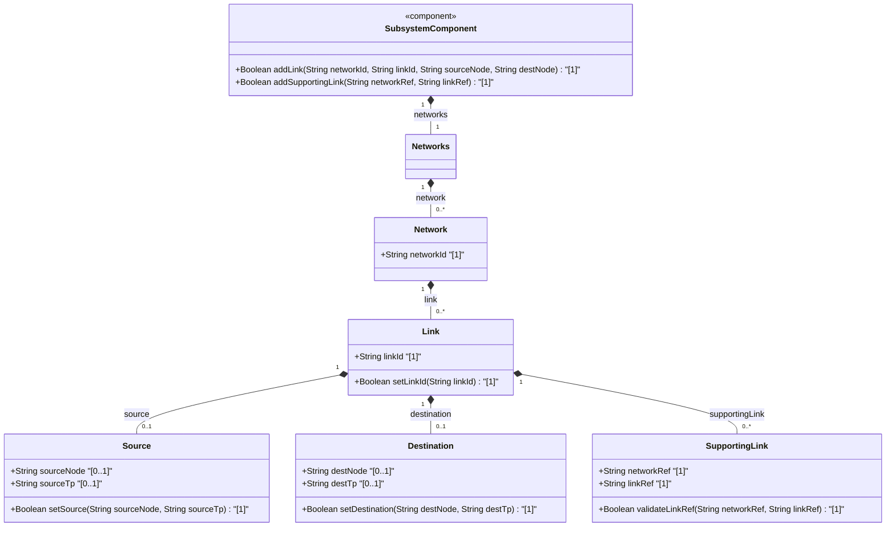

# Implementation Plan: Update UML Class Diagram in feat-28 Spec

## Overview
Update the UML Class Diagram in `docs/features/feat-28-link-data-model-and-supporting-links.md` to include `SubsystemComponent` and missing operations for `Link`, `Source`, `Destination`, and `SupportingLink`.

## Proposed Changes

### Target File
- `docs/features/feat-28-link-data-model-and-supporting-links.md`

### Specific Edits
Replace lines 24-52 with:

## Execution Strategy
- Per project rules (`Strict Coordinator Tool Locking & 4-Point Compliance Check`), the specification update will be delegated to a context-isolated subagent.
- The subagent will execute `replace_file_content` on `docs/features/feat-28-link-data-model-and-supporting-links.md`.

## Verification Plan
1. View `docs/features/feat-28-link-data-model-and-supporting-links.md` after subagent execution to confirm exact match.
2. Verify Mermaid syntax (no colons in return types/arg lists, valid header, closed fences).
